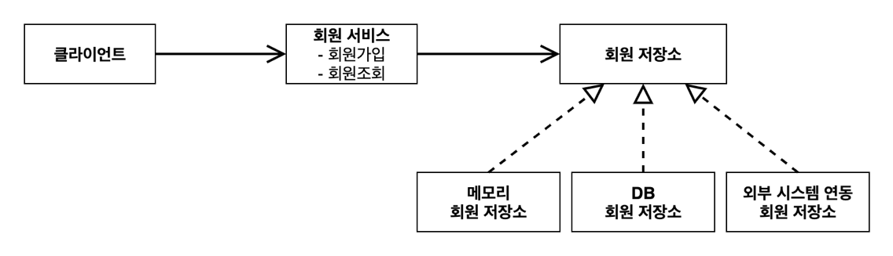
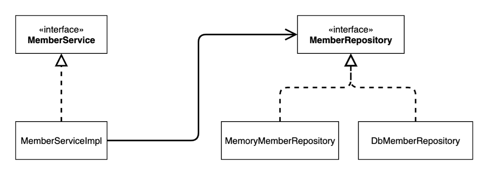

# 섹션 02. 스프링 핵심 원리 이해(1) - 예제 만들기
### 01. 비즈니스 요구사항과 설계
- 비즈니스 요구사항과 설계
  - 회원
    - 회원을 가입 및 조회 가능
    - 회원은 `일반`과 `VIP` 등급이 있다.
    - 회원 데이터는 자체 DB를 구축할 수 있고, 외부 시스템과 연동 가능(미확정)
  - 주문과 할인 정책
    - 회원은 상품을 주문이 가능함
    - 회원 등급에 따른 할인 정책 적용 가능
    - `할인 정책` 적용시 모든 VIP는 `1000원`을 할인 해주는 고정 할인을 적용을 원함(추후 변경 여부 있음)
    - 할인 정책은 변경 가능성이 높다.
    - 회사의 기본 할인 정책은 아직 미정이며 오픈 직전까지 고민을 미루고 싶어함.
    - 최악의 경우 적용하지 않을 수 있음  
 

- `객체 지향 설계 방법`을 활용해 언제든 구현체를 갈아끼울 수 있도록 설계하도록 한다!
- `참고` : 이번 섹션은 스프링 없는 순수 자바로만 개발이 목표!  
   

### 02. 회원 도메인 설계
- 회원 도메인 요구사항
  - 회원을 가입 및 조회 가능
  - 회원은 `일반`과 `VIP` 등급이 있다.
  - 회원 데이터는 자체 DB를 구축할 수 있고, 외부 시스템과 연동 가능(미확정)  
 

- 회원 도메인 협력 관계

- 회원 클래스 다이어그램

- 회원 객체 다이어그램

- 회원 서비스 : __MemberServiceImpl__  
   

### 03. 회원 도메인 개발
- `enum Grade` : 회원등급 종류 명시`(일반 = 'BASIC', 'VIP')`
- `class Member` : 회원 정보 엔티티`('id', 'name', 'grade')`
- `interface MemberRepository` : 회원 저장소 인터페이스`(회원정보 저장 및 검색)`
  - `class MemoryMemberRepository` : 회원 저장소 구현체(임시, DB 확정 전)
- `interface MemberService` : 회원 서비스 인터페이스`(회원 가입 및 조회)`
  - `class MemberServiceImpl` : 저장소 구현체 `MemoryMemberRepository`에 `회원 정보를 저장`하고 저장 된 `회원 정보를 검색` 구현  
 

- 현재 상황은 아직 DB가 확정되지 않은 경우를 가정한다. 
  - 개발 진행을 위해서 가장 단순한 `MemoryMemberRepository`를 구현해 진행한다.  
 

- `참고(1)` : `HashMap`은 `동시성 이슈`가 발생할 수 있으므로 실무에선 `ConcurrentHashMap`을 사용한다.
  - 해당 강의에선 추가 설명이 길어질 것을 염려해 부득이하게 `HashMap`을 사용했다.
- `참고(2)` : 인터페이스 구현체 이름 작성시 관례상 `implements`의 줄임말인 `impl`을 인터페이스명 뒤에 더해 사용함
  - ex) `interface MemberService`의 구현체일 경우 = `MemberServiceImpl`  
   

### 04. 회원 도메인 실행과 테스트
- `회원 객체 다이어그램`을 테스트  
 

- `class MemberApp` : `memberService` 객체를 생성해 회원 정보를 통해 가입하고 멤버 목록 확인 및 검색
- `class MemberServiceTest` : `MemberService` 테스트 코드 작성  
 

- 애플리케이션 로직으로 테스트 하는 것은 좋은 방법이 아니다. `JUnit 테스트`를 사용하자!  
 

- 회원 도메인 설계의 문제점
  - 의존관계에서 `인터페이스(추상)`뿐 아니라 `구현`까지 모두 의존하는 문제점이 있음
  - `MemberServiceImpl`는 `MemberRepository(추상)`과 `MemoryMemberRepository(구현)` 모두를 의존
  - 추후 변경 시 반드시 문제가 생김!!