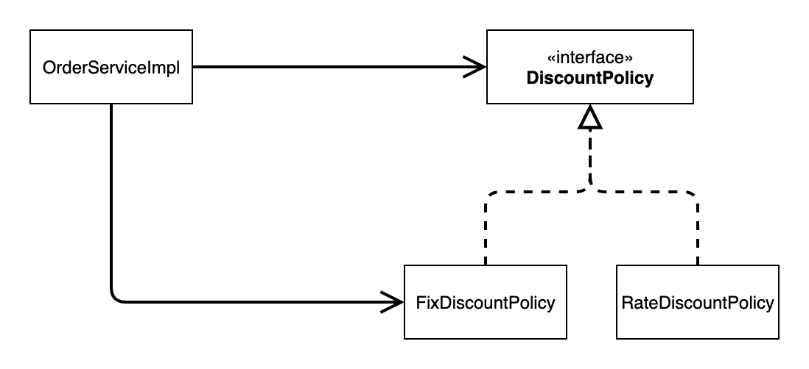
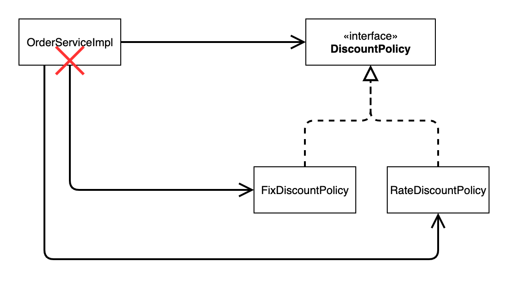
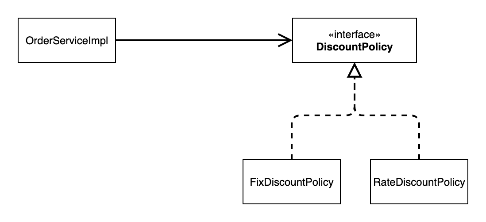
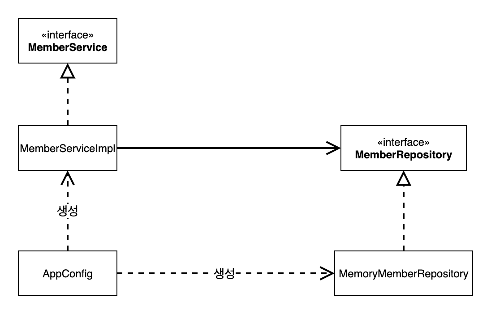
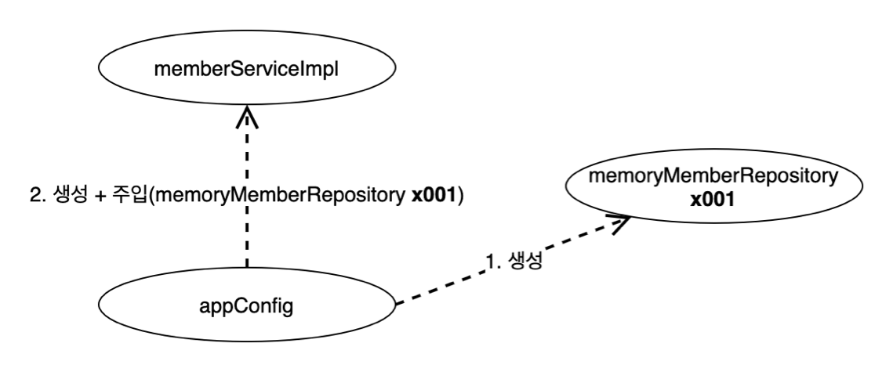
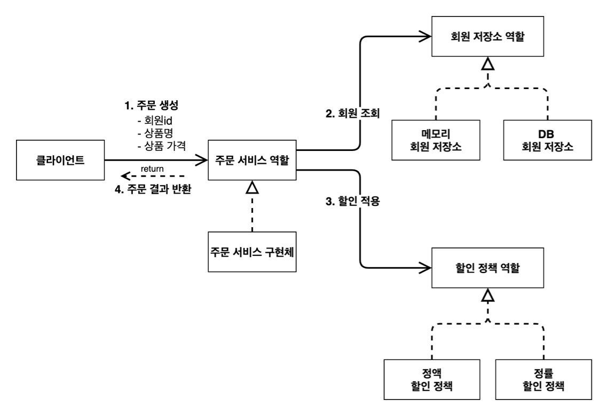
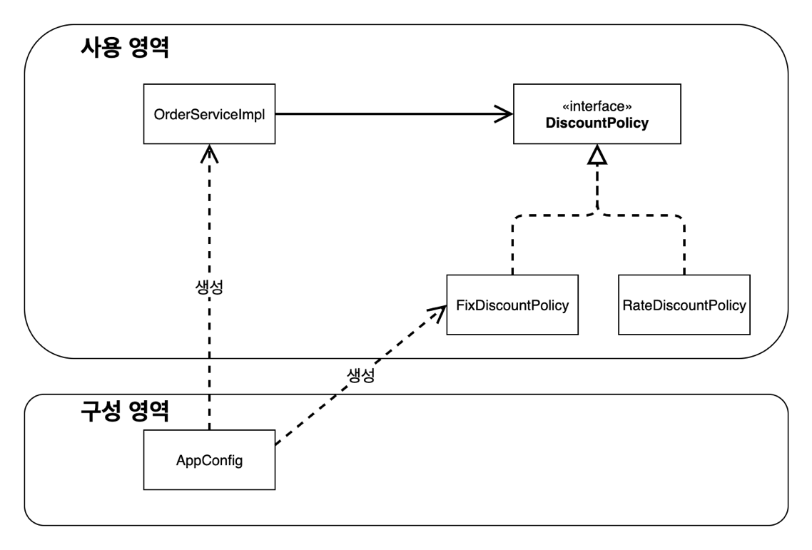
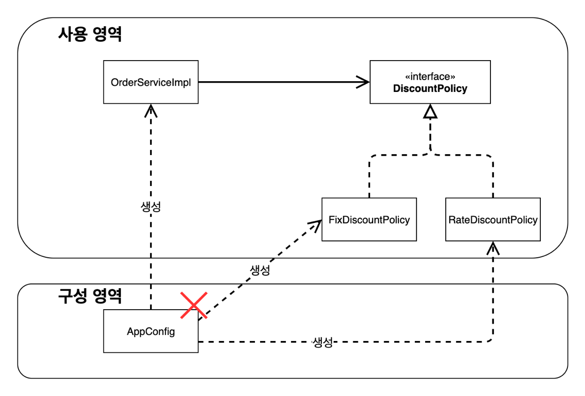
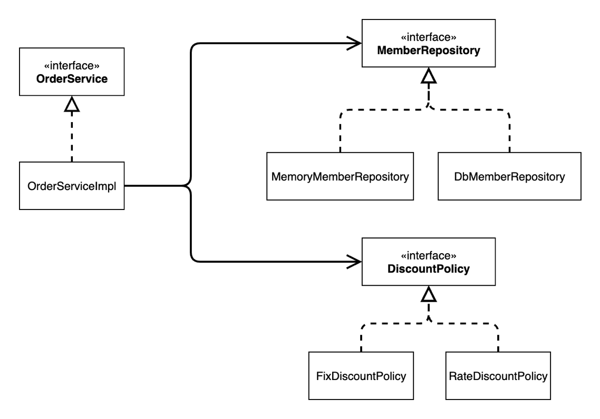
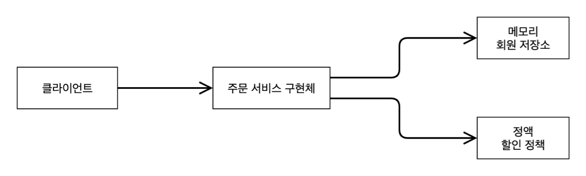

# 섹션 03. 스프링 핵심 원리 이해(2) - 객체 지향 원리 적용
## 01. 새로운 할인 정책 개발
- `참고(1)` : [애자일 소프트웨어 개발 선언](https://agilemanifesto.org/iso/ko/manifesto.html)  
<br/>

### __RateDiscountPolicy__ 추가
  
<br/>

- `class RateDiscountPolicy` : 일정 %의 할인 금액을 반환한다.
- `class RateDiscountPolicyTest` : 회원의 등급이 `VIP`인지 아닌지에 따라 원하는 결과가 나오는지 확인한다.  
<br/><br/><br/>

## 02. 새로운 할인 정책 적용과 문제점
### 새로운 할인 정책 적용시 문제점 발견!
- 분명 역할과 구현을 충실히 분리 -> check!
- 다형성 활용은 물론이고 인터페이스와 구현 객체를 분리 -> check!
- OCP, DIP` 같은 객체지향 설계 원칙을 충실히 준수 -> 그렇게 느끼지만 실상은 아니다!
  - 어? `DIP의 경우` `OrderServiceImpl`는 `DiscountPolicy` 인터페이스에 의존하면서 지키지 않았나?
    - 클래스 의존 관계를 분석하면 추상뿐 아니라 구체 클래스에도 의존하고 있음을 알 수 있다.
    - 추상(인터페이스) 의존 : `DiscountPolicy`
    - 구체(구현) 의존 : `FixDiscountPolicy` `RateDiscountPolicy`
  - `OCP의 경우` : `OrderServiceImpl`는 이미 구체 클래스도 의존하고 있기 때문에 구체 클래스 변경 시 영향을 받는다!
    - 즉 영향을 받기에 OCP를 위반했다고 할 수 있다.  
<br/>

### 기대했던 혹은 바랬던 의존관계
  
단순하게 `DiscountPolicy` 인터페이스에만 의존한다고 잘못 생각함  
<br/>

### 실제 의존관계
  
보다싶이 `DiscountPolicy`뿐 아니라 구체 클래스 `FixDiscountPolicy`도 함께 의존하고 있다  
이는 `DIP 위반`이다!!  
<br/>

### 정책 변경 시 의존관계
  
그래서 보는 것 처럼 구체 클래스를 타 클래스로 변경하는 순간 `OrderServiceImpl`도 함께 수정해야 하므로 `OCP 위반`이다.  
<br/>

### 과연 어떻게 위의 문제를 해결할 수 있을까?
- 현재 문제는 `OrderServiceImpl`가 인터페이스와 구현 클래스 모두 의존하는게 문제
- 즉 `인터페이스`만 의존하도록 의존관계를 수정하면 된다!!  
<br/>

### 인터페이에만 의존하도록 설계를 변경!
  
<br/>

### 인터페이스에만 의존하도록 코드를 변경!
```
public class OrderServiceImpl implements OrderService {
    //private final DiscountPolicy discountPolicy = new RateDiscountPolicy();
    private DiscountPolicy discountPolicy;
}
```
- 하지만 구현체가 없기 때문에 코드 실행 시 `NPE(Null pointer exception)`이 발생한다.
- `해결방안` : 누군가 클라이언트에 인터페이스의 구현 객체를 대신 생성하고 주입해주어야 함!!  
<br/><br/><br/>

## 03. 관심사의 분리
### 애플리케이션이 하나의 공연이라고 생각할 때
- 배우는 본인의 배역을 수행하는 것만 집중해야 한다.
- 상대 배역의 배우가 바뀌더라도 배우의 배역 수행에 변경이 없어야 한다.
- 공연 구성, 담당배우 섭외 등의 책임을 담당하는 별도의 `공연 기획자`가 필요한 시점!!
- `공연 기획자`를 통해서 책임을 확실하게 분리하도록 한다.  
<br/>

### AppConfig 등장!
- 애플리케이션의 전체 동작 방식을 구성(config)하기 위해, 구현 객체를 생성하고 연결하는 책임을 가진 별도의 클래스
- `AppConfig`는 실제 동작에 필요한 `구현 객체를 생성`한다!
  - `MemberServiceImpl` `MemoryMemberRepository` `OrderServiceImpl` `FixDiscountPolicy`
- `AppConfig`는 생성한 객체 인스턴스의 참조(레퍼런스)를 `생성자를 통해서 주입(연결)`한다!  
<br/>

- `참고(2)` : 현재까지는 각 클래스에 생성자가 없기에 컴파일 오류가 발생하고 있다.  
<br/>

### MemberServiceImpl - 생성자 주입
- 설계 변경으로 해당 클래스는 더이상 `MemoryMemberRepository`를 의존하지 않음
- 단지 `추상(interface MemberRepository)`에만 의존한다.
- 클라이언트 입장에서는 어떤 구현 객체가 들어올지(주입될지) 알 수도 알 필요도 없다!
  - 이제부터 어떠한 구현 객체가 주입 될지는 오직 `외부(AppConfig)`에서 결정하기 때문이다.
- 위에서 예시로든 것 처럼 해당 클래스는 `의존관계`에 대한 부분은 외부에서 처리하고 `내부 실행에만 집중`하면 된다.  
<br/>

### 그림 - 클래스 다이어그램

- 객체 생성과 연결은 `AppConfig`가 담당
- `DIP 충족!` : `MemberServiceImpl`은 이제부터 추상(인터페이스)에만 의존하면 됨(a.k.a 구체 클레스 is 뭔들)
- `관심사의 분리` : `객체 생성 및 주입(연결) 역할` `실행 역할`이 명확하게 분리됨  
<br/>

### 그림 - 회원 객체 인스턴스 다이어그램

- `appConfig` 객체는 `memoryMemberRepository` 객체를 생성, 그 참조값을 `memberServiceImpl`로 생성하며 생성자로 전달함
- 클라이언트인 `memberServiceImpl` 입장에서는 의존관계를 마치 외부에서 주입해주는 것 같음
  - 이를 `DI(Dependency Injection)` 우리말로 `의존관계 주입` 또는 `의존성 주입`이라 한다.  
<br/>

### OrderServiceImpl - 생성자 주입
- 위에 먼저 말한 `MemberSerivceImpl - 생성자 주입`과 같다.
  - 기존에 의존하고 있던 구체 클래스의 개수의 차이만 있을 뿐 `AppConfig`를 통해 더 이상 구체 클래스에 의해 여향을 받지 않음!
- 해당 클래스는 `의존관계`에 대한 부분은 외부에서 처리하고 `내부 실행에만 집중`하면 된다.  
  <br/>

### AppConfig 실행 - 사용 클래스 내
```
public class MemberApp {
  public static void main(String[] args) {
    AppConfig appConfig = new AppConfig();
    MemberService memberService = appConfig.memberService();
    ...
  }
}
```
- `AppConfig`를 생성하고 `MemberService` 생성시 `AppConfig`가 선택한 구체 클래스를 주입함
- `OrderApp`도 마찬가지  
<br/>

### AppConfig 실행 - 테스트 코드 내
```
class MemberServiceTest {
  MemberService memberService;
  @BeforeEach
  public void beforeEach() {
    AppConfig appConfig = new AppConfig();
    memberService = appConfig.memberService();
  }
  ...
}
```
- `@BeforeEach`를 사용해 테스트 코스 실행마다 `beforeEach()`를 수행한다.
- `memberService`를 선언하고 `beforeEach()`를 통해 `AppConfig` 생성 및 구체 클레스를 주입한다.
- `OrderServiceTest`도 마찬가지  
<br/>

### 정리
- `AppConfig`를 통해서 역할을 명확하게 분리함
- 클라이언트는 `추상(인터페이스)`에만 의존하면 되고 `구체 클래스`는 `AppConfig`가 생성 및 주입을 담당하게 됨  
<br/><br/><br/>

## 04. AppConfig 리팩터링
- 현재 상황에서 `AppConfig`는 `중복`이 존재하고 `역할`에 따른 `구현`이 잘 보이지 않는다.  
<br/>

### 기대하는 그림
  
<br/>

### 리팩터링 후
- 중복을 제거하고 역할에 따른 구현이 잘 보이도록 리팩터링을 진행하였다.
```
public class AppConfig {

    public MemberService memberService() {
        return new MemberServiceImpl(memberRepository());
    }

    private MemoryMemberRepository memberRepository() {
        return new MemoryMemberRepository();
    }

    public OrderService orderService() {
        return new OrderServiceImpl(memberRepository(), discountPolicy());
    }

    public DiscountPolicy discountPolicy() {
        return new FixDiscountPolicy();
    }
}
```
- 이로서 `AppConfig`의 전체 구성이 어떤지 빠르게 파악할 수 있게 되었다!
- 또한 `MemoryMemberRepository` `FixDiscountPolicy`를 변경 시 해당 메서드만 바꾸면 된다는 장점도 생겼다!  
<br/><br/><br/>

## 05. 새로운 구조와 할인 정책 적용
- 이전으로 돌아가서 `정액 할인 정책`을 `정률 % 할인 정책`으로 변경해보자
- `FixDiscountPolicy` -> `RateDiscountPolicy`
- 과연 어떤 부분을 변경해야 할까?
  - 현재 `AppConfig`의 등장으로 애플리케이션은 `사용 영역`과 `객체 생성 및 구성 영역`으로 분리된 상태이다.
<br/>

### 현재 사용과 구성의 분리 
  


### 할인 정책의 변경

- 특정 구체 클래스를 변경해도 구성 영역에만 영향이 있을 뿐 사용 영역에는 전혀 영향이 가지 않는다!  
<br/>

### 할인 정책 변경에 따른 코드 수정
```
public DiscountPolicy discountPolicy() {
  // return new FixDiscountPolicy(); (변경 전 코드)
  // 할인 정책 변경에 따른 구체 클래스 변경
  return new RateDiscountPolicy();
}
```
- 추후에 할인 정책을 또 변경하더라도 `AppConfig`만 수정하면 된다!
- `AppConfig` 등장 전 처럼 클라이언트 코드인 `OrderServiceImpl`를 비롯한 어떤 `사용영역` 코드도 변경할 필요가 없어졌다!  
<br/>

### 이로써 DIP와 OCP 모두를 잡을 수 있게 되었다!  
<br/><br/><br/>

## 06. 전체 흐름 정리
### 지금까지의 흐름
- 새로운 할인 정책 개발
- 새로운 할인 정책의 적용과 문제점
- 관심사의 분리
- `AppConfig` 리팩터링
- 새로운 구조와 할인 정책의 적용  
<br/>

### 새로운 할인 정책 개발
- 다형성 덕분에 새로운 `정률 할인 정책` 코드를 추가로 개발하는 것은 문제가 되지 않았음  
<br/>

### 새로운 할인 정책 적용과 문제점
- 문제는 `새로 개발한 정책 적용`인데, 이를 적용하니 `클라이언트 코드` 또한 함께 변경해야 하는 상황이 발생
- 이유는 `주문 서비스 클라이언트`의 의존에 있음
  - 추상(interface)인 `DiscountPolicy`뿐만 아니라 구체 클래스인 `FixDiscountPolicy`도 의존하기 때문!  
<br/>

### 관심사의 분리
- 기존에는 클라이언트의 경우 `실행`은 물론 `구현 객체 생성`도 직접하는 상태
- `AppConfig`를 만들어 `구현 객체 생성 및 연결(주입)` 책임(임무)을 줌
- 즉, `AppConfig`의 등장으로 클라이언트 객체는 오롯이 `실행`만 하면 됨
  - 권한이 줄어들어 맡은 `책임`이 명확해짐  
<br/>

### AppConfig 리팩터링
- 구성 정보에서 `역할`과 `구현`을 명확하게 분리함
  - 이로 인해서 보다 역할이 잘 드러나고 불필요한 중복을 제거할 수 있음  
<br/>

### 새로운 구조와 할인 정책 적용
- 할인 정책 변경 : `정액 할인 정책` -> `정률 % 할인 정책`
- 할인 정책 변경 시에도 `AppConfig`의 구성 영역만 변경하면 됨, 더 이상 사용 영역의 변경이 불필요
  - 더욱이 클라이언트 코드도 변경할 필요가 없음  
<br/><br/><br/>

## 07. 좋은 객체 지향 설계의 5가지 원칙의 적용
### 지금까지의 코드는 SRP, DIP, OCP가 적용되었다
   - 이번에는 5가지 원칙 중 현재 코드에 적용된 3가지 원칙에 대해 알아보자  
<br/>

### SRP - 단일 책임 원칙 : 한 클래스는 하나의 책임만 가져야 함
- 클라이언트 객체는 `구현 객체 생성 및 연결, 실행`의 다양한 책임을 가질 수 있음
- 우리는 이를 `AppConfig`에는 `구현 객체 생성과 연결(주입)`의 책임을 클라이언트 객체는 `실행`의 책임을 주어 관심사를 분리함  
<br/>

### DIP - 의존관게 역전 원칙 : 프로그래머는 "추상화에 의존해야지, 구체화에 의존하면 안된다."(a.k.a 의존성 주입)
- 새로운 할인 정책 개발 후 적용 시 클라이언트 코드도 변경해야하는 상황이 발생
  - 기존 클라이언트 코드가 `추상(인터페이스)`에도 의존하고 `구현(구현 클래스)`에도 의존했기 때문
- 클라이언트 코드가 `추상`에만 의존할 수 있게 `AppConfig`를 만들어 `구현 객체 생성 및 연결(의존성 주입)` 책임을 부여함  
<br/>

### OCP - 소프트웨어 요소는 확장에는 열려 있으나 변경에는 닫혀 있어야 함
- 애플리케이션을 사용 영역과 구성 영역으로 나눔
- `AppConfig`에서 `할인 정책`을 변경해 클라이언트 코드에 주입하기에 클라이언트 코드의 변경이 없음
- 즉, 소프트웨어 요소를 새롭게 확장하여도 사용 영역의 변경이 없다(닫혀 있다)!  
<br/><br/><br/>

## 08. IoC, DI 그리고 컨테이너
### 제어의 역전 IoC(Inversion of Control)
- 기존 프로그램은 클라이언트 구현 객체가 스스로 필요한 서버 구현 객체를 생성, 연결, 실행해왔다.
  - 한 마디로 구현 객체가 프로그램의 제어 흐름을 스스로 조종함
- 하지만 `AppConfig`의 등장에 따라 구현 객체는 자신의 로직 `실행`만을 담당한다.
  - 프로그램의 제어 흐름에 대한 권한을 모두 `AppConfig`가 가지기 때문
- 이처럼 프로그램의 제어 흐름을 직접 제어하는 것이 아니라 외부에서 관리하는 것을 `제어의 역전`이라고 한다.  
<br/>

### 프레임워크 vs 라이브러리
- 프레임워크 : 작성한 코드를 대신 제어하고 실행하는 경우
  - ex) JUnit
- 라이브러리 : 작성한 코드를 직접 제어하는 경우  
<br/>

### 의존관계 주입 DI(Dependency Injection)
- 의존관계는 `정적인 클래스 의존 관계`와 실행 시점에 결정되는 `동적인 객체(인스턴스) 의존 관계`로 나눌 수 있다.  
<br/>

### 정적인 클래스 의존관계
- 애플리 케이션을 실행하지 않아도 분석할 수 있음
  - `import 코드`만 보고 의존관계를 쉽게 판단 가능
- 하지만 클래스 의존 관계만으로는 실제로 어떤 객체가 주입 될지 알 수 없음  
<br/>

### 클래스 다이어그램
  
<br/>

### 동적인 객체 인스턴스 의존 관계
- 애플리케이션 실행 시 실제 생성된 객체 인스턴스의 참고가 연결된 의존 관계  
<br/>

### 객체 다이어그램

- `실행 시점(런타임)`에 외부(AppConfig)에서 실제 구현 객체를 생성하고 클라이언트에 전달 후 `클라이언트 - 실제 구현 객체`의 관계가 연결(주입)되는 것을 `의존관계 주입`이라고 함
- 의존관계를 주입하게 되면 클라이언트 코드 변경 없이 클라이언트가 호출하는 대상(인스터스)을 변경할 수 있음
- 즉, 정적인 클래스 의존관계 변경 없이 동적인 객체 인스턴스 의존관계를 쉽게 변경 가능함  
<br/>

### IoC 컨테이너, DI 컨테이너
- 객체를 생성 및 연결(주입)해 주는 것(like AppConfig)을 `IoC 컨테이너(DI보다 범용적 의미)` 또는 `DI 컨테이너`라 함
  - 만약 `의존관계 주입`에 초점을 맞춘다면 `DI 컨테이너`라 하는게 맞다
- 그 외로 `어샘블러` `오브젝트 팩토리` 등으로 불리기도 함  
<br/><br/><br/>

## 09. 스프링으로 전환하기
- 지금 까지 순수한 자바 코드만으로 DI를 적용해왔다. 이제 스프링을 사용해보자~!  
<br/>

### 스프링 컨테이너 
스프링 전환 수정코드는 'AppConfig', 'OrderApp', 'MemberApp' 클래스를 확인!
- `ApplicationContext`를 스프링 컨테이너라 한다.
- 이전에는 `AppConfig`를 통해 개발자가 직접 객체를 생성하고 의존성을 주입했지만 앞으로는 `스프링 컨테이너`를 통해 사용한다.
- `@Configuration`이 붙은 `AppConfig`를 설정(구성) 정보로 사용함
  - 이 때 `@Bean`이 붙은 모든 메서드를 호출해 반환된 객체를 스프링 컨테이너에 등록함
  - 이렇게 스프링 컨테이너에 등록된 객체를 `스프링 빈`이라고 함
- 스프링 빈의 경우 `@Bean`이 붙은 메서드 명을 이름으로 사용함
- 스프링 컨테이너에서 필요한 스프링 빈(객체)를 찾을 땐 `applicationContext.getBean()` 메서드를 사용한다.
- 이제부터는 객체를 스프링 빈으로 등록하고 이를 찾아서 사용하도록 한다.