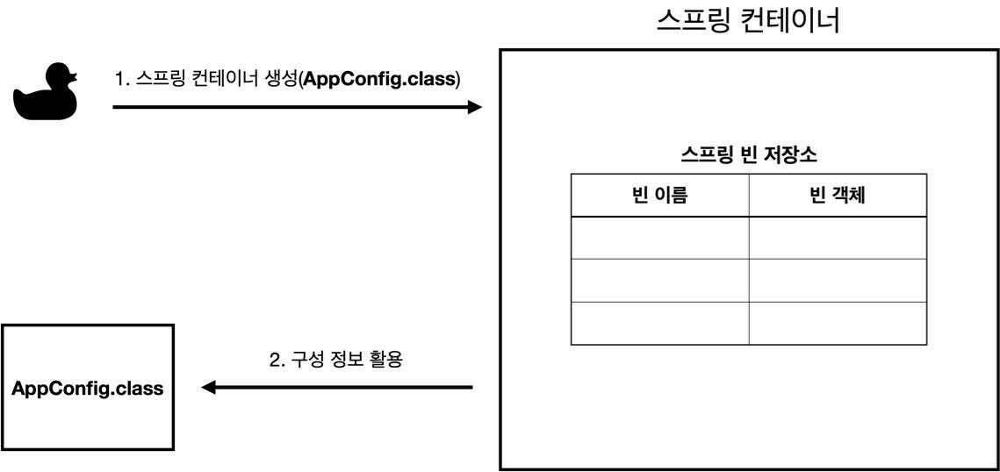
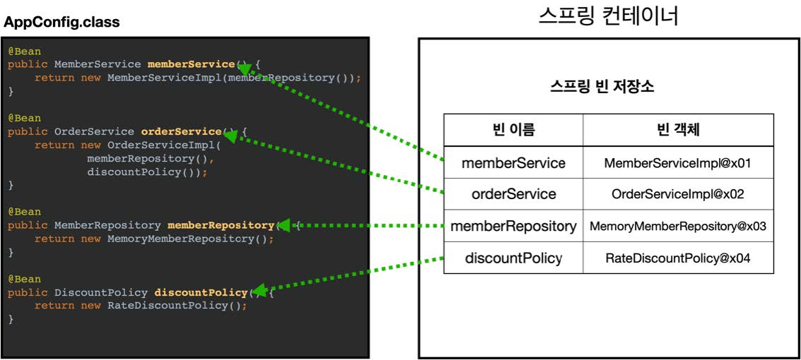
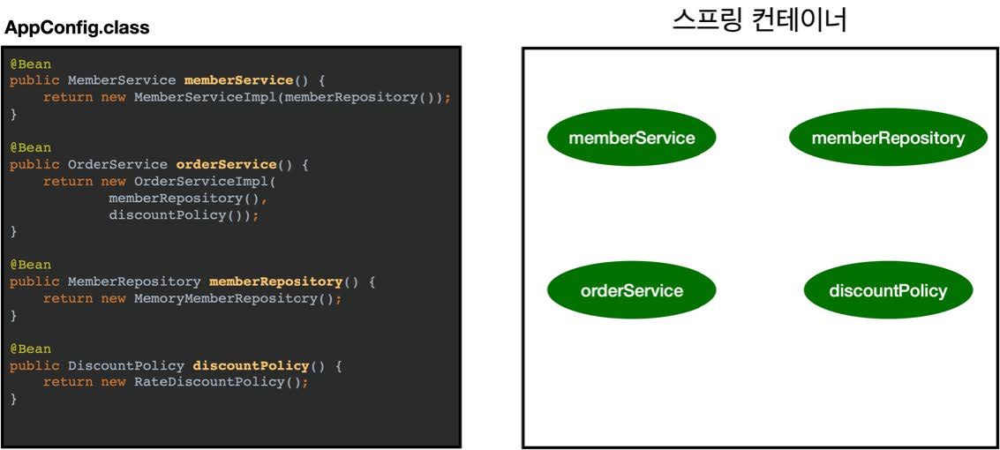
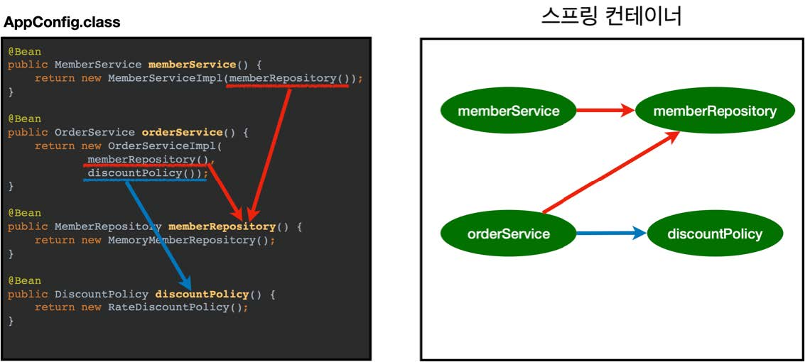
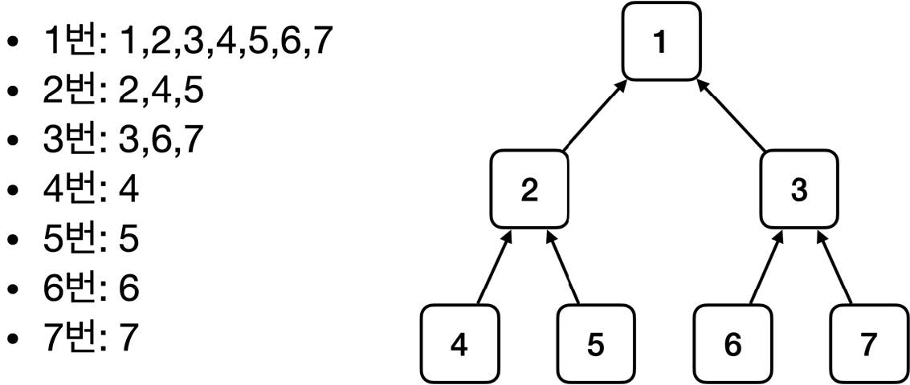
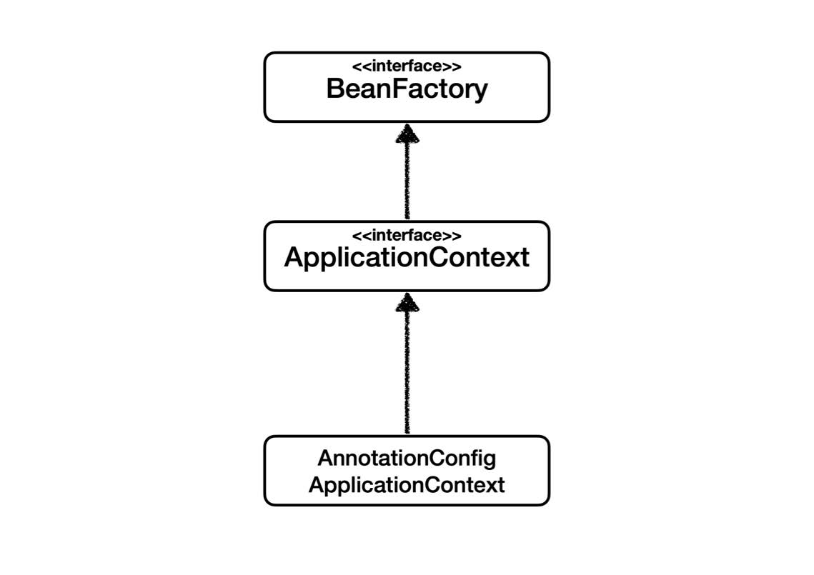
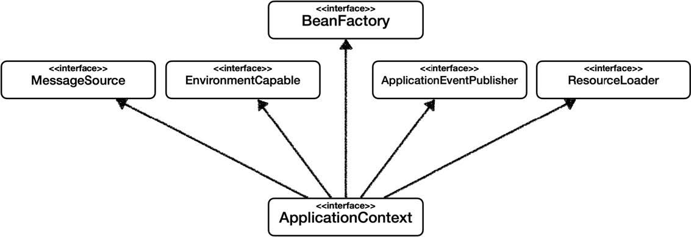
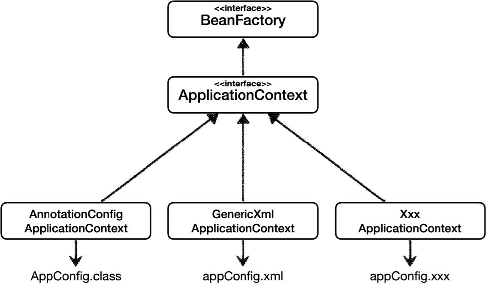

# 섹션 04. 스프링 컨테이너와 스프링 빈
## 01. 스프링 컨테이너 생성
```
//스프링 컨테이너 생성
ApplicationContext applicationContext =
    new AnnotationConfigApplicationContext(AppConfig.class);
```
- `interface ApplicationContext`를 스프링 컨테이너라고 함
- 스프링 컨테이너는 XML을 기반으로 만들 수 있으며 애노테이션 기반의 자바 설정 클래스로도 만들 수 있음
  - 이전 강의에서 `AppConfig`를 활용한 것이 애노테이션 기반으로 스프링 컨테이너를 만든 것임
  - `new AnnotationConfigApplicationContext(AppConfig.class);`를 통해 만들 수 있음
    - 해당 클래스는 `ApplicationContext의 구현체`이므로 가능!  
<br/>

- `참고(1)` : `BeanFactory`를 직접 구현하는 경우는 거의 없어 `ApplicationContext`를 스프링 컨테이너라고 한다.  
<br/>

### 스프링 컨테이너의 생성 과정
__1. 스프링 컨테이너 생성__

- 컨테이너 생성 : `new AnnotationConfigApplicationContext(AppConfig.class)`
- 생성 시 `구성 정보`를 지정해주어야 함
  - 예시 그림에서는 `AppConfig.class`를 구성 정보로 지정함  
<br/>

__2. 스프링 빈 등록__

- 스프링 컨테이너는 파라미터로 넘어온 설정 클래스 정보를 사용해 스프링 빈을 등록함
- 빈 이름의 경우 `메서드 명`을 사용하며 직접 부여도 가능함
  - 직접 부여할 경우 : `@Bean(name = "memberService2")`  
<br/>

- `주의!` : 빈 이름은 항상 서로 다른 이름을 부여해야 함, 같은 이름 부여 시에는 빈이 무시되거나 덮어버리는 오류가 발생  
<br/>

__3. 스프링 빈 의존관계 설정 준비__
  
<br/>

__4. 스프링 빈 의존관계 설정 - 완료__

- 스프링 컨테이너는 설정 정보를 참고해 `의존관계 주입(DI)`을 함
- 어찌보면 자바 코드를 호출하는 것 처럼 보이나 분명한 차이가 존재하며 후에 `싱글톤 컨테이너`에서 다룰려고 한다.  
<br/>

- `참고(2)`
  - `스프링`은 빈을 생성하고, 의존관계 주입하는 단계가 나누어져 있음
  - 위에 설명처럼 `자바 코드`로 스프링 빈을 등록하면 `생성자 호출`과 `의존관계 주입`이 한 번에 처리됨  
<br/>

### 정리
스프링 컨테이너를 생성하고, 스프링 빈도 등록하고, 의존관계도 설정했으니 다음엔 스프링 컨테이너에서 `데이터 조회`를 해보자!  
<br/><br/><br/>

## 02. 컨테이너에 등록된 모든 빈 조회
- `Tip!` : 코드 작성 시 리스트나 배열이 있는 경우 `iter + 엔터`를 하면 `for문`이 자동으로 생성된다!
- `Tip!` : 작성 코드를 드래그해 선택한 후 `ctrl + d'를 하면 선택 영역이 복사 된다!  
<br/>

### 예제 코드 - class ApplicationContextInfoTest
- 모든 빈 출력 - `findAllBean()`
  - 실행 시 스프링에 등록된 모든 빈 정보를 출력
  - `getBeanDefinitionNames()` : 스프링에 등록된 모든 빈 이름을 조회
  - `getBean()` : 빈 이름으로 빈 객체(인스턴스)를 조회
- 애플리케이션 빈 출력 - `findApplicationBean()`
  - 스프링 내부에서 사용하는 빈 제외 본인이 직접 등록한 빈만 출력
  - `getRole()` : 스프링 내부에서 사용하는 빈을 구분
    - `ROLE_APPLICATION` : 일반적으로 사용자가 정의한 빈
    - `ROLE_INFRASTRUCTURE` : 스프링이 내부에서 사용하는 빈  
<br/><br/><br/>

## 03. 스프링 빈 조회 - 기본
### 스프링 컨테이너에서 스프링 빈을 찾는 가장 기본적이 방법
- `getBean(빈 이름, 타입)` `getBean(타입)`
- 조회 대상 스프링 빈이 없을 경우 예외 발생!
  - ex) `NoSuchBeanDefinitionException: No bean named 'xxxxx' available`  
<br/>

- `Tip!` : 코드 작성 시 `ctrl + e`를 사용하면 이전에 작성하던 코드로 이동이 가능하다!  
<br/>

### 예제 코드 - ApplicationContextBasicFindTest
- `findBeanName()`: 빈 이름과 타입으로 조회
  - `MemberService.class` 타입의 `"memberService"`란 이름을 가진 빈을 조회 후 변수에 저장
  - 변수에 저장된 빈이 `MemberServiceImpl`의 인스턴스인지 확인
- `findBeanByType()` : 빈의 타입으로만 조회
- `findBeanName2()` : 인스턴스가 아닌 구현 클래스 타입으로 조회
  - 이와 같은 방법은 구현 클래스의 변경에 영향을 받으므로 유연성이 떨어져 좋지 않음
- `findBeanNameX()` : 빈의 이름이 없는 확인(있다면 테스트 실패, 없다면 테스트 성공)
  - 람다식을 사용하여 빈 이름을 조회할 때 `NoSuchBeanDefinitionException` 발생하는지 확인  
<br/><br/><br/>

## 04. 스프링 빈 조회 - 동일한 타입이 둘 이상
- `Tip!` : 변수 생성시 생성부를 먼저 작성한 후 `ctrl + alt + v`를 사용하면 선언부가 자동 생성된다!  
<br/>

- 타입만으로 스프링 빈 조회시 같은 타입의 스프링 빈이 둘 이상이라면 오류가 발생한다. -> 빈 이름 지정 필요
- `ac.getBeansOfType()`을 사용하면 해당 타입의 모든 빈을 조회 가능  
<br/>

### 예제 코드 - ApplicationContextSameBeanFindTest
- `findBeanByTypeDuplicate()` : 이름은 다르지만 같은 타입의 스프링 빈이 둘 이상 있을 경우 예외가 발생하는지 확인
  - `getBean()`을 사용해 타입만 지정해 스프링 빈을 조회할 경우 `NoUniqueBeanDefinitionException` 예외가 발생한다
  - 이는 둘 중 어떤 스프링 빈을 반환해야 할 지 몰라서 생기는 예외이다.
- `findBeanByName()` : `getBean()`을 사용할 때 타입 중복으로 생기는 문제점을 해결하려면 타입뿐만 아니라 스프링 빈 이름도 지정해준다.
- `findAllBeanByType()` : 특정 타입의 모든 스프링 빈을 조회하고 싶다면 `getBeansOfType()`을 사용한다.  
<br/><br/><br/>

## 05. 스프링 빈 조회 - 상속 관계
- 부모 타입을 조회시 자식 타입도 함께 조회한다.
  - 그래서 자바 객체 중 최상위 타입의 `Object` 타입을 조회하면 모든 스프링 빈을 조회함  
<br/>

__설명 예시 그림__
  
<br/>

### 예제 코드 - ApplicationContextExtendsFindTest
- `findBeanByParentTypeDuplicate()` : `getBean()`을 사용해 부모 타입으로 조회시 자식이 둘 이상 있다면 예외가 발생한다.
  - 타입으로만 조회시 `getBean()`을 사용했는데 같은 타입의 스프링 빈이 두 개 이상 있는 것과 같은 이유
- `findBeanByParentTypeBeanName()` : 부모 타입 지정뿐아니라 조회하고자 하는 스프링 빈의 이름도 지정하면 해결된다.
- `findBeanBySubType()` : 특정 하위 타입으로 조회해도 되긴 하나 도긴개긴이다.
  - 특정 하위 타입을 가지는 스프링 빈이 2개 이상 있다면...
- `findBeanByParentType()` : `getBeansOfType()`을 사용해 부모 타입으로 조회하면 부모 타입은 물론 하위 타입의 모든 스프링 빈이 조회된다.
- `findBeanByObjectType()` : 최상위 타입인 `Object`로 조회하면 모든 스프링 빈이 조회된다.  
<br/><br/><br/>

## 06. BeanFactory와 ApplicationContext
  
<br/>

### BeanFactory
- 스프링 컨테이너의 최상위 인터페이스
- 스프링 빈을 관리, 조회하는 역할
- `getBean()` 제공
- 지금까지 예제를 통해 다룬 대부분의 기능은 `BeanFactory`가 제공하는 기능  
<br/>

### ApplicationContext
- `BeanFactory`의 기능을 모두 상속 받아 제공함
- 애플리케이션 개발시 기본 기능은 물론 많은 부가기능을 필요로하는데, 이 부가기능을 제공함  
<br/>

### ApplicationContext가 제공하는 부가기능

- 메시지소스를 활용한 국제화 기능
  - 예를 들면 한국에서 들어오면 한국어, 영어권에서 들어오면 영어를 출력
- 환경변수
  - 로컬, 개발, 운영등을 구분해서 처리
- 애플리케이션 이벤트
  - 이벤트를 발행하고 구독하는 모델을 편리하게 지원
- 편리한 리소스 조회
  - 파일, 클래스패스, 외부 등에서 리소스를 편하게 조회  
<br/>

### 정리
- `ApplicationContext`는 `BeanFactory`를 상속 받음
  - `ApplicationContext`의 경우 `빈 관리 기능 + 편리한 부가 기능`을 제공
  - 부가기능까지 제공하는 `ApplicationContext`가 있기에 `BeanFactory`를 사용할 일은 거의 없음
- `BeanFacotry` `ApplicationContext`를 `스프링 컨테이너`라고 함  
<br/><br/><br/>

## 07. 다양한 실전 형식 지원 - 자바 코드, XML
스프링 컨테이너는 다양한 형식의 설정 정보를 수용할 수 있는 유연한 설계를 가지고 있다.
- 자바 코드, XML, Groovy 등  
<br/>

  
<br/>

### 애노테이션 기반 자바 코드 설정 사용
- 현재까지 강의를 따라오면서 사용한 방식 : `new AnnotationConfigApplicationContext(AppConfig.class)`
- `AnnotationConfigApplicationContext`클래스를 사용해 자바 코드로 이루어진 설정 정보를 넘김  
<br/>

### XML 설정 사용
- 최근 스프링 부트를 많이 사용하면서 해당 설정 방식은 잘 사용하지 않음
- 하지만, 아직 많은 레거시 프로젝트가 `XML`로 되어 있기도 하고 `컴파일 없이 빈 설정 정보를 변경 가능`하기에 한 번쯤 배워는 것도 좋음
- `enericXmlApplicationContext`를 사용해 `XML`설정 파일을 넘김  
<br/>

### XML 기반의 스프링 빈 설정 정보 - src/main/resources/appConfig.xml
- `appConfig.xml` 스프링 설정 정보와 `AppConfig.java` 설정 정보를 비교해보면 거의 비슷함
