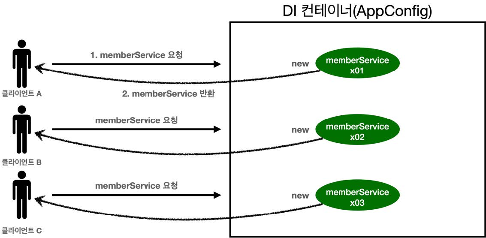
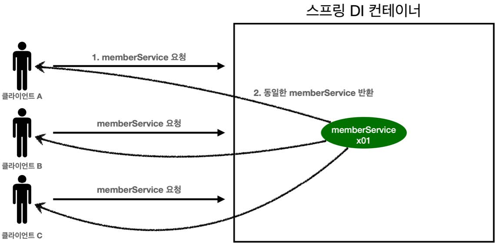

# 섹션 05. 싱글톤 컨테이너
## 01. 웹 애플리케이션과 싱글톤

- 스프링은 `기업용 온라인 서비스 기술`을 지원하기 위해 태어났다.
- 대부분의 스프링 애플리케이션은 `웹 애플리케이션`이다.
  - 물론 그 외의 개발도 얼마든지 가능하다.
- 웹 애플리케이션의 경우 보통 `다수의 고객`으로부터 `동시 요청`이 발생한다.  
<br/>

### 스프링 없는 순수한 DI 컨테이너 예제 코드 - SingleTonTest
- `AppConfig`(스프링 없는 순수한 DI 컨테이너)는 요청이 들어올 때 마다 객체를 새로 생성함
  1. 고객 트래픽이 초당 100이 나오게되면 초당 100개 객체가 생성되고 소멸함 -> `메모리 낭비가 심함`
  2. 메모리 낭비를 막기위해 객체는 `딱 1개`만 생성하고 이를 공유해서 사용하도록 함 -> `싱글톤 패턴`  
<br/><br/><br/>

## 02. 싱글톤 패턴
클래스의 인스턴트(객체)가 딱 1개만 생성되는 것을 보장하는 디자인 패턴
- `private` 생성자를 사용해 외부에서 임의로 `new 키워드`를 사용하지 못하도록 해야 함  
<br/>

### 싱글톤 패턴 예제 코드 - SingletonService(테스트 코드 쪽에 작성)
- statice 영역에 `instance`를 미리 하나 생성해 올려둠
- 해당 객체 인스턴스가 필요할 경우 오직 `getInstance()`메서드를 통해서만 조회 가능
  - 해당 메서드 호출 시 항상 같은 인스턴스를 반환
- 생성자를 `private`으로 설점
  - 딱 1개의 객체 인스턴스가 존재해야하므로 외부에서 객체 인스턴스가 생성되는 걸 막음  
<br/>

### 싱클톤 패턴 테스트 코드 - SingleTonTest(singletonServiceTest())
- `private`를 사용해 `new 키워드`를 막아둬 해당 키워드 사용시 오류가 발생함
- 호출할 때 마다 같은 객체 인스턴스를 반환함  
<br/>

- `참고(1)` : `isEqualTo()`와 `isSameAs()`의 차이
  - `isSameAs()` : 자바의 `==`연산과 같음, 원시형 타입은 값을 비교, `인스턴스(객체)는 주소`를 비교해 서로 같은지를 확인
  - `isEqualTo()` : 저장된 값을 기준으로 비교, `객체의 값`이 같은지 비교하고 싶다면 이를 사용  
<br/>

### 싱글톤 패턴 문제점
싱글톤 패턴 적용시 이미 만들어진 객체를 공유해서 효율적으로 사용이 가능하다.  
하지만, 아래와 같은 많은 문제점들을 가지고 있다.
- 구현하는데 많은 코드를 필요로 한다.
- 의존관계를 보면 클라이언트가 구체 클래스에 의존하고 있다. 이는 `DIP` 위반이다.
  - 또한 이 때문에 `OCP`를 위반할 가능성이 높음
- 테스트하기가 쉽지 않음
- 내부 속성 변경 및 초기화가 어려움
- `private`생성자로 인해 자식클래스 생성이 어려움
- 결론적으로 `유연성`이 떨어져 `안티 패턴`으로 불리기도 함  
<br/><br/><br/>

## 03. 싱글톤 컨테이너
스프링 컨테이너는 싱글톤 패턴의 문제점을 해결하면서 객체 인스턴스를 싱글톤으로 관리한다.  
  - 지금까지 배운 `스프링 빈`이 싱글톤으로 관리된다.  
<br/>

### 싱글톤 컨테이너
- `스프링 컨테이너` : 싱글톤 패턴을 적용하지 않아도 객체 인스턴스를 싱글톤으로 관리
   - 싱글톤 컨테이너 역할을 함, 싱글톤 객체를 생성 및 관리하는 기능을 `싱글톤 레지스트리`라 함
   - 싱글턴 패턴의 모든 단점을 해결하며 객체를 싱글톤으로 유지할 수 있음  
<br/>

### 스프링 컨테이너를 사용하는 테스트 코드 - SingleTonTest(springContainer())
기존 싱글톤 컨테이너를 스프링 컨테이너로 수정하였다.  
기존 코드는 주석처리 해두었으니 한 번 비교해보도록 하자!  
<br/>

### 싱글톤 컨테이너 적용 후

- 스프링 컨테이너 덕분에 고객의 요청이 올 때 마다 객체를 생성할 필요가 없음
- 이미 만들어진 객체를 공유해서 낭비없이 효율적으로 재사용이 가능함  
<br/>

- `참고(2)` : 스프링의 기본 빈 등록방식은 싱글톤이나 해당 방식만을 지원하는 것은 아니다.
  - 요청마다 새로운 객체를 생성해서 반환하는 기능도 있다.  
  - 그러나 거의 대부분 99%는 기본 빈 등록방식을 사용한다.  
<br/><br/><br/>

## 04. 싱글톤 방식의 주의점
### 싱글톤 객체는 상태를 유지(stateful)하게 설계하면 안 됨
- 싱글톤 패턴이든 스프링(싱글톤 컨테이너)을 사용하든, 여러 클라이언트가 하나의 같은 객체를 공휴하기 때문에
- 고로 `무상태(stateless)`로 설계해야 함
  - 특정 클라이언트에 의존적인 필드가 존재하면 안 됨
  - 특정 클라이언트가 값을 변경할 수 있는 필드가 존재하면 안 됨, 왠만하면 `읽기`만 가능해야 함
  - `필드`를 대신해 자바에서 공유되지 않는 `지역변수` `파라미터` `ThreadLocal` 등을 사용해야 함
  - 만약 스프링 빈의 필드에 `공유 값`을 설정하면 큰 장애가 발생할 수 있음  
<br/>

### 상태를 유지할 경우 발생하는 문제 예시 코드 - StatefulService & StatefulServiceTest
- 스레드의 진행에 따라 `price`의 값이 변경되어 문제가 발생한다.
  - `statefulService`의 `price`가 공유된 필드여서 변경이 가능한 상태
- 위와 같은 상황은 실무에서 종종 볼 수 있다. 하지만 정말 해결하기 어렵기 때문에 큰 문제를 야기하는 골치아픈 상황이다.
  - 그러므로 반드시 `공유필드`는 조심, 또 조심해야 한다.
  - 스프링 빈은 항상 `무상태(stateless)`로 설계해야 한다는 점 명심하자!
- 문제 해결을 위해 두 클래스에 주석으로 설명을 적어두었다. 참고하도록하자  
<br/><br/><br/>

## 05. @Configuration과 싱글톤
다음 `AppConfig` 코드의 일부를 보고 의문점이 생김
```
@Configuration
public class AppConfig {

  @Bean
  public MemberService memberService() {
    return new MemberServiceImpl(memberRepository());
  }
  
  @Bean
  public OrderService orderService() {
    return new OrderServiceImpl(
            memberRepository(),
            discountPolicy());
  }
  
  @Bean
  public MemberRepository memberRepository() {
    return new MemoryMemberRepository();
  }
  ...
}
```
- `memberService`빈과 `orderService`빈을 각각 생성하면 결과적으로 각각 다른 2개의 `MemoryMemberRepository`가 생성된다.
  - 각각 다른 객체가 생성되었으니 싱글톤이 깨지는 것처럼 보인다.
  - 과연 스프링 컨테이너는 해당 부분을 어떻게 해결할까?  
<br/>

### 검증 용도 테스트 코드 작성 - ConfigurationSingletonTest
```
    // @Configuration 테스트 용도
    public MemberRepository getMemberRepository() {
        return memberRepository;
    }
```
- 검증을 위해 위의 코드를 `OrderServiceImpl` `MemberServiceImpl`에 각각 추가한다.
  - `MemberRepository`를 조회할 수 있는 기능을 추가  
<br/>

- 확인 결과 총 3번 생성된 `memberRepository`인스턴스 모두 같은 인스턴스가 공유되어 사용되고 있음
- 혹시 중복 호출이 되지 않은 걸까?  
<br/>

### AppConfig에 호출 기록이 남도록 코드 추가
```
    @Bean
    public MemberService memberService() {
        System.out.println("call AppConfig.memberService");
        return new MemberServiceImpl(memberRepository());
    }

    @Bean
    public MemoryMemberRepository memberRepository() {
        System.out.println("call AppConfig.memberRepository");
        return new MemoryMemberRepository();
    }

    @Bean
    public OrderService orderService() {
        System.out.println("call AppConfig.orderService");
        return new OrderServiceImpl(memberRepository(), discountPolicy());
    }
```
- `memberService()` `memberRepository()` `orderService()`에 메소드가 호출되면 메시지가 출력되도록 코드를 추가함  
<br/>

#### 출력될 메시지를 순서에 상관없이 임의로 예상했을 경우 (memberService() -> orderService() -> memberRepository() 순)
```
  call AppConfig.memberService
  call AppConfig.memberRepository
  call AppConfig.orderService
  call AppConfig.memberRepository
  call AppConfig.memberRepository
```  
#### 신기한 실제 출력 결과 - `ConfigurationSingletonTest` 테스트 실행
```
  call AppConfig.memberService
  call AppConfig.memberRepository
  call AppConfig.orderService
```
- 중복 없이 메서드 당 1번만 호출된 걸 확인 할 수 있음