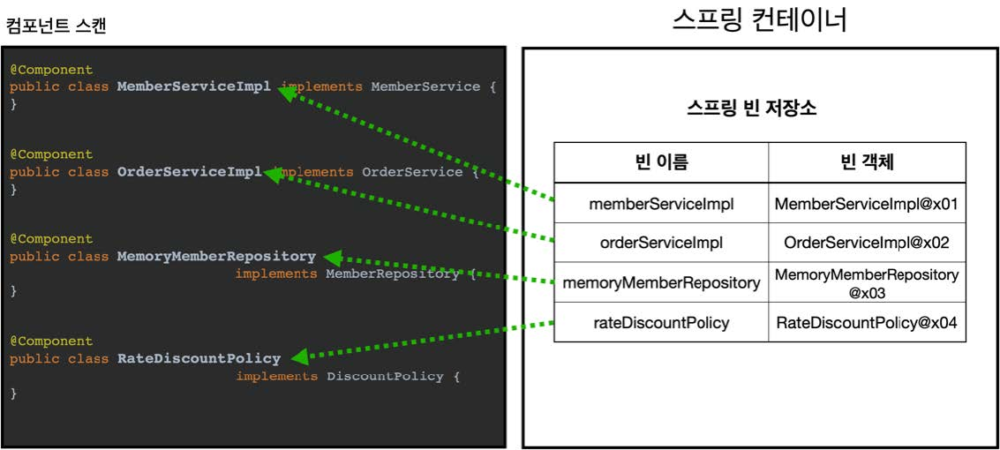
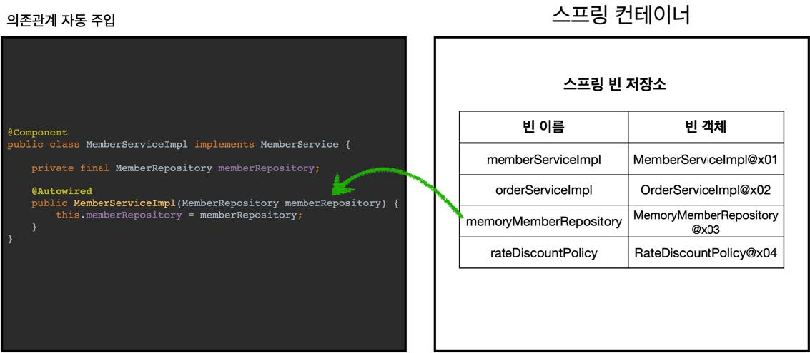
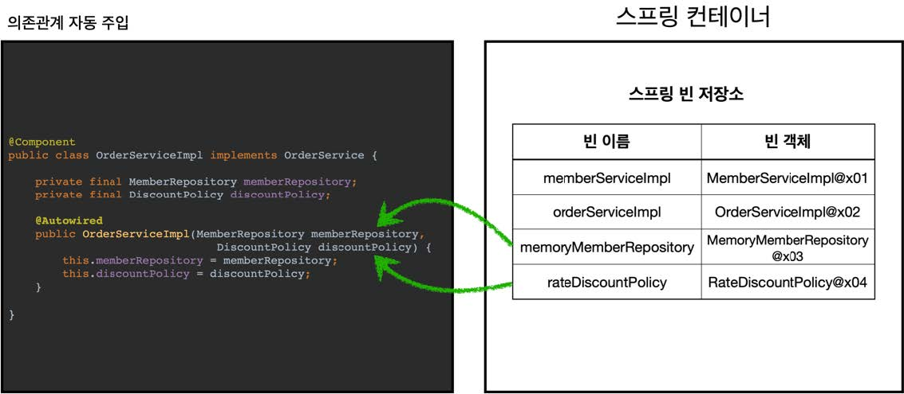

# 섹션 06. 컴포넌트 스캔
## 01. 컴포넌트 스캔과 의존관계 자동 주입 시작하기
- 지금까지는 스프링 빈 등록 시 자바 코드의 `@Bean`이나 XML의 `<bean>`을 통해서 설정 정보에 직접 스프링 빈 나열
- 스프링은 설정 정보가 없어도 자동으로 스프링 빈을 등록하는 `컴포넌트 스캔`이라는 기능을 제공
  - `@Autiowired` 제공 : 의존관계 자동 주입 기능을 가짐  
<br/>

### AutoAppConfig.java
```
@Configuration
@ComponentScan(
        excludeFilters = @ComponentScan.Filter(type = FilterType.ANNOTATION, classes = Configuration.class)
)
public class AutoAppConfig {

}
```
- 컴포넌트 스캔을 사용하기 위해 `@ComponentScan`을 설정 정보에 붙여준다.
- 이전에 만든 `AppConfig`와는 다르게 `@Bean`으로 등록한 클래스가 하나도 없음  
<br/>

- `참고!` : `@ComponentScan`을 사용하면 `@Configuration`이 붙은 설정 정보도 자동으로 등록된다.
  - 즉, 이전에 `@Configuration`을 붙여 만들어 둔 `AppConfig` `TestConfig` 등의 설정 정보도 함께 등록됨
  - `excludeFilters`를 사용해 설정 정보를 컴포넌트 스캔 대상에서 제외시킴
  - 실무에선 이런 경우가 거의 없고 해당 강의에서는 기존 예제를 유지하기 위해 해당 방법을 사용함  
<br/>

- 컴포넌트 스캔은 `@Component` 애노테이션이 붙은 클래스를 스캔해 스프링 빈으로 등록함  
<br/>

- `참고!` : `@Configuration`이 스캔 대상이 된 이유는 해당 애노테이션 소스코드에 `@Component`가 붙어있기 때문이다.  
<br/>

### 각 클래스가 컴포넌트 스캔의 대상이 되도록 @Component를 추가
`MemoryMemberRepository` `RateDiscountPolicy` `MemberServiceImpl` `OrderServiceImpl`에 `@Component`를 붙여준다.
- 그런데 `MemberServiceImpl` `OrderServiceImpl`는 의존관계 주입이 필요하다.
- 하지만 `@Component`를 붙인 이상 직접 의존관계를 주입 할 방법이 없는데 어떻게 해결할까?  
<br/>

### 의존관계 자동 주입이 되도록 @Autowired를 추가
`MemberServiceImpl` `OrderServiceImpl`클래스의 생성자에 `@Autowired`를 붙여준다.
- `@Autowired`를 사용하면 의존관계를 자동으로 주입해 줌
  - 여러 의존관계도 문제없이 한 번에 주입받을 수 있음  
<br/>

### 컴포넌트 스캔 테스트 코드 - AutoConfigTest
- 기존과 동일하게 `AnnotationConfigApplicationContext`를 사용함
- 설정 정보로 `AutoAppConfig`클래스를 넘겨준다.
```
ClassPathBeanDefinitionScanner - Identified candidate component class:
.. RateDiscountPolicy.class
.. MemberServiceImpl.class
.. MemoryMemberRepository.class
.. OrderServiceImpl.class
```
- 로그를 통해 컴포넌트 스캔이 잘 동작하는지 확인 할 수 있다.  
<br/>

### 그림으로 알아보는 컴포넌트 스캔과 자동 의존관계 주입
__1. @ComponenetScan (컴포넌트 스캔)__

- `@ComponentScan`은 `@Component`가 붙은 모든 클래스를 스프링 빈으로 등록함
- 이 때 생성되는 빈의 이름은 클래스명에서 맨 앞 글자를 소문자로 바꾸어 사용함
  - 빈 이름 기본 : ex) MemberSeriveImpl (클래스) -> memberServiceImpl (빈)
  - 빈 이름 설정 : 스프링 빈 이름을 직접 설정하고 싶다면?
    - `@Component("memberSeriveImpl2")`같은 방법으로 직접 이름을 부여한다.  
<br/>

__2. @Autowired (의존관계 자동 주입)__


- 클래스 생성자에 `@Autowired`를 붙이면 스프링 컨테이너가 자동으로 해당하는 스프링 빈을 찾아 주입한다.
- 스프링 빈 조회 시 기본 전략은 `타입이 같은` 빈을 찾아 주입한다.
  - `getBean(MemberRepository.class`와 동일하다 보면 됨
- 생성자에 파라미터(매개변수)가 많아도 자동으로 전부 주입한다.  
<br/><br/><br/>

## 02. 탐색 위치와 기본 스캔 대상
### 탐색할 패키지의 시작 위치 지정
모든 자바 클래스를 다 컴포넌트 스캔하는 것은 시간낭비다.  
꼭 필요한 위치부터 탐색하도록 `시작 위치 지정`이 가능하다.
```
@ComponentScan(
  basePackages = "hello.core",
}
```
- `basePackages` : 탐색할 패키지의 시작 위치를 지정, 탐색 범위는 `해당 패키지 ~ 하위 패키지`
  - 여러 시작 위치 지정 : `basePackages = {"hello.core", "hello.service"}`
- `basePackageClasses` : 지정한 클래스의 패키지를 탐색 시작 위치로 지정
- 만약 따로 시작 위치를 지정하지 않으면 `@ComponentScan`이 붙은 클래스의 패키지가 시작위치가 됨  
<br/>

### 권장 방법
따로 시작 위치를 지정하는 것이 아니라 설정 정보 클래스의 위치를 프로젝트 최상단에 두자!!
- 스프링 부트는 이 방법을 기본으로 제공함  
<br/>

예를 들어 아래와 같이 프로젝트 구조가 되어 있다면?
- com.hello
- com.hello.serivce
- com.hello.repository  

최상단 위치인 `com.hello`에 `AutoAppConfig`같은 메인 설정 정보를 위치하고 `@ComponentScan`을 붙이며 스캔 시작 위치는 생략한다.
- 참고로 스프링 부트의 대표적인 시작 정보인 `@SpringBootApplication`을 시작 루트 위치에 두는 것이 관례!  
<br/>

### 컴포넌트 스캔 기본 대상 
아래 애노테이션의 소스코드를 보면 `@Component`를 포함하고 있다.
- `@Component` : 컴포넌트 스캔에서 사용
- `@Controller` : 스프링 MVC 컨트롤러에서 사용
- `@Service` : 스프링 비즈니스 로직에서 사용
- `@Repository` : 스프링 데이터 접근 계층에서 사용 
- `@Configuration` : 스프링 설정 정보에서 사용  
<br/>

- `참고!` : 사실 애노테이션 자체에는 상속관계라는 것은 없음
  - 위 처럼 특정 애노테이션이 다른 애노테이션이 인식할 수 있는 이유는 스프링이 지원하는 기능이기 때문이다.  
<br/>

아래의 애노테이션이 있으면 컴포넌트 스캔의 용도만 아니라 스프링은 부가 기능을 수행함
- `@Controller` : 스프링 MVC 컨트롤러로 인식
- `@Repository` : 스프링 데이터 접근 계층으로 인식, 데이터 계층의 예외를 스프링 예외로 변환
- `@Configuration` : 스프링 설정 정보로 인식, 스프링 빈이 싱글톤을 유지하도록 추가 처리를 함
- `@Service` : 사실 `@Service`는 특별한 처리를 하지 않음, 개발자가 핵심 비즈니스 로직 식별에 도움이 됨  
<br/>

- `참고!` : `useDefaultFilters` 옵션은 기본으로 켜져있는데, 옵션을 끄면 기본 스캔 대상들이 제외 됨