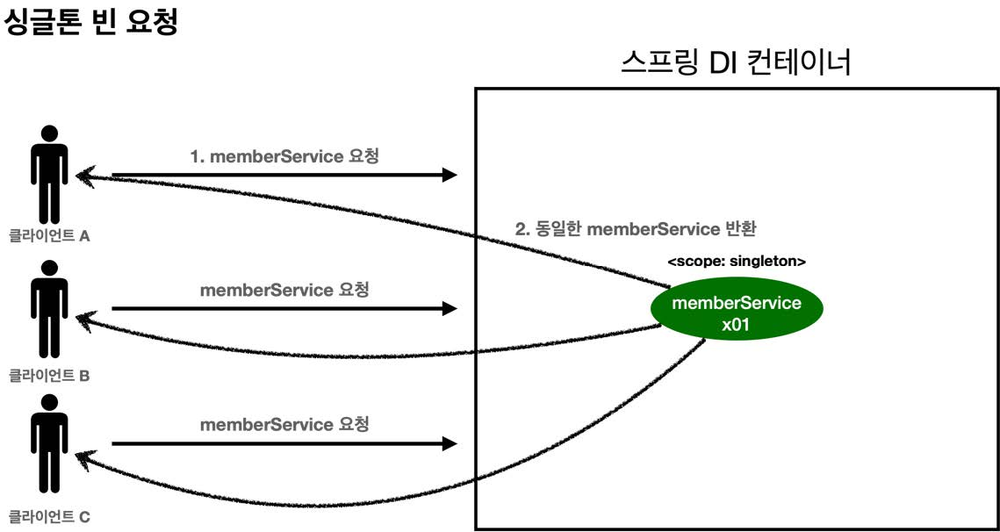
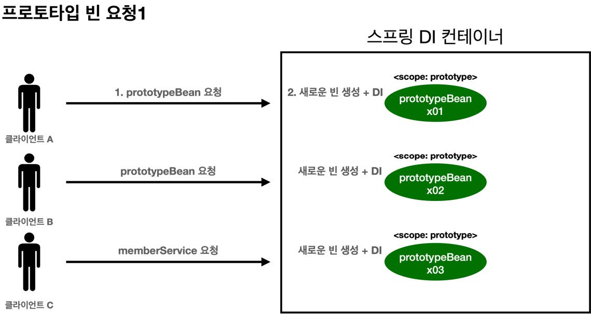
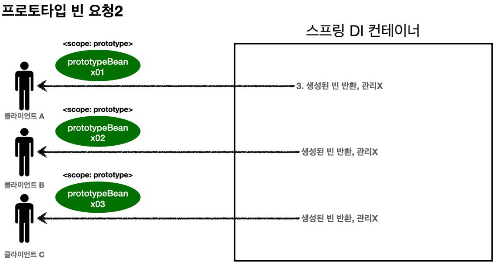
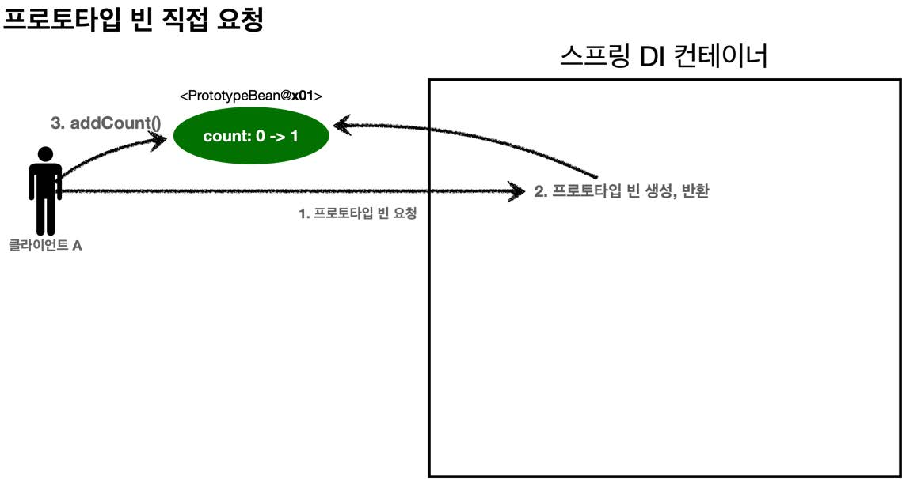
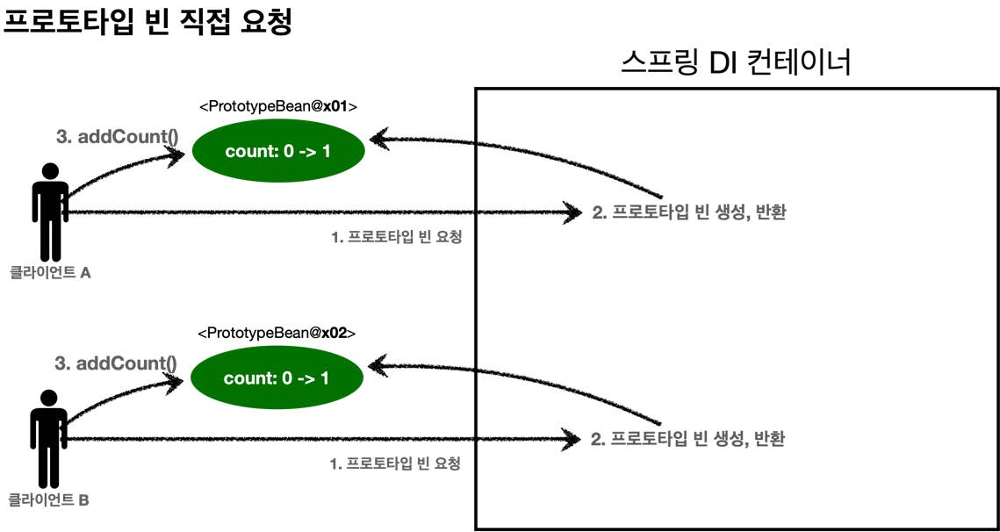
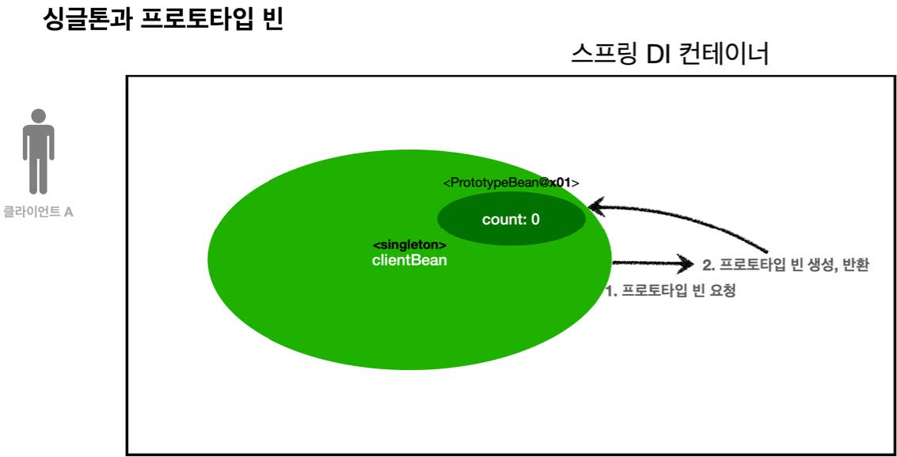
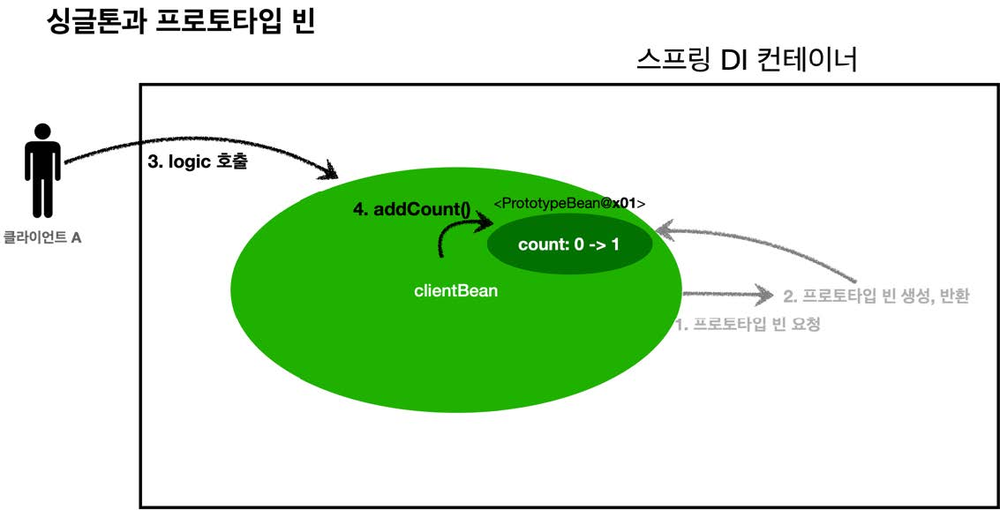
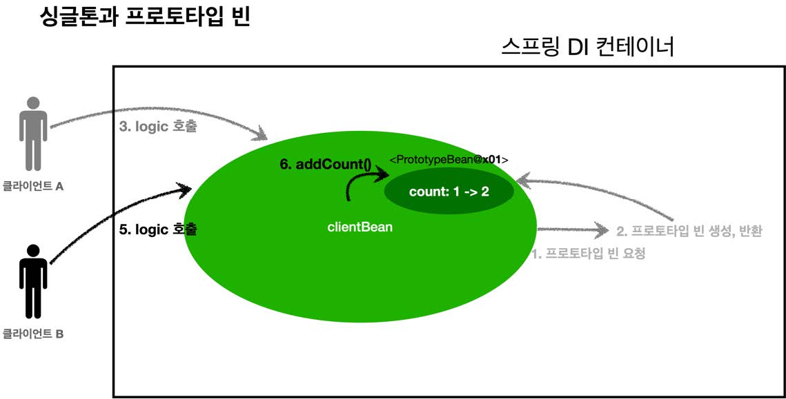
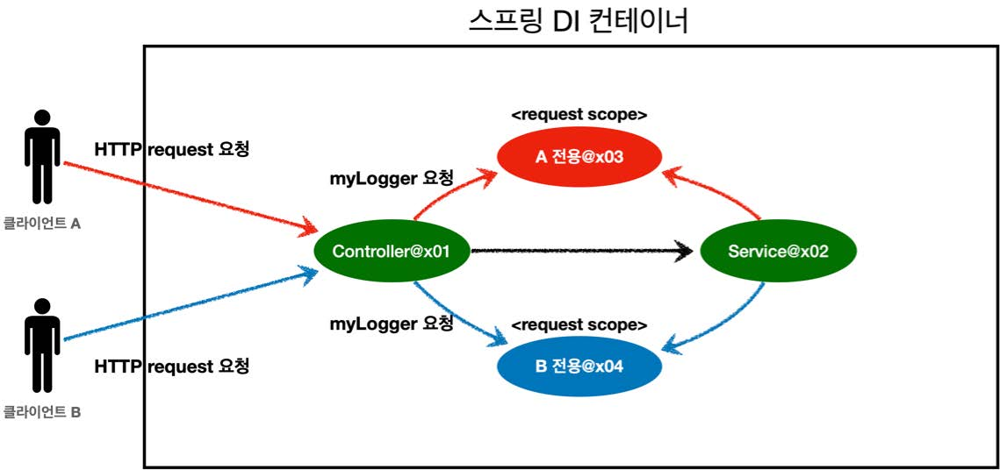

# 섹션 09. 빈 스코프
## 01. 빈 스코프란?
지금까지 강의에서 스프링 빈이 컨테이너의 시작과 함께 생성되어 스프링 컨테이너가 종료될 때 까지 유지된다고 배움  
 - 스프링 빈이 기본적으로 `싱글톤 스코프`로 생성되기 때문
 - `스코프` : 번역하면 `범위`, 스프링 빈이 존재할 수 있는 범위를 뜻함  
<br/>

### 스프링이 지원하는 다양한 스코프
- `싱글톤` : 기본 스코프, `스프링 컨테이너의 시작과 종료까지` 유지되는 `가장 넓은 범위`의 스코프
- `프로토타입` : 스프링 컨테이너는 `프로토타입 빈 생성과 의존관계 주입까지`만 관여하는 `매우 짧은 범위`의 스코프
- `웹 관련 스코프`
  - `request` : `웹 요청이 들어오고 나갈때 까지` 유지되는 스코프
  - `session` : `웹 세션이 생성되고 종료될 때 까지` 유지되는 스코프
  - `application` : `웹의 서블릿 컨텍스트와 같은 범위`로 유지되느 스코프  
<br/>

### 빈 스코프 지정
#### 컴포넌트 스캔 자동 등록
```
@Scope("prototype")
@Component
public class HelloBean {}
```
#### 수동 등록
```
@Scope("prototype")
@Bean
PrototypeBean HelloBean() {
    return new HelloBean();
}
```  
<br/>

### 정리
지금까지는 결국 `싱글톤 스코프`를 사용했던 것!  
<br/><br/><br/>

## 02. 프로토타입 스코프
`싱글톤 스코프`의 경우 빈을 조회하면 스프링 컨테이너는 항상 같은 인스턴스의 스프링 빈을 제공함  
하지만 `프로토타입 스코프`의 경우에는 스프링 컨테이너에 빈을 조회하면 항상 새로운 인스턴스를 생성해 반환함  
<br/>

### 빈 요청 - 싱글톤 스코프

1. 빈을 스프링 컨테이너에 요청
2. 스프링 컨테이너는 생성 당시에 생성해둔 스프링 빈을 반환(모두 같은 인스턴스)
   - 그렇기에 이후 같은 스프링 빈에 대한 요청이 와도 같은 인스턴스의 스프링 빈을 반환함  
<br/>

### 빈 요청 - 프로토타입 스코프
__요청 과정(그림.1)__

__반환 과정(그림.2)__

1. 빈을 스프링 컨테이너에 요청
2. 스프링 컨테이너는 요청 시점에 프로토타입 빈을 생성하고 필요한 의존관계를 주입함
   - 여기까지가 `그림.1`의 과정
3. 스프링 컨테이너는 생성한 프로토타입 빈을 클라이언트에 반환함
   - 이후 같은 스프링 빈에 대한 요청시 스프링 컨테이너는 새로운 프로토타입 빈을 생성해 반환함
   - 여기까지가 `그림.2`의 과정  
<br/>

### 정리
`스프링 컨테이너는 프로토타입 빈을 생성하고 의존관계 주입 및 초기화까지만 처리한다.`  
프로토타입 빈을 관리하는 책임은 스프링 컨테이너가 아닌 반환 받은 클라이언트에 있다.  
그래서 `@PreDestroy`같은 소멸 메서드가 호출되지 않음  
<br/>

### 싱글톤 스코프 빈 테스트 - SingletonTest
__실행 결과__
```
SingletonBean.init
singletonBean1 = hello.core.scope.PrototypeTest$SingletonBean@54504ecd
singletonBean2 = hello.core.scope.PrototypeTest$SingletonBean@54504ecd
org.springframework.context.annotation.AnnotationConfigApplicationContext - Closing 
SingletonBean.destroy
```
- `빈 초기화 메서드 실행` -> `같은 인스턴스의 빈을 조회` -> `종료 메서드 정상 호출`
  - 출력된 결과물로 위의 과정이 순차적으로 진행됨을 알 수 있음  
<br/>

### 프로토타입 스코프 빈 테스트 - PrototypeTest
__실행 결과__
```
find prototypeBean1
PrototypeBean.init
find prototypeBean2
PrototypeBean.init
prototypeBean1 = hello.core.scope.PrototypeTest$PrototypeBean@13d4992d
prototypeBean2 = hello.core.scope.PrototypeTest$PrototypeBean@302f7971
org.springframework.context.annotation.AnnotationConfigApplicationContext - Closing
```
- `프로토타입 스코프 빈`은 스프링 컨테이너에서 요청을 받아 빈을 조회할 때 생성하고 초기화 메서드도 실행됨
- 스프링 빈 생성시 서로다른 인스턴스의 빈을 생성해 초기화도 2번 실행된 것을 알 수 있다.
- 생성된 프로토타입 빈을 반환한 이후 스프링 컨테이너는 더 이상 반환한 스프링 빈을 관리하지 않음
  - 실행 결과를 보면 `@PreDestroy`(소멸 메서드)가 실행되지 않았음
  - 프로토타입 빈을 소멸(종료)시키려면 클라이언트(`PrototypeTest`)에서 생성된 인스턴스에 `destroy()`를 사용해야 함  
<br/>

### 정리 - 프로토타입 스코프 빈의 특징
- 스프링 컨테이너에 빈 조회를 요청 할 때마다 새로운 프로토타입 빈이 생성됨
- 스프링 컨테이너는 `프로토타입 빈의 생성, 의존관계 주입, 초기화`까지만 관리(관여)한다.
- 스프링 컨테이너를 통한 소멸(종료) 메서드는 수행되지 않는다.
  - 소멸(종료) 메서드에 대한 호출은 프로토타입 빈을 호출한 클라이언트에서 해야한다.  
<br/><br/><br/>

## 03. 프로토타입 스코프 - 싱글톤 빈과 함께 사용시 문제점
스프링 컨테이너에 `프로토타입 빈`을 요청하면 항상 새로운 인스턴스를 생성해서 반환함  
하지만 `싱글톤 빈`과 함께 사용할 때는 의도한 대로 잘 동작하지 않는다.  
<br/>

### 프로토타입 빈(직접 요청) - SingletonWithPrototypeTest1(prototypeFind())
__첫 번째 요청__

1. `클라이언트 A`는 스프링 컨테이너에 프로토타입 빈을 요청
2. 스프링 컨테이너는 새로운 프로토타입 빈을 생성해서 반환(x01), 해당 빈의 `count` 값은 `0`이다
3. 클라이언트는 조회한 프로토타입 빈에 `addCount()`를 호출하면서 `count`를 `+1`한다.
4. 최종적으로 `프로토타입 빈(x01)`의 `count`는 `1`이 된다.  
<br/>

__두 번째 요청__

- 첫 번째 요청과 같은 수행을 한다. 다른 점은 프로토타입 빈의 인스턴스가 다르다.
- 최종적으로 `프로토타입 빈(x02)`의 `count`는 `1`이 된다.  
<br/>

### 프로토타입 빈(with 싱글톤) - SingletonWithPrototypeTest1(singletonClientUsePrototype())
__싱글톤에서 프로토타입 빈 사용(1)__

- `clientBean`은 싱글톤이다. 보통 스프링 컨테이너 생성시점에 생성 및 의존관계 주입이 이루어진다.
1. `clientBean`은 자동 의존관계 주입을 사용함.
   -주입 시점에 스프링 컨테이너에 프로토타입 빈을 요청
2. 스프링 컨테이너는 프로토타입 빈을 생성해서 `clientBean`에 반환함.
   - 이 때 프로토타입 빈의 `count` 값은 `0`이다.
- `clientBean`은 내부 필드에 프로토타입 빈을 보관 중(정확히는 참조값을 보관)  

__싱글톤에서 프로토타입 빈 사용(2)__

- `클라이언트A`는 `clientBean`을 스프링 컨테이너에 요청해서 받음
  - 싱글톤이므로 항상 같은 인스턴스의 `clientBean`을 반환 받음
3. `클라이언트A`가 `clientBean.logic()`을 호출
4. `clientBean`은 `prototypeBean`의 `addCount()`를 호출해 프로토타입 빈의 `count`를 `1`증가 시킴
   - 현재 `count` 값은 `1`  

__싱글톤에서 프로토타입 빈 사용(3)__

- `클라이언트B`가 `clientBean`을 스프링 컨테이너에 요청
  - `clientBean`은 싱글톤이므로 항상 같은 인스턴스의 `clientBean`을 반환
- 중요한 점은 `clientBean`이 내부 필드에 보관하고 있는 프로토타입 빈(참조값)은 이미 주입이 끝난 빈이다.
  - 현재 프로토타입 빈은 요청할 때마다 생성되는 것이 아님
  - 주입 시점에 이미 스프링 컨테이너에 요청을 통해 프로토타입 빈이 생성되어 있는 상태
5. `클라이언트B`는 `clientBean.logic()`을 호출
6. `clientBean`은 `prototypeBean`의 `addCount()`를 호출해 프로토타입 빈의 `count`를 `1`증가 시킴
   - 현재 `count` 값은 `2`  
<br/>

### 정리
- 스프링은 일반적으로 `싱글톤 빈`을 사용함
  - `싱글톤 빈`이 `프로토타입 빈`을 사용하게 됨
  - 때문에 주입 시점에 이미 `싱글톤 빈`과 함께 `프로토타입 빈`이 생성됨
    - 결국 이 때 생성된 `프로토타입 빈`이 싱글톤 빈과 함께 계속 유지되는 문제가 생김
- 사실 대부분의 경우 싱글톤 빈은 싱글톤 빈대로 프로토타입 빈은 프로토타입 빈대로 사용하는 것을 원할 것이다.
  - 프로토타입 빈이 요청할 때마다 새로 생성되기를 바라는 경우가 많을 것  
<br/>

- `참고!` : 다수의 `빈`에서 같은 프로토타입 빈을 주입 받으면?
  - 주입 시점에 각각 인스턴스가 다른 새로운 프로토타입 빈이 생성됨
  - 물론 이미 주입 시점에 생성되었기에 사용할 때마다 새로 생성되는 것은 아님  
<br/><br/><br/>

## 04. 프로토타입 스코프 - 싱글톤 빈과 함께 사용시 Provider로 문제 해결
싱글톤 빈과 함께 프로토타입 빈을 사용할 때  
어떻게 하면 사용(요청)할 때마다 새로운 프로토타입 빈을 생성할 수 있을까?  
<br/>

### 스프링 컨테이너에 요청(비추천 방식)
가장 간단한 방법으로 싱글톤 빈이 프로토타입을 사용할 때마다 스프링 컨테이너에 새로 요청한다.  
<br/>

__핵심 코드__
```
@Scope("singleton")
static class ClientBean {
    @Autowired
    private ApplicationContext ac;

    public int logic() {
        PrototypeBean prototypeBean = ac.getBean(PrototypeBean.class);
        prototypeBean.addCount();
        int count = prototypeBean.getCount();
        return count;
    }
}
```
- `ac.getBean()`을 통해 항상 새로운 프로토타입 빈이 생성되는 것을 확인 가능함
- `Dependency Lookup(DL)` : 의존관계를 외부에서 주입(DI) 받는게 아니라 필요한 의존관계를 직접 찾는 것
- 하지만 스프링의 애플리케이션 컨텍스트 전체를 주입받게 되면?
  - 스프링 컨테이너에 종속적인 코드가 되어버림
  - 단위 테스트가 어려워짐
- 당장 필요한 기능은 지정한 프로토타입 빈을 스프링 컨테이너에서 대신 찾아주는 기능이다.
  - `DL`정도의 기능이 지금 필요하다!
  - 사실 놀랍게도 스프링에는 이미 이러한 기능이 준비되어 있다.  
<br/>

### ObjectFactory, ObjectProvider
지정한 빈을 컨테이너에서 대신 찾아주는 `DL 서비스`를 제공하는 것이 바로 `ObjectProvider` 
- 과거에 사용한 `ObjectFactory`에 편의 기능을 추가해 만들어진 것이 `ObjectProvider`  
<br/>

__핵심 코드__
```
@Scope("singleton")
static class ClientBean {
    @Autowired
    private ObjectProvider<PrototypeBean> prototypeBeanProvider;

    public int logic() {
        PrototypeBean prototypeBean = prototypeBeanProvider.getObject();
        prototypeBean.addCount();
        nt count = prototypeBean.getCount();
        return count;
    }
}
```
- `prototypeBeanProvider.getObject()`을 통해 항상 새로운 프로토타입 빈이 생성된다.
- `ObjectProvider`의 `getObject()`를 호출하면 내부에선 스프링 컨테이너를 통해 해당 빈을 찾아 반환함
  - 딱 `DL` 기능을 함
- 스프링이 제공하는 기능을 사용하지만, 기능이 단순해 `단위테스트 생성`이나 `mock코드 만들기`는 훨씬 쉬워짐  
<br/>

#### 특징
- `ObjectFactory` : 기능이 단순함
- `ObjectProvider` : ObjectFactory 상속, 옵션, 스트림 처리등 편의 기능이 많음
- 둘 다 별도의 라이브러리 필요 없음, 스프링에 의존  
<br/>

### JSR-330 Provider
마지막 방법은 `JSR-330 자바 표준`을 사용하는 방법이다.
- 해당 방법을 사용하기 위해 `gradle`에 아래의 라이브러리를 스프링부트 버전에 맞게 추가해준다.
  - 스프링부트 3.0 미만
    - `javax.inject:javax.inject:1` 라이브러리 추가해야 한다.
  - 스프링부트 3.0 이상
    - `jakarta.inject:jakarta.inject-api:2.0.1` 라이브러리를 추가해야 한다.
- `Provider` 사용시 라이브러리를 잘 확인하도록 하자!  
<br/>

__핵심 코드__
```
@Scope("singleton")
static class ClientBean {
    @Autowired
    private Provider<PrototypeBean> provider;

    public int logic() {
        PrototypeBean prototypeBean = provider.get();
        prototypeBean.addCount();
        nt count = prototypeBean.getCount();
        return count;
    }
}
```
- `provider.get()`을 통해서 항상 새로운 프로토타입 빈이 생성됨
- `provider`의 `get()`을 호출하면 내부에선 스프링 컨테이너를 통해 해당 빈을 찾아 반환함(DL)
- 자바 표준이면서 기능이 단순하므로 `단위 테스트 생성` `mock 코드 만들기`가 훨씬 쉬워짐  
<br/>

#### 특징
- `get()` 하나로 기능이 매우 단순
- 별도의 라이브러리가 불필요
- 자바 표준이므로 스프링이 아닌 다른 컨테이너에서도 사용가능  
<br/>

#### 정리
- 매번 사용할 때 마다 의존관계 주입이 완료된 새로운 객체가 필요하면 프로토타입 빈을 사용
- 사실 실무에서는 싱글톤 빈으로 대부분의 문제를 해결할 수 있어 사용할 일은 매우 드물다.
- `ObjectProvider` `JSR330 Provider` 등은 프로토타입 뿐만 아니라 `DL이 필요한 경우`는 언제든지 사용가능  
<br/>

- `참고!` : `JSR-330 Provider` VS `ObjectProvider`
  - `ObjectProvider` : `DL`을 위한 편의 기능을 많이 제공, 스프링 외에 별도의 의존관계 추가가 불필요해 편리
  - `JSR-330 Provider` : 코드를 스프링이 아닌 `다른 컨테이너에서도 사용할 수 있어야` 한다면
  - `스프링과 자바표준이 서로 겹치는` 다른 기능들도 많이 존재함
    - 대부분 `스프링`이 더 다양하고 많은 편리기능을 제공하고 있음
    - 특별히 다른 컨테이너를 사용하는 것이 아니라면 스프링이 제공하는 기능을 사용하는게 좋음
- `참고!` : 스프링이 제공하는 메서드에 `@Lookup`을 사용하는 방법도 있음
  - 단 앞서 언급된 방법들로도 충분하고, 고려해햐할 내용이 많음  
<br/><br/><br/>

## 05. 웹 스코프
### 웹 스코프의 특징
- 웹 환경에서만 동작함
- 프로토타입 스코프와 다르게 스프링이 해당 스코프의 종료시점까지 관리해줌
  - 따라서 `@PreDestroy`같은 소멸(종료) 메서드 호출이 가능함  
<br/>

### 웹 스코프 종류
- `request` : `HTTP 요청` 하나가 들어오고 나갈 때 까지 유지되는 스코프
  - 각각의 HTTP 요청마다 별도의 빈 인스턴스가 생성, 관리됨
- `session` : `HTTP Session`과 동일한 생명주기를 가지는 스코프
- `application` : `서블릿 컨텍스트(ServletContext)`와 동일한 생명주기를 가지는 스코프
- `websocket` : `웹 소켓`과 동일한 생명주기를 가지는 스코프  
<br/>

### HTTP request 요청 당 각각 할당되는 request 스코프

- 나머지 웹 스코프들도 `범위만 다르지` 동작 방식은 다 비슷하다.  
<br/><br/><br/>

## 06. request 스코프 예제 만들기
### 웹 환경 추가
웹 스코프는 `웹 환경`에서만 동작한다. 그러니 라이브러리를 추가해 `웹 환경`을 만들어주자!  
<br/>

#### build.gradle에 라이브러리 추가
```
//web 라이브러리 추가
implementation 'org.springframework.boot:spring-boot-starter-web'
```
- 라이브러리 추가 후 `hello.core.CoreApplication`의 `main`메서드를 실행하면 웹 애플리케이션이 실행된다.  
<br/>

- `참고!` : `spring-boot-starter-web` 라이브러리를 추가하면 스프링 부트는 내장 톰켓 서버를 활용해 웹 서버와 스프링을 함께 실행시킴
- `참고!` : 스프링 부트는 웹 라이브러리가 없으면 `AnnotationConfigApplicationContext`을 기반으로 애플리케이션을 구동함
  - 웹 라이브러리가 추가되 웹과 관련된 추가 설정과 환경들이 필요하므로  
<br/>

### request 스코프 예제 개발
`request 스코프`는 여러 HTTP 요청이 오면 정확하게 어떤 요청이 남긴 로그인지 구분할 때 사용하기 좋음
- 기대하는 공통 포멧 : `[UUID][requestURL] {message}`
- UUID를 사용해서 HTTP 요청을 구분
- requestURL 정보도 추가로 넣어서 어떤 URL을 요청해서 남은 로그인지 확인  
<br/>

#### 예제 코드
- `class MyLogger` : 로그를 출력하기 위한 클래스
  - `@Scope(value = "request")`를 사용해 `request 스코프`로 지정함
    - 해당 빈은 HTTP 요청 당 하나씩 생성되며, 요청이 끝나는 시점에 소멸한다.
  - 해당 빈은 새성되는 시점에 자동으로 `@PostConstruct`초기화 메서드를 사용해 `uuid`를 생성해 저장해둠
    - 해당 빈이 HTTP 요청마다 생성되므로 `uuid`를 통해 다른 HTTP 요청과 구분 가능
  - 해당 빈이 소멸되는 시점에 `@PreDestroy`를 사용해 소멸(종료) 메시지를 남김
  - `requestURL`은 빈 생성 시점에 알 수 없어 외부에서 `setter`로 입력 받음  
<br/>

- `class LogDemoController` : 로거가 잘 작동하는지 확인하는 테스트용 컨트롤러
  - `HttpServletRequest`를 통해 요청 `URL`을 받음
    - `requestURL`의 값 `http://localhost:8080/log-demo`
  - `requestURL`의 값을 `myLogger`에 저장함
    - `myLogeer`의 경우 HTTP 요청 당, 각각 구분되어 값이 섞일 일이 없음
  - 컨트롤러에서 `controller test`라는 로그를 남김  
<br/>

- `참고!` : `requestURL`을 `MyLogger에 저장하는 부분`은 컨트롤러 보다 공통 처리가 가능한 `스프링 인터셉터`나 `서블릿 필터`를 활용하는 것이 좋다  
<br/>

- `class LogDemoService` : 비즈니스 로직이 있는 서비스 계층
  - `request scope`를 사용하지 않고 파라미터로 모든 정보를 서비스 계층에 넘기면, 파라미터가 많아서 지저분해짐
  - `requestURL` 같은 `웹과 관련된 정보`가 웹과 관련없는 서비스 계층까지 넘어가게 됨
    - 웹과 관련된 부분은 컨트롤러까지만 사용해야 함
    - 서비스 계층은 웹 기술에 종속되지 않고, 가급적 순수하게 유지하는 것이 유지보수 관점에서 좋음
  - `request scope`의 `MyLogger` 덕분에 불필요한 파라미터 정보를 넘기지 않음
    - `MyLogger 멤버변수`에 저장해서 코드와 계층을 깔끔하게 유지할 수 있음  
<br/>

### 예제 코드 실행
__원하는 출력 결과__
```
[d06b992f...] request scope bean create
[d06b992f...][http://localhost:8080/log-demo] controller test
[d06b992f...][http://localhost:8080/log-demo] service id = testId
[d06b992f...] request scope bean close
```
- 하지만 실제 결과는 애플리케니션 실행 시점에 오류가 발생한다.
- 스프링 애플리케이션 실행 시점에 `싱글톤 빈`은 생성해서 주입이 가능하나 `request 스코프 빈`은 아직 생성조차 되지 않음
  - `request 스코프 빈`은 실제 고객의 `HTTP 요청`이 있어야 생성되기 때문이다.  
<br/><br/><br/>

## 07. 스코프와 Provider
문제 해결을 위해 이전에 배운 `Provider`을 사용해보자!  
<br/>

### 예제 코드 - ObjectProvider 추가
__LogDemoController__
```
@Controller
@RequiredArgsConstructor
public class LogDemoController {

    private final LogDemoService logDemoService;
    private final ObjectProvider<MyLogger> myLoggerProvider;

    @RequestMapping("log-demo")
    @ResponseBody
    public String logDemo(HttpServletRequest request) {
        String requestURL = request.getRequestURL().toString();
        MyLogger myLogger = myLoggerProvider.getObject();
        myLogger.setRequestURL(requestURL);

        myLogger.log("controller test");
        logDemoService.logic("testId");
        return "OK";
    }
}
```
__LogDemoService__
```
@Service
@RequiredArgsConstructor
public class LogDemoService {

    private final ObjectProvider<MyLogger> myLoggerProvider;

    public void logic(String id) {
        MyLogger myLogger = myLoggerProvider.getObject();
        myLogger.log("service id = " + id);
    }
}
```
- 이제 main() 메서드로 스프링을 실행하고, 웹 브라우저에 `http://localhost:8080/log-demo`를 입력
  - 드디어 원하는 결과가 출력된다!
- `ObjectProvider`덕분에 `ObjectProvider.getObject()`를 호출하는 시점까지 `request scope 빈`의 생성을 지연가능
- `ObjectProvider.getObject()`를 호출하시는 시점
  - HTTP 요청이 진행 중, `request scope 빈`의 생성이 정상 처리됨
- `ObjectProvider.getObject()`를 `LogDemoController` `LogDemoService`에서 각각 따로 호출하면?
  - 같은 HTTP 요청이라면 같은 스프링 빈이 반환됨!(물론 육안 구분은...)