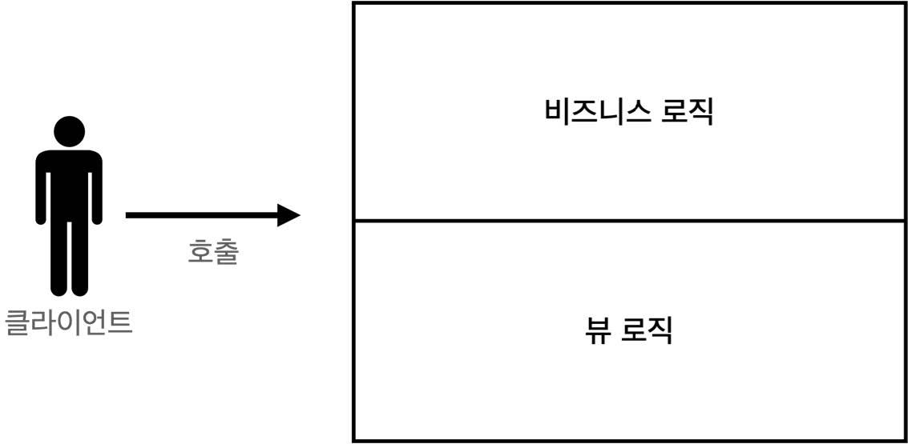
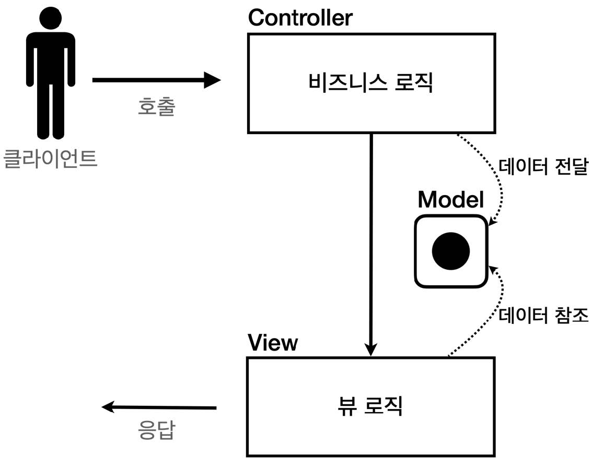
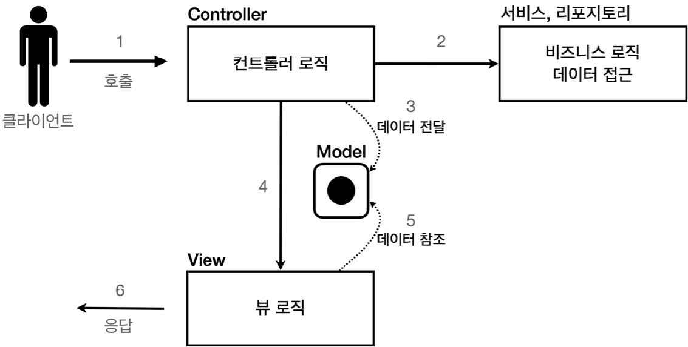

## 섹션 03. 서블릿, JSP, MVC 패턴
### 04. MVC 패턴 - 개요
- 너무 많은 역할
  - 하나의 서블릿이나 JSP만으로 비즈니스 로직과 뷰 렌더링까지 모두 처리하게 되면, 너무 많은 역할을 하게 된다.
  - 이는 결과적으로 유지보수의 어려움을 초래한다.
- 변경 라이프 사이클
  - 비즈니스 로직과 뷰 로직의 사이, 변경 라이프 사이클이 다르다.
  - 수정에 있어서 서로에게 영향을 주는 경우는 드물다.
  - 변경 라이프 사이클이 다른데 하나의 코드로 관리!?, 유지보수의 불편함만 초래한다.
- 기능 특화
  - 특정 기능에 특화 되어있다면 해당 부분만 담당토록 하자!
    - JSP 같은 뷰 템플릿은 화면 렌더링에 최적화 되어 있다.
- Model View Controller
  - MVC 패턴은 단일 서블릿 or JSP로 처리하던 것을 컨트롤러(Controller)와 뷰(View)라는 영역으로 역할을 나눈 것을 말한다.
  - 웹 애플리케이션의 경우 보통 `MVC패턴`을 사용한다.
  - `Controller` : HTTP 요청을 받아 파라미터 검증, 비즈니스 로직 실행한다. `View`에서 사용할 결과 데이터를 조회해 `Model`에 담는다.
  - `Model` : `View`에 출력할 데이터를 담아둔다.
  - `View` : `Model`에 담겨있는 데이터를 통해 화면을 렌더링한다. HTML을 생성하는 걸 말함  
 

#### 참고
- 컨트롤러에 비즈니스 로직을 담을 수도 있지만 이는 컨트롤러의 역할이 너무 많아진다.
- 일반적으로 비즈니스 로직은 서비스(Service) 계층을 별도로 만들어 처리한다.
  - 이 때, 컨트롤러는 필요한 비즈니스 로직이 있는 서비스를 호출하는 역할을 담당한다.
- 비즈니스 로직 변경 시 호출 컨트롤러의 코드도 변경될 수 있다.  
 

- 단일 서블릿, JSP 사용

- MVC 패턴 사용1

- MVC 패턴 사용
