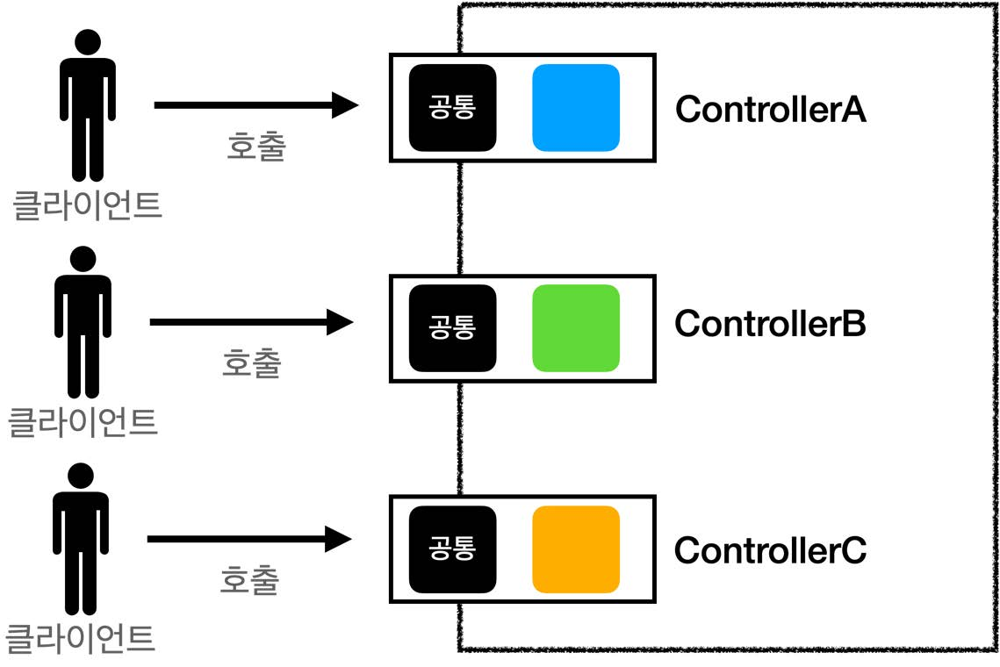

# 섹션 04. MVC 프레임워크 만들기
## 01. 프론트 컨트롤러 패턴 소개
### 프론트 컨트롤러 도입 전
  
 

### 프론트 컨트롤러 도입 후
  
 

### FrontController 패턴 특징
- 프론트 컨트롤러 서블릿 하나로 클라이언트의 요청을 받음
  - 요청에 맞는 컨트롤러를 찾아서 호출해준다.
- 공통 처리 가능
- 프론트 컨트롤러를 제외한 나머지 컨트롤러들은 서블릿을 사용하지 않아도 된다.  
 

### 스프링 웹 MVC와 프론트 컨트롤러
- 스프링 웹 MVC의 핵심이 `FrontController`이다.
- 스프링 웹 MVC의 `DispatcherServlet`이 프론트 컨트롤러 패턴으로 구현되어 있다.  
   

## 02. 프론트 컨트롤러 도입 - v1
### v1 구조
  
   

## 03. View 분리 - v2
### v2 구조
  
   

## 04. Model 추가 - v3 ★★★
### v3 구조
  
   

## 05. 단순하고 실용적인 컨트롤러 - v4
### v4 구조

- 구조가 `v3`와 동일하다.
- 단, `Controller`가 `ModelView`가 아닌 `ViewName`만을 반환한다.  
   

## 06. 유연한 컨트롤러1 - v5
### v5 구조

- 핸들러 어댑터 : 중간 어댑터 역할을 하는 어댑터
  - 다양한 종류의 컨트롤러를 호출할 수 있음
- 핸들러 : 컨트롤러의 확장(넓은 의미), 이제 어댑터가 존재하기 때문
  - 어떠한 종류들 해당 어댑터가 있다면 다 처리가 가능함
