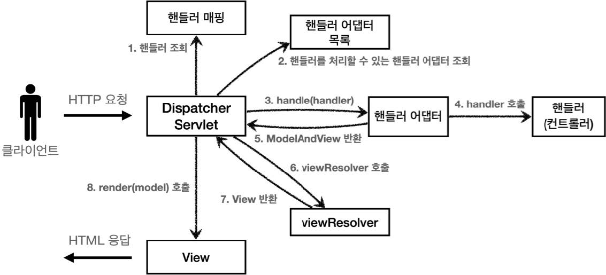

# 섹션 05. 스프링 MVC - 구조 이해
## 01. 스프링 MVC 전체 구조
### Spring MVC 구조

- 앞서 만든 프레임워크와 비교
  - FrontController -> `DispatcherServlet`
  - handlerMappingMap -> `HandlerMapping`
  - MyHandlerAdapter -> `HandlerAdapter`
  - ModelView -> `ModelAndView`
  - viewResolver -> `ViewResolver`
  - MyView -> `View`  
<br/>

### DispatcherServlet 구조
`org.springframework.web.servlet.DispatcherServlet`
- 컨트롤러 패턴으로 구현되어 있음
- Spring MVC의 프론트 컨트롤러가 `DispatcherServlet`이며, 핵심임  
<br/>

### DispatcherServlet 등록
- `DispatcherServlet` 또한 부모 클래스에서 `HttpServlet`을 상속받아 사용, 서블릿으로 동작
  - 상속 : DispatcherServlet -> FrameworkServlet -> HttpServletBean -> HttpServlet
- 스프링 부트의 경우 `DispatcherServlet`을 서블릿으로 자동등록 하면서 `모든 경로(urlPatterns="/")`에 대해 매핑함
  - 더 자세한 경로가 우선순위가 높으며, 기존에 등록한 서블릿도 동작함  
<br/>

### 요청 흐름
- 서블릿 호출 `HttpServlet`이 제공하는 `service()`가 호출 됨
- 스프링 MVC는 `DispatcherServlet`의 부모인 `FrameworServlet`에서 `service()`를 오버라이드 해둠
- `FrameworkServlet.service()`를 시작으로 여러 메서드가 호출되며 `DispatcherServlet.doDispatch()`가 호출 됨
```
//DispacherServlet.doDispatch()

protected void doDispatch(HttpServletRequest request, HttpServletResponseresponse) throws Exception {
    
    HttpServletRequest processedRequest = request;
    HandlerExecutionChain mappedHandler = null;
    ModelAndView mv = null;

    // 1. 핸들러 조회
    mappedHandler = getHandler(processedRequest);
    if (mappedHandler == null) {
        noHandlerFound(processedRequest, response);
        return;
    }

    // 2. 핸들러 어댑터 조회 - 핸들러를 처리할 수 있는 어댑터
    HandlerAdapter ha = getHandlerAdapter(mappedHandler.getHandler());

    // 3. 핸들러 어댑터 실행 -> 4. 핸들러 어댑터를 통해 핸들러 실행 -> 5. ModelAndView 반환
    mv = ha.handle(processedRequest, response, mappedHandler.getHandler());

    processDispatchResult(processedRequest, response, mappedHandler, mv, dispatchException);

}

private void processDispatchResult(HttpServletRequest request, HttpServletResponse response,
        HandlerExecutionChain mappedHandler, ModelAndView mv, Exception exception) throws Exception {
    
    // 뷰 렌더링 호출
    render(mv, request, response);
}

protected void render(ModelAndView mv, HttpServletRequest request, HttpServletResponse response) throws Exception {
    View view;
    String viewName = mv.getViewName();

    // 6. 뷰 리졸버를 통해서 뷰 찾기, 7. View 반환
    view = resolveViewName(viewName, mv.getModelInternal(), locale, request);

    // 8. 뷰 렌더링
    view.render(mv.getModelInternal(), request, response);
}
```
- 동작 순서
  1. `핸들러 조회`: 핸들러 매핑을 통해 요청 URL에 매핑된 핸들러(컨트롤러)를 조회한다.
  2. `핸들러 어댑터 조회`: 핸들러를 실행할 수 있는 핸들러 어댑터를 조회한다.
  3. `핸들러 어댑터 실행`: 핸들러 어댑터를 실행한다.
  4. `핸들러 실행`: 핸들러 어댑터가 실제 핸들러를 실행한다.
  5. `ModelAndView 반환`: 핸들러 어댑터는 핸들러가 반환하는 정보를 ModelAndView로 변환해서 반환한다.
  6. `viewResolver 호출`: 뷰 리졸버를 찾고 실행한다.  
      JSP의 경우: `InternalResourceViewResolver`가 자동 등록되고, 사용된다.
  7. `View 반환`: 뷰 리졸버는 뷰의 논리 이름을 물리 이름으로 바꾸고, 렌더링 역할을 담당하는 뷰 객체를 반환한다.  
      JSP의 경우 `InternalResourceView(JstlView)`를 반환하는데, 내부에 `forward()`로직이 있다.
  8. `뷰 렌더링`: 뷰를 통해서 뷰를 렌더링 한다.  
<br/>

### 주요 인터페이스
- 핸들러 매핑: `org.springframework.web.servlet.HandlerMapping`
- 핸들러 어댑터: `org.springframework.web.servlet.HandlerAdapter`
- 뷰 리졸버: `org.springframework.web.servlet.ViewResolver`
- 뷰: `org.springframework.web.servlet.View`
- 스프링 MVC의 큰 강점이며 인터페이스 제공으로 `DispatcherServlet`코드 변경 없이 원하는 기능을 변경하거나 확장 가능하다.