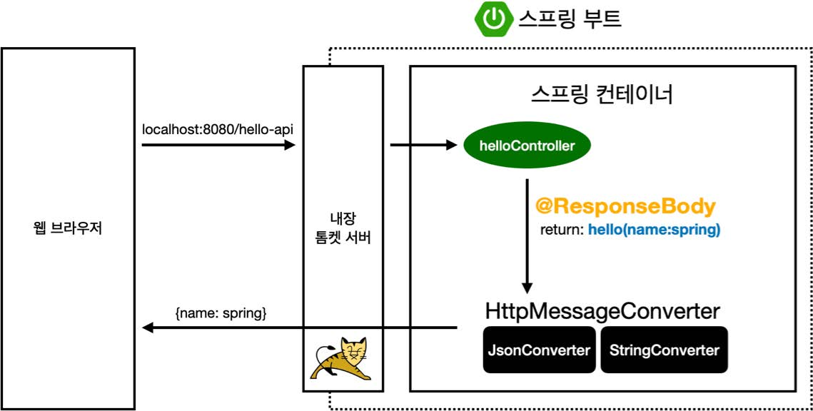

# 섹션 06. 스프링 MVC - 기본 기능
## 13. HTTP 메시지 컨버터
뷰 템플릿으로 HTML을 생성하고 응답하는 것이 아닌 `HTTP API`처럼 JSON 데이터를 HTTP 메시지 바디에서 직접 읽거나 쓰는 경우 `HTTP 메시지 컨버터`를 사용하면 편리하다.  
<br/>

### @ResponseBody 사용 원리

- @ResponseBody 사용 
  - HTTP의 BODY에 문자 내용을 직접 반환
  - `viewResolver`대신 `HttpMessageConverter`가 동작함
    - 기본 문자 처리: `StringHttpMessageConverter`
    - 기본 객체 처리: `MappingJackson2HttpMessageConverter`
    - byte 처리 등, 기타 여러 `HttpMessageConverter`가 기본적으로 등록되어 있음  
<br/>

### 스프링 MVC는 아래의 경우에 HTTP 메시지 컨버터를 적용
- HTTP 요청: `@RequestBody`, `HttpEntity(RequestEntity)`
- HTTP 응답: `@ResponseBdoy`, `HttpEntity(ResponseEntity)`  
<br/>

### HTTP 메시지 컨버터 인터페이스
```
org.springframework.http.converter.HttpMessageConverter
```
- HTTP 메시지 컨버터는 HTTP 요청/응답 둘다 사용 됨
  - `canRead()`, `canWrite()`: 메시지 컨버터가 해당 클래스, 미디어타입을 지원하지는지 체크
  - `read()`, `write()`: 메시지 컨버터를 통해 메시지를 읽고 쓰는 기능  
<br/>

### 스프링 부트 기본 메시지 컨버터
스프링 부트는 다양한 메시지 컨버터를 제공한다. 이 때 대상 클래스 타입과 미디어 타입을 체크해 사용여부를 결정한다. 만약 조건을 만족하지 않는다면 다음 메시지 컨버터로 우선순위를 넘긴다.
- 주요 메시지 컨버터
  - `ByteArrayHttpMessageConverter`: `byte[] 데이터` 처리
    - 클래스 타입: `byte[]`, 미디어타입: `*/*`
    - 요청 ex) `@RequestBody byte[] data`
    - 응답 ex) `@ResponseBody return byte[]` 쓰기 미디어타입 `application/octet-stream`
  - `StringHttpMessageConverter` : `String 문자`로 데이터 처리
    - 클래스 타입: `String`, 미디어타입: `*/*`
    - 요청 ex) `@RequestBody String data`
    - 응답 ex) `@ResponseBody return "ok"` 쓰기 미디어타입 `text/plain`
  - `MappingJackson2HttpMessageConverter` : `application/json`
    - 클래스 타입: `객체 or HashMap`, 미디어타입 `application/json 관련`
    - 요청 ex) `@RequestBody HelloData data`
    - 응답 ex) `@ResponseBody return helloData` 쓰기 미디어타입 `application/json 관련`  
<br/>

### HTTP 요청 데이터 읽기
- HTTP 요청이 오고, 컨트롤러에서 `@RequestBody`, `HttpEntity`파라미터를 사용
- 메시지 컨버터가 메시지를 읽을 수 있는지 확인을 위해 `canRead()` 호출
  - 대상 클래스 타입 지원 여부 확인
    - ex) `@RequestBody`의 대상 클래스 (`byte[]`, `String`, `HelloData`)
  - HTTP 요청의 Content-Type 미디어 타입 지원 여부 확인
    - ex) `text/plain`, `application/json`, `*/*`
- `canRead()` 조건을 만족하면 `read()`를 호출해 객체를 생성/반환 함  
<br/>

### HTTP 응답 데이터 생성
- 컨트롤러에서 `@ResponseBody`, `HttpEntity`로 값이 반환함
- 메시지 컨버터가 메시지를 작성할 수 있는지 확인을 위해 `canWrite()`를 호출
  - 대상 클래스 타입 지원 여부 확인
    - ex) return의 대상 클래스 (`byte[]`, `String`, `HelloData`)
  - HTTP 요청의 Accept 미디어 타입 지원 여부 확인.(정확히는 `@RequestMapping의 produces`)
    - ex) `text/plain`, `application/json`, `*/*`
- `canWrite()` 조건을 만족하면 `write()`를 호출해 HTTP 응답 메시지 바디에 데이터를 생성