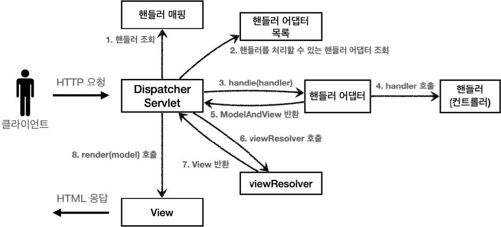
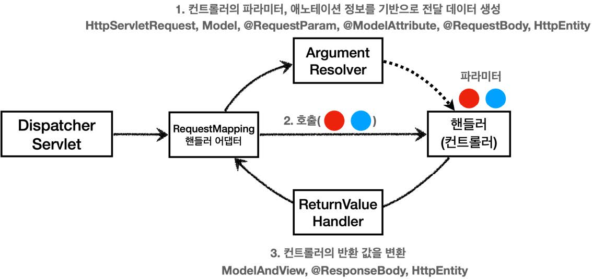
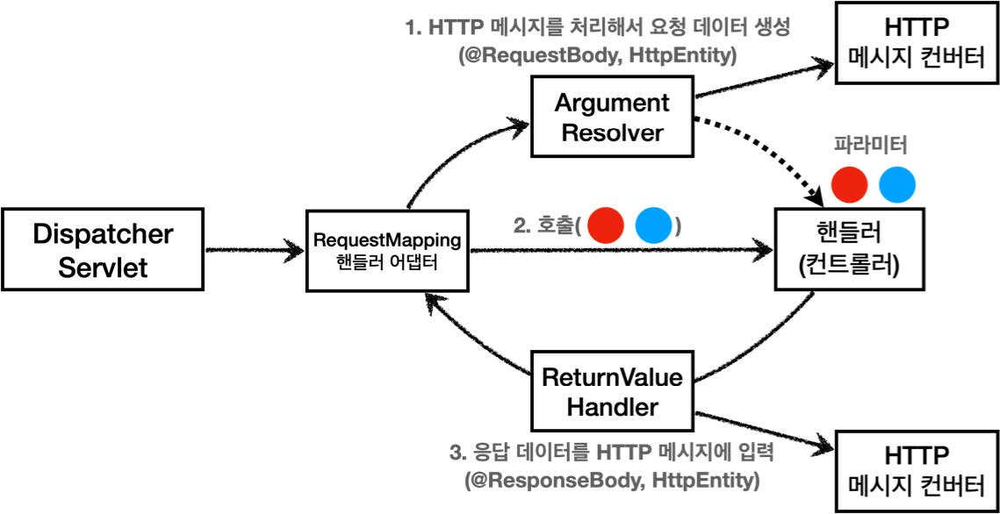

# 섹션 06. 스프링 MVC - 기본 기능
## 13. HTTP 메시지 컨버터
뷰 템플릿으로 HTML을 생성하고 응답하는 것이 아닌 `HTTP API`처럼 JSON 데이터를 HTTP 메시지 바디에서 직접 읽거나 쓰는 경우 `HTTP 메시지 컨버터`를 사용하면 편리하다.  
<br/>

### @ResponseBody 사용 원리

- @ResponseBody 사용 
  - HTTP의 BODY에 문자 내용을 직접 반환
  - `viewResolver`대신 `HttpMessageConverter`가 동작함
    - 기본 문자 처리: `StringHttpMessageConverter`
    - 기본 객체 처리: `MappingJackson2HttpMessageConverter`
    - byte 처리 등, 기타 여러 `HttpMessageConverter`가 기본적으로 등록되어 있음  
<br/>

### 스프링 MVC는 아래의 경우에 HTTP 메시지 컨버터를 적용
- HTTP 요청: `@RequestBody`, `HttpEntity(RequestEntity)`
- HTTP 응답: `@ResponseBdoy`, `HttpEntity(ResponseEntity)`  
<br/>

### HTTP 메시지 컨버터 인터페이스
```
org.springframework.http.converter.HttpMessageConverter
```
- HTTP 메시지 컨버터는 HTTP 요청/응답 둘다 사용 됨
  - `canRead()`, `canWrite()`: 메시지 컨버터가 해당 클래스, 미디어타입을 지원하지는지 체크
  - `read()`, `write()`: 메시지 컨버터를 통해 메시지를 읽고 쓰는 기능  
<br/>

### 스프링 부트 기본 메시지 컨버터
스프링 부트는 다양한 메시지 컨버터를 제공한다. 이 때 대상 클래스 타입과 미디어 타입을 체크해 사용여부를 결정한다. 만약 조건을 만족하지 않는다면 다음 메시지 컨버터로 우선순위를 넘긴다.
- 주요 메시지 컨버터
  - `ByteArrayHttpMessageConverter`: `byte[] 데이터` 처리
    - 클래스 타입: `byte[]`, 미디어타입: `*/*`
    - 요청 ex) `@RequestBody byte[] data`
    - 응답 ex) `@ResponseBody return byte[]` 쓰기 미디어타입 `application/octet-stream`
  - `StringHttpMessageConverter` : `String 문자`로 데이터 처리
    - 클래스 타입: `String`, 미디어타입: `*/*`
    - 요청 ex) `@RequestBody String data`
    - 응답 ex) `@ResponseBody return "ok"` 쓰기 미디어타입 `text/plain`
  - `MappingJackson2HttpMessageConverter` : `application/json`
    - 클래스 타입: `객체 or HashMap`, 미디어타입 `application/json 관련`
    - 요청 ex) `@RequestBody HelloData data`
    - 응답 ex) `@ResponseBody return helloData` 쓰기 미디어타입 `application/json 관련`  
<br/>

### HTTP 요청 데이터 읽기
- HTTP 요청이 오고, 컨트롤러에서 `@RequestBody`, `HttpEntity`파라미터를 사용
- 메시지 컨버터가 메시지를 읽을 수 있는지 확인을 위해 `canRead()` 호출
  - 대상 클래스 타입 지원 여부 확인
    - ex) `@RequestBody`의 대상 클래스 (`byte[]`, `String`, `HelloData`)
  - HTTP 요청의 Content-Type 미디어 타입 지원 여부 확인
    - ex) `text/plain`, `application/json`, `*/*`
- `canRead()` 조건을 만족하면 `read()`를 호출해 객체를 생성/반환 함  
<br/>

### HTTP 응답 데이터 생성
- 컨트롤러에서 `@ResponseBody`, `HttpEntity`로 값이 반환함
- 메시지 컨버터가 메시지를 작성할 수 있는지 확인을 위해 `canWrite()`를 호출
  - 대상 클래스 타입 지원 여부 확인
    - ex) return의 대상 클래스 (`byte[]`, `String`, `HelloData`)
  - HTTP 요청의 Accept 미디어 타입 지원 여부 확인.(정확히는 `@RequestMapping의 produces`)
    - ex) `text/plain`, `application/json`, `*/*`
- `canWrite()` 조건을 만족하면 `write()`를 호출해 HTTP 응답 메시지 바디에 데이터를 생성  
<br/><br/><br/>

## 14. 요청 매핑 핸들러 어댑터 구조
### Spring MVC 구조

- 핵심은 애노테이션 기반의 컨트롤러(= `@RequestMapping`)를 처리하는 핸들러 어댑터인 요청 매핑 핸들러 어댑터(=`RequestMappingHnadlerAdapter`)에 있음  
<br/>

### RequestMappingHandlerAdapter 동작 방식

<br/>
- `ArgumentResolver`
  - 애노테이션 기반의 컨트롤러는 매우 다양한 파라미터를 사용 가능함 (= 유연함↑)
    - `HttpServletRequest`, `Model`
    - 애노테이션: `@RequestParam`, `@ModelAttribute`
    - HTTP 메시지 처리: `@RequestBody`, `HttpEntity`
  - 애노테이션 기반 컨트롤러를 처리하는 `RequestMappingHandlerAdapter`는 `ArgumentResolver`를 호출
    - `컨트롤러(핸들러)`가 필요로 하는 다양한 `파라미터의 값(객체)` 생성
  - 스프링의 경우 30개 이상의 `ArgumentResolver`를 기본적으로 제공함
- `동작 방식`
  - `ArgumentResolver`의 `supportsParameter()` 호출, 해당 파라미터를 지원하는지 체크
  - 지원한다면 `resolveArgument()` 호출, 실제 객체를 생성
  - 생성된 객체는 컨트롤러 호출시 넘어감
- `ReturnValueHandler` (= `HandlerMethodReturnValueHandler`의 줄임말)
  - `ArgumentResolver`와 비슷, `응답 값을 변환하고 처리`함
  - 컨트롤러에서 `String`으로 `뷰 이름`으로 반환해도 동작하는 이유
  - 스프링의 경우 10여개의 `ReturnValueHandler`를 지원함
    - ex) `ModelAndView`, `@ResponseBody`, `HttpEntity`, `String`  
<br/>

### HTTP 메시지 컨버터
#### HTTP 메시지 컨버터 위치

- HTTP 메시지 컨버터를 사용하는 `@RequestBody`도 컨트롤러가 필요로 하는 파라미터의 값에 사용됨
- `@ResponseBody`의 경우도 컨트롤러의 반환 값을 이용함
- `요청의 경우`
  - `@RequestBody`를 처리하는 `ArgumentResolver`가 있고, `HttpEntity`를 처리하는 `ArgumentResolver`가 있음 
  - `ArgumentResolver`들이 HTTP 메시지 컨버터를 사용해서 `필요한 객체를 생성`
- `응답의 경우` 
  - @ResponseBody 와 HttpEntity 를 처리하는 ReturnValueHandler 가 있다. 그리고
  - 여기에서 HTTP 메시지 컨버터를 호출해서 응답 결과를 만든다.
- 스프링 MVC
  - `@RequestBody, @ResponseBody`가 있으면 `RequestResponseBodyMethodProcessor(ArgumentResolver)`를 사용
  - `HttpEntity`가 있으면 `HttpEntityMethodProcessor(ArgumentResolver)`를 사용  
<br/>

### 확장
- 스프링은 다음을 모두 인터페이스로 제공한다. 필요하면 언제든지 기능을 확장할 수 있다.
  - `HandlerMethodArgumentResolver`
  - `HandlerMethodReturnValueHandler`
  - `HttpMessageConverter`
- 사실 스프링이 대부분의 기능을 제공하기에 실제 기능을 확장할 일이 많지는 않음
  - 기능 확장은 `WebMvcConfigurer`를 상속 받아서 스프링 빈으로 등록하면 됨