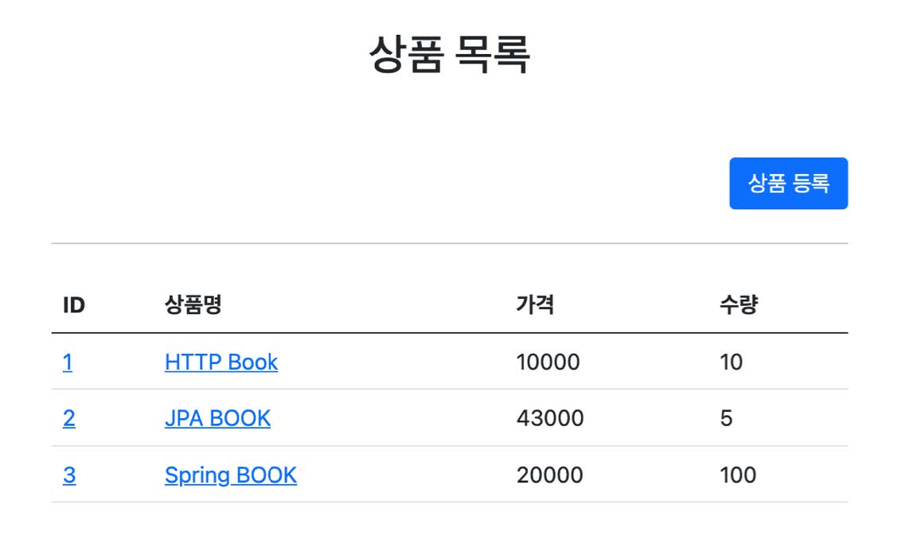
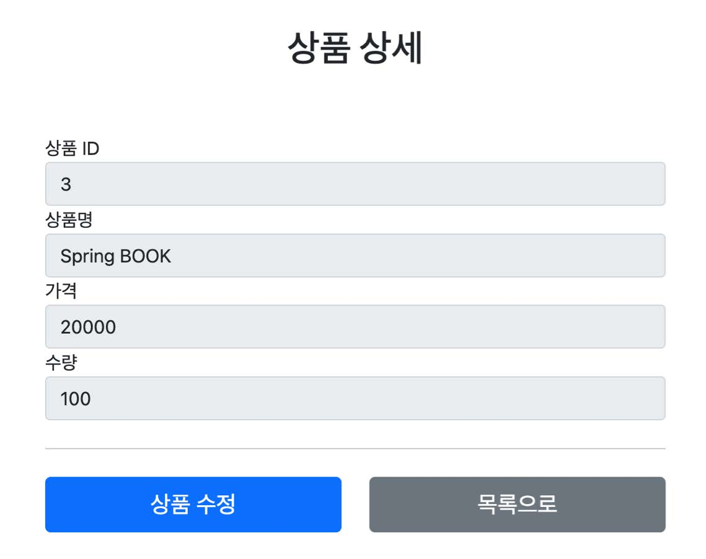
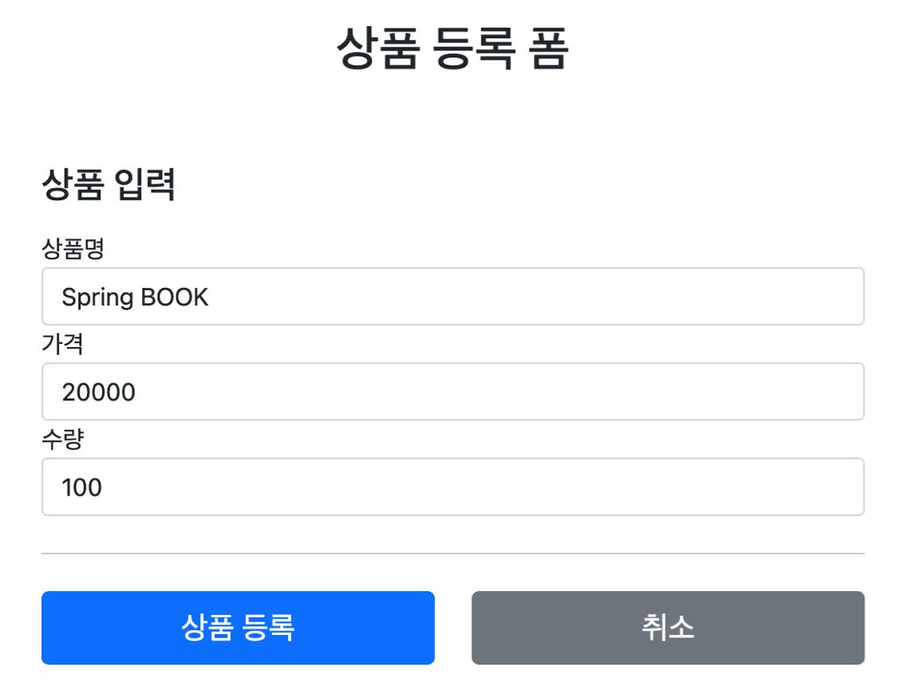
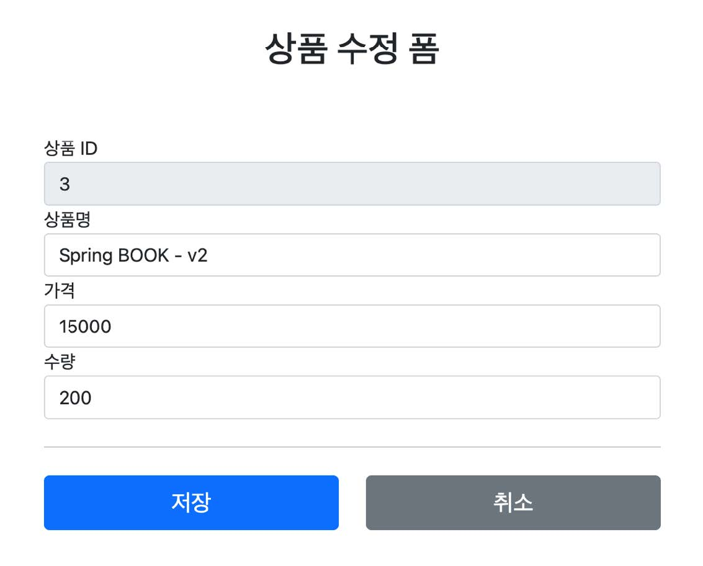
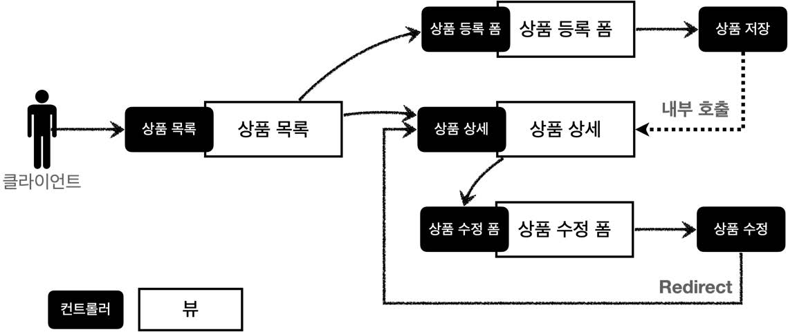

# 섹션 07. 스프링 MVC - 웹 페이지 만들기
## 02. 요구사항 분석
### 상품 관리 서비스 개발
- 상품 도메인 모델
  - 상품 ID
  - 상품명
  - 가격
  - 수량
- 상품 관리 기능
  - 상품 목록
  - 상품 상세
  - 상품 등록
  - 상품 수정  
 

### 서비스 화면

  
 

### 서비스 제공 흐름도

- 개발 업부 분담(가정)
  - `디자이너`: 요구사항에 맞도록 디자인하고, 디자인 결과물을 웹 퍼블리셔에게 넘겨줌
  - `웹 퍼블리셔`: 다자이너에서 받은 디자인을 기반으로 HTML, CSS를 만들어 개발자에게 제공
  - `백엔드 개발자`: 디자이너, 웹 퍼블리셔를 통해서 HTML 화면이 나오기 전까지 시스템을 설계하고, 핵심 비즈니스 모델을 개발
    - 이후 HTML이 나오면 이 HTML을 뷰 템플릿으로 변환해서 동적으로 화면을 또 웹 화면의 흐름을 제어  
 

### 참고!
- React, Vue.js 같은 웹 클라이언트 기술을 사용하고, 웹 프론트엔드 개발자가 별도로 있으면, 웹 프론트엔드 개발자가 웹 퍼블리셔 역할까지 포함해서 하는 경우도 있음
- 웹 클라이언트 기술을 사용하면, 웹 프론트엔드 개발자가 HTML을 동적으로 만드는 역할과 웹 화면의 흐름을 담당
  - 이 경우 백엔드 개발자는 HTML 뷰 템플릿을 직접 만지는 대신에, HTTP API를 통해 웹 클라이언트가 필요로 하는 데이터와 기능을 제공하면 됨