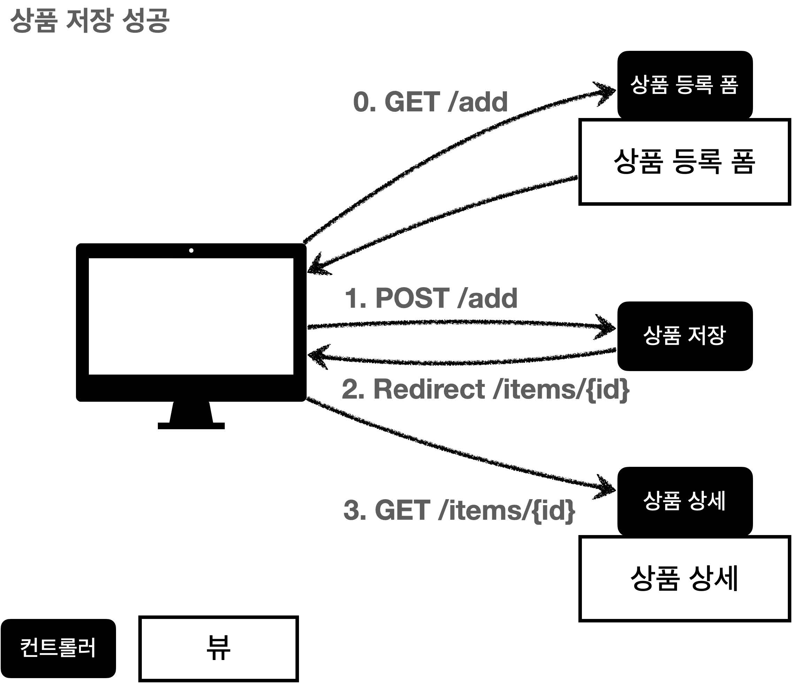
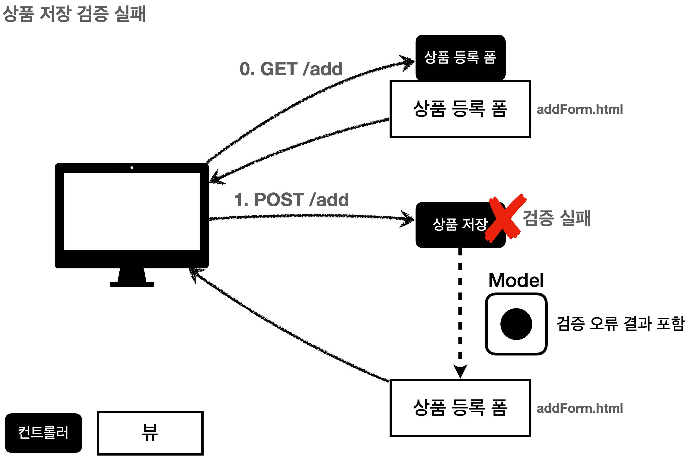

# 섹션 04. 검증1 - Validation
## 01. 검증 요구사항
상품 관리 시스템에 새로운 요구사항 등장!
- 요구사항: 검증 로직 추가
  - 타입 검증
    - 가격, 수량에 문자가 있다면 검증 오류 처리
  - 필드 검증
    - 상품명: 입력 필수, 공백x
    - 가격: 1,000원 이상 1,000,000 이하
    - 수량: 최대 9999
  - 특정 필드의 범위를 넘어서는 검증
    - 가격*수량의 합은 10,000원 이상  
 

### 검증 오류 이유 제공
현재 상태의 `상품 관리 시스템`은 검증 오류가 발생하면 오류 화면으로 이동한다. 
이렇게 되면 사용자는 다시 처음부터 데이터를 입력해야하는 불편함을 겪게된다. 
그렇기에 시스템에서는 사용자가 입력 실수로 오류가 발생한다면 어떤 오류가 발생했는지를 알려줄 필요가 있다.
- `컨트롤러의 중요한 역할 중 하나는 HTTP 요청이 정상인지 검증하는 것`, 검증 로직 개발이 어쩌면 더 어려울 수도...
- 클라이언트 검증, 서버 검증
  - 클라이언트 검증은 조작할 수 있음 -> 보안에 취약
  - 서버만으로 검증 시 즉각적인 고객 사용성이 부족해짐
  - 둘을 적절히 섞어 사용하고 최종적으로 서버 검증은 필수
  - API 방식을 사용하면 API 잘 정의해서 검증 오류를 API 응답 결과에 잘 남겨야함  
   

## 03. 검증 직접 처리 - 소개
### 상품 저장 검증 성공 시

사용자가 정상범위의 데이터를 입력 할 경우 서버에선 검증 로직이 통과하고, 상품 저장, 상품 상세 화면으로 redirect 함  
 

### 상품 저장 검증 실패 시

사용자가 정상범위가 아닌 데이터를 입력 할 경우 서버 검증 로직이 실패해야 함 
이 경우 다시 한번 사용자에게 상품 등록 화면을 보여주고 오류 발생의 원인이 무엇인지 알려줄 필요가 있음  
   

## 07. BindingResult2
### BindingResult
- 스프링이 제공하는 검증 오류를 보관하는 객체, 검증 오류가 발생하면 해당 객체에 보관하면 됨
- `BindingResult`가 있다면 `@ModelAttribute`에 데이터 바인딩 시 오류가 발생해도 컨트롤러가 호출 됨
  - 예시로 `@ModelAtrribute`에 바인딩 시 오류가 발생한다면?
    - `BindingResult`없음: 400 오류 발생, 컨트롤러가 호출되지 않고 오류 페이지로 이동
    - `BindingRESULT`있음: 오류 정보(FieldError)를 BindingResult에 담아 컨트롤러를 정상 호출  
 

### BindingResult에 검증 오류 적용방법 3가지
- `@ModelAttribute`의 객체에 타입 오류 등으로 바인딩이 실패하는 경우 스프링이 `FieldError`생성해 `BindginResult`에 넣어줌
- 개발자가 직접 넣어줌
- `Validator`사용  
 

### 타입 오류 확인
숫자가 입력되어야 할 곳에 문자를 입력해 타입을 다르게해 `BindingResult`를 호출 `bindingResult`의 값을 확인  
 

### 주의
- `BindingResult`는 검증할 대상 바로 다음에 와야함 (순서 중요)
- `BindingResult`는 Model에 자동으로 포함됨  
 

### BindingResult와 Errors
- `BindingResult`는 인터페이스며 `Errors` 인터페이스를 상속받고 있음
  - 구현체는 `BeanPropertyBindingResult`이며 두 인터페이스 모두 구현하고 있음
- 사실 `Errors`를 `BindingResult` 대신에 사용해도 됨
  - `Errors`: 단순한 오류 저장과 조회 기능 제공
  - `BindingResult`: Errors가 제공하는 기능 + 추가적인 기능 제공
  - 기능들 더 많이 제공하는 `BindingResult`를 많이 사용함