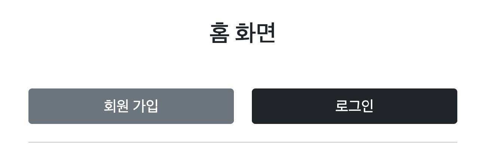
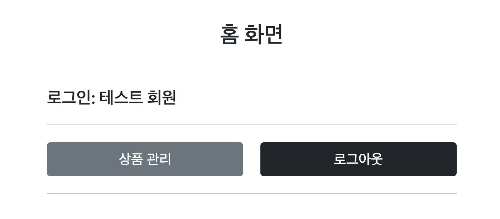
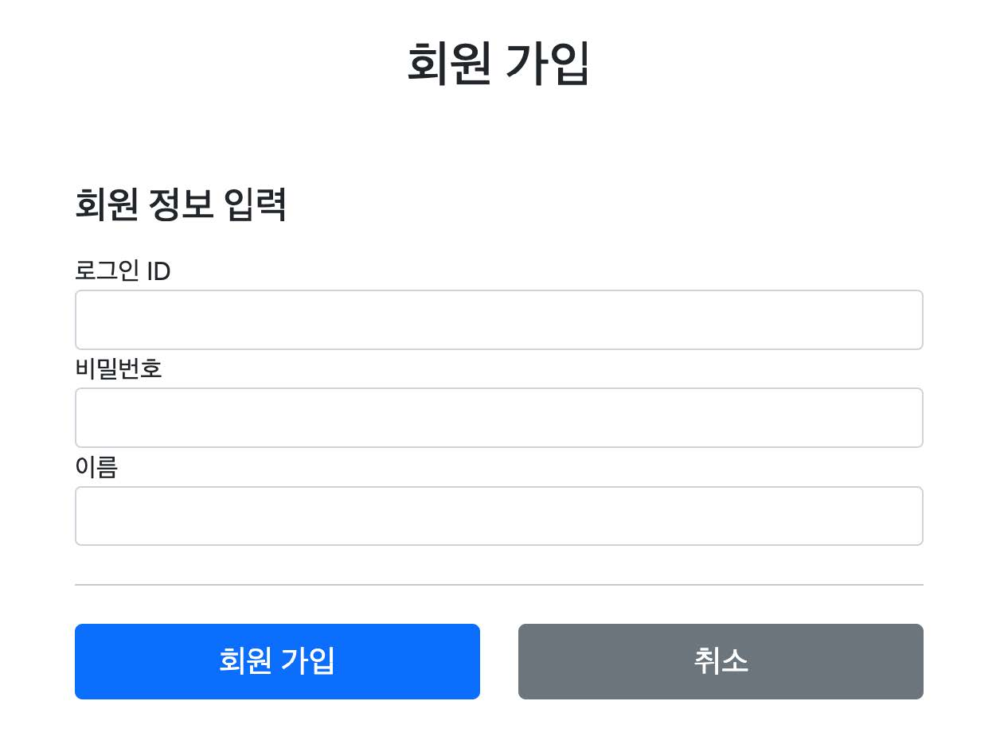
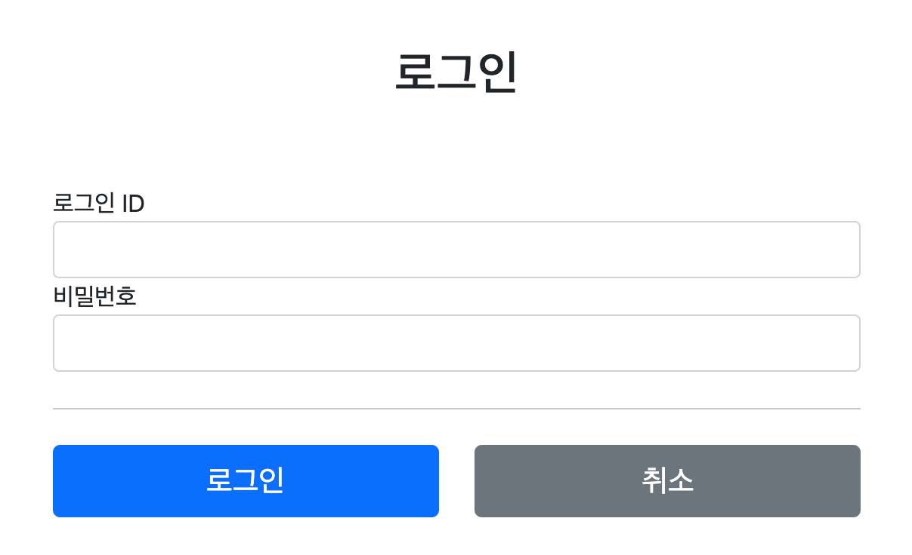
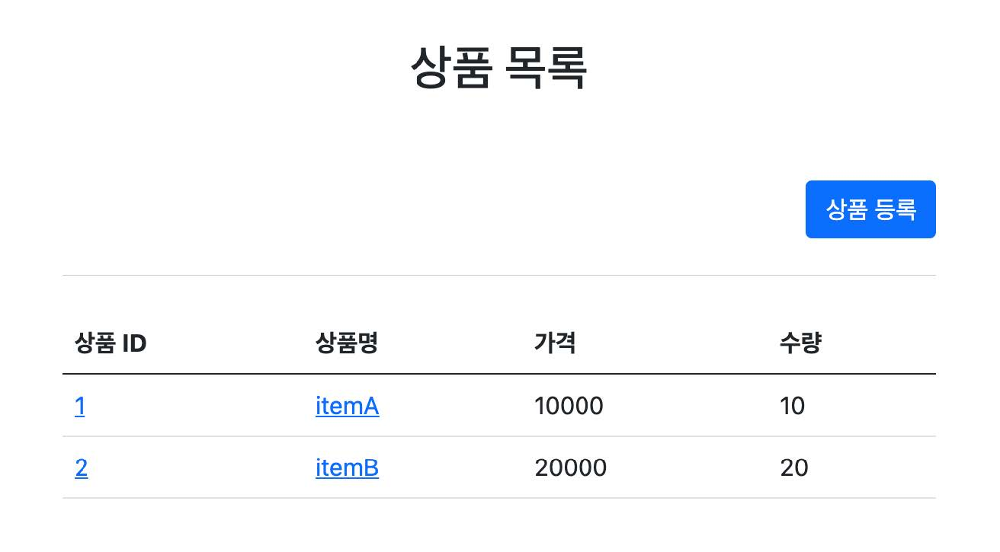
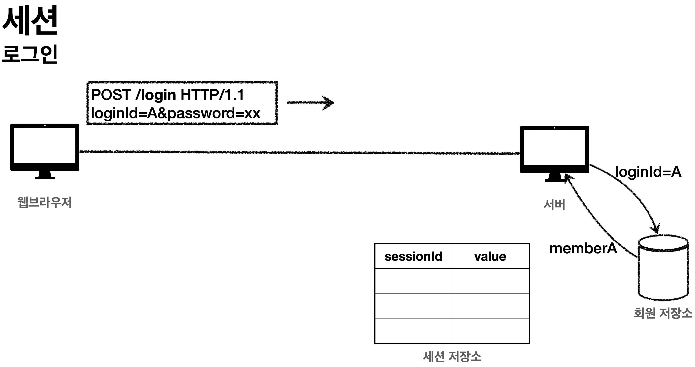
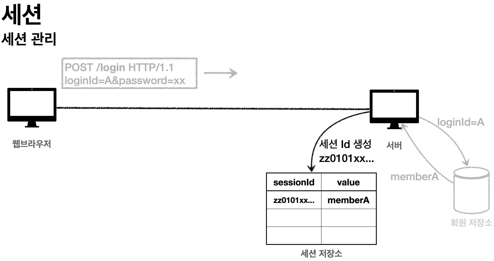
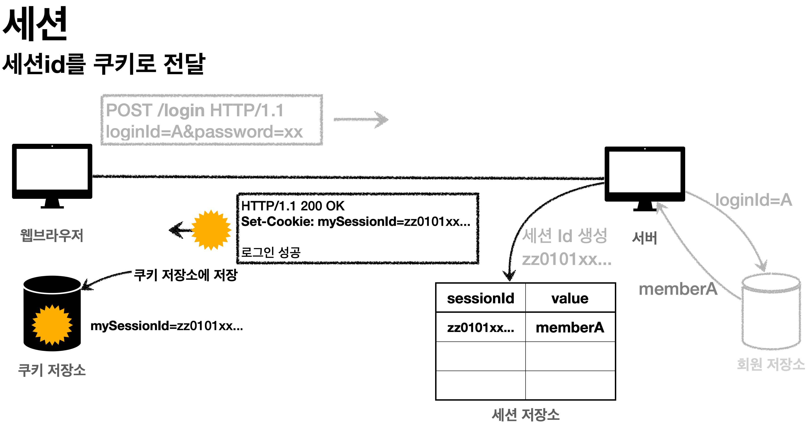
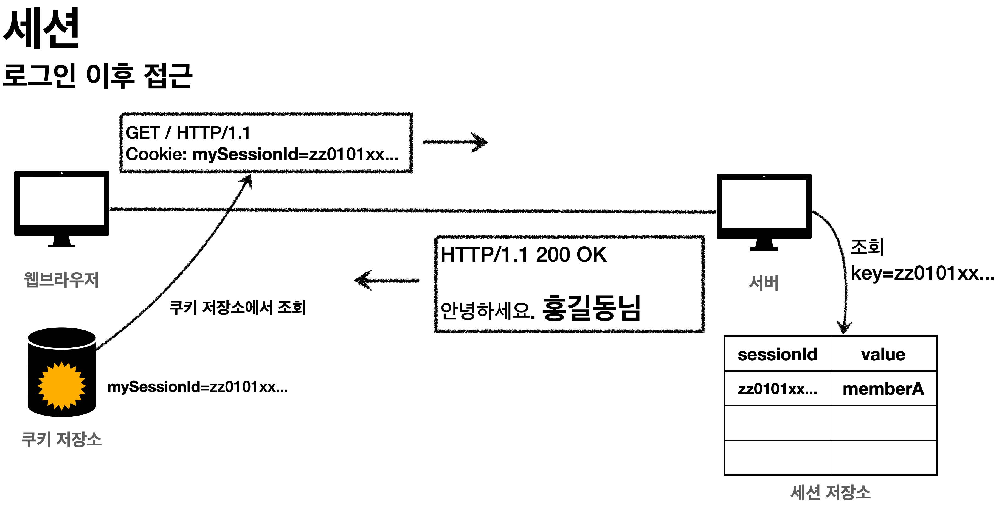

# 섹션 06. 로그인 처리1 - 쿠키, 세션
## 01. 로그인 요구사항
- 홈 화면 - 로그인 전
  - 회원가입
  - 로그인
- 홈 화면 - 로그인 후
  - 본인 이름(누구님 환영합니다.)
  - 상품 관리
  - 로그 아웃
- 보안 요구사항
  - 로그인 사용자만 상품에 접근하고, 관리할 수 있음
  - 로그인 하지 않은 사용자가 상품 관리에 접근하면 로그인 화면으로 이동
- 회원 가입, 상품 관리  
 

### 홈 화면 - 로그인 전
  
 

### 홈 화면 - 로그인 후
  
 

### 회원 가입
  
 

### 로그인
  
 

### 상품 관리
  
   

## 02. 프로젝트 생성
### 패키지 구조 설계
#### package 구조
- hello.login
  - domain
    - item
    - member
    - login
  - web
    - item
    - member
    - login  
 

#### 도메인이 가장 중요!
`도메인`: 화면, UI, 기술 인프라 등의 영역을 제외한 시스템이 구현해야 하는 비즈니스 업무 영역을 말함
- 향후 `web`을 다른 기술로 수정해도 `도메인은 그대로 유지`할 수 있어야 함
  - 즉, `web`은 `domain`을 알고 있지만 `domain`은 `web`을 모르도록 설계해야 함
  - 의존관계: `web --> domain`, `domain -X-> web`  
   

## 07. 쿠키와 보안 문제
쿠키를 사용해 로그인 ID를 전달해 로그인을 유지할 수 있었음 
하지만 이렇게 되면 `심각한 보안 문제`가 발생한다.  
 

### 보안 문제
- 쿠키 값은 임의로 변경 가능함
  - 클라이언트가 쿠키를 강제로 변경하면 다른 사용자가 됨
  - 실제 웹 브라우저 개발자모드 -> Application -> Cookie 변경으로 확인 가능함
  - `Cookie: memberId=1` -> `Cookie: memberId=2` (다른 사용자명이 확인됨)
- 쿠키에 보관된 정보는 훔칠 수 있음
  - 쿠키에 개인정보 또는 신용카드 정보가 있다면?
    - 웹 브라우저에 해당 정보가 보관되고 네트워크 요청시 마다 계속 클라이언트에서 서버로 전달 될 것임
  - 쿠키 정보가 사용자의 로컬 PC에서 털릴 수도 있고 네트워크 전송 구간에서 도난당할 수 있음
- 해커가 쿠키를 해킹하는데 성공할 경우
  - 쿠키를 평생 이용할 수 있고 그 동안 악의적인 요청을 계속 시도할 수 있음  
 

### 대안
- 쿠키에 중요한 정보를 노출하지 않고, 사용자 별로 예측 할 수 없는 `임의의 토큰(랜덤 값)`을 노출하도록 함
  - 또한 토큰과 사용자 id를 매핑해 서버에서 인식하고 토큰은 서버에서 관리하도록 한다.
- 설령 해커가 토큰을 해킹해도 평생 해당 정보를 사용할 수 없도록 서버에서 해당 토큰의 `만료 시간을 짧게` 유지해야 한다.
  - 해킹의 의심된다면 해당 토큰을 강제적으로 제거하도록 함
   

## 08. 로그인 처리하기 - 세션 동작 방식
### 목표
쿠키를 그냥 보관하기에는 많은 보안 문제가 발생한다. 문제 해결을 위해 중요 정보를 모두 서버에 저장해야 할 필요가 있다. 
또한 클라이언트와 서버는 추정 불가능한 임의의 식별자 값으로 연결해야 한다. 
위와 같은 방법을 `세션`이라고 한다.  
 

### 세션 동작 방식
#### 로그인
  
- 사용자가 `loginId`, `password` 정보를 입력하면 서버에서 해당 사용자(정보)를 확인
 

#### 세션 생성

- 세션 ID를 생성하는데, 추정이 불가능해야 함
- `UUID`는 추정이 불가능
  - `Cookie: mySessionId=zz0101xx-bab9-4b92-9b32-dadb280f4b61`
- 생성된 `세션 ID`와 세션에 `보관할 값(memberA)`을 서버의 세션 저장소에 보관함  
 

#### 세션 ID를 쿠키로 전달

- 클라이언트와 서버는 `쿠키`로 연결이 되어야 함
  - 서버는 클라이언트에 `mySessionId`라는 이름으로 `세션 ID`만 쿠키에 담아 전달함
  - 클라이언트는 쿠키 저장소에 `mySessionId` 쿠키를 보관함
- 중요한 점!
  - 회원 관련 개인 정보는 전혀 클라이언트에 전달하지 않는다는 점
  - 오직 `추정 불가능한 세션 ID`만 쿠키를 통해 클라이언트에 전달함  
 

#### 클라이언트의 세션 ID 쿠키 전달

- 클라이언트는 요청시 항상 `mySessiondId` 쿠키를 전달
- 서버에선 클라이언트가 전달한 `mySessionId` 쿠키 정보로 세션 저장소를 조회해 로그인시 보관한 세션 정보를 사용  
 

### 정리
세션을 사용해 `서버에서 중요 정보를 관리`하게 됨, 덕분에 아래와 같은 보안 문제를 해결 가능할 것
- 쿠키 값 변조
- 쿠키에 저장된 정보 해킹 우려
- 쿠키 해킹 후 사용