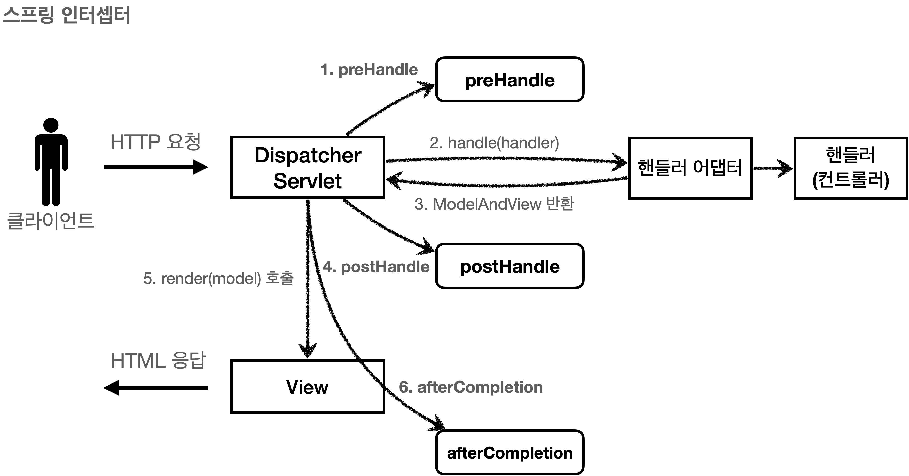
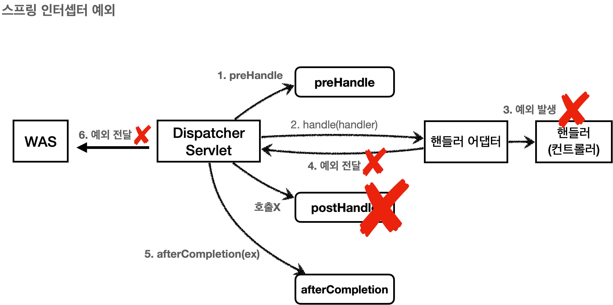

# 섹션 07. 로그인 처리2 - 필터, 인터셉터
## 01. 서블릿 필터 - 소개
### 공통 관심 사항
- 로그인 한 사용자만 상품 관리 페이지에 접속할 수 있어야 함
- 등록, 수정, 삭제, 조회 등 상품 관리의 모든 컨트롤러 로직에 공통으로 로그인 여부를 확인해야 함
  - 로그인과 관련된 로직이 변경 되면 작성한 모든 로직을 전부 수정해야 할 수 있음
- 애플리케이션 여러 로직에서 공통으로 관심이 있는 것을 `공통 관심사(cross-cutting-concern)`라고 함
- 공통 관심사는 스프링의 AOP로 해결할 수 있으나 `서블릿 필터, 스프링 인터셉터`를 사용하는 것이 좋음
  - 서블릿 필터, 스프링 인터셉터: `HttpServletRequest`를 제공함
<br/>

### 서블릿 필터 소개
필터는 서블릿이 지원하는 수문장!  
<br/>

#### 필터 흐름
```
HTTP 요청 -> WAS -> 필터 -> 서블릿 -> 컨트롤러
```
- 필터를 적용하면필터 호출 다음 서블릿이 호출됨
  - 때문에 모든 고객 요청 로그를 남기는 요구사항이 있다면 필터를 사용함
  - 필터는 특정 URL 패턴에 적용할 수 있음 (`/*` 적용 -> 모든 요청에 필터가 적용됨)
  - 스프링 사용하는 경우 말하는 `서블릿`은 디스패처 서블릿으로 생각하면 됨  
<br/>

#### 필터 제한
```
HTTP 요청 -> WAS -> 필터 -> 서블릿 -> 컨트롤러 //로그인 사용자
HTTP 요청 -> WAS -> 필터(적절하지 않은 요청이라 판단, 서블릿 호출X) //비 로그인 사용자
```
- 필터에 적절하지 않은 요청이라 판단되면 해당 부분에서 작업을 끝낼 수 있음
  - 로그인 여부 체크에 딱 좋음  
<br/>

#### 필터 체인
```
HTTP 요청 -> WAS -> 필터1 -> 필터2 -> 필터3 -> 서블릿 -> 컨트롤러
```
- 필터는 체인으로 구성됨
  - 중간에 필터를 자유롭게 추가할 수 있음
  - ex) 로그를 남기는 필터를 먼저 적용, 로그인 여부를 체크하는 필터 생성 가능  
<br/>

#### 필터 인터페이스
```java
public interface Filter {

        public default void init(FilterConfig filterConfig) throws ServletException {}

        public void doFilter(ServletRequest request, ServletResponse response, FilterChain chain) throws IOException, ServletException;

        public default void destroy() {}
}
```
- 필터 인터페이스를 구현, 등록하면 서블릿 컨테이너가 필터를 싱글톤 객체로 생성, 관리함
  - `init()`: 필터 초기화 메서드, 서블릿 컨테이너가 생성될 때 호출됨
  - `doFilter()`: 고객의 요청이 올 때 마다 해당 메서드가 호출됨, 필터의 로직을 구현하면 됨
  - `destroy()`: 필터 종료 메서드, 서블릿 컨테이너가 종료될 때 호출됨  
<br/><br/><br/>

## 04. 스프링 인터셉터 - 소개
서블릿 필터와 같이 공통 관심 사항을 효과적으로 해결할 수 있는 기술
- 스프링 인터셉터는 스프링 MVC가 제공하는 기술임
- 적용되는 순서와 범위, 사용방법이 서블릿 필터와는 다르다.  
<br/>

#### 스프링 인터셉터 흐름
```
HTTP 요청 -> WAS -> 필터 -> 서블릿 -> 스프링 인터셉터 -> 컨트롤러
```
- 스프링 인터셉터는 디스패처 서블릿과 컨트롤러 사이에서 컨트롤러 호출 직전에 호출됨
- 스프링 MVC가 제공하는 기능이므로 디슾처 서블릿 이후에 등장함 (스프링 MVC 시작점 = 디스패처 서블릿)
- 스프링 인터셉터에도 URL 패턴을 적용할 수 있음
  - 서블릿 URL 패턴과는 다르고, 매우 정밀하게 설정 가능함  
<br/>

#### 스프링 인터셉터 제한
```
HTTP 요청 -> WAS -> 필터 -> 서블릿 -> 스프링 인터셉터 -> 컨트롤러 //로그인 사용자
HTTP 요청 -> WAS -> 필터 -> 서블릿 -> 스프링 인터셉터(적절하지 않은 요청이라 판단, 컨트롤러 호출X) //비 로그인 사용자
```
- 인터셉터에서 적절하지 않은 요청이라 판단되면 해당 부분에서 작업을 끝낼 수 있음
  - 때문에 로그인 여부를 체크하기에 딱 좋음
<br/>

#### 스프링 인터셉터 체인
```
HTTP 요청 -> WAS -> 필터 -> 서블릿 -> 인터셉터1 -> 인터셉터2 -> 컨트롤러
```
- 스프링 인터셉터는 체인으로 구성되며, 자유롭게 인터셉터를 추가 가능함
  - `로그 남기는 인터셉터 -> 로그인 여부 체크 인터셉터`를 만들 수 있음
- 서블릿 필터와는 호출 순서만 다르고 제공하는 기능은 비슷해 보임
  - 하지만 편리성이나 정교한 기능면에서는 `스프링 인터셉터`가 더 우위에 있다.  
<br/>

#### 스프링 인터셉터 인터페이스
```java
public interface HandlerInterceptor {
    
    default boolean preHandle(HttpServletRequest request, HttpServletResponse response, 
                              Object handler) throws Exception {}

    default void postHandle(HttpServletRequest request, HttpServletResponse response, 
                            Object handler, @Nullable ModelAndView modelAndView) throws Exception {}
    
    default void afterCompletion(HttpServletRequest request, HttpServletResponse response,
                                 Object handler, @Nullable Exception ex) throws Exception {}
}
```
- `HandlerInterceptor` 인터페이스를 구현하면 스프링 인터셉터를 사용 가능함
- 인터셉터는 컨트롤러 `호출 전(preHandle), 호출 후(postHandle), 요청 완료 이후(afterCompletion)` 등과 같이 단계적으로 세분화 되어 있음
  - 서블릿 필터의 경우: 단순하게 `doFilter()` 하나만 제공
- 인터셉터는 어떤 컨트롤러가 호출되는지에 대한 `호출 정보`도 받을 수 있음
  - 물론 어떤 `modelAndView`가 반환되는지 `응답 정보`도 받을 수 있음
  - 서블릿 필터의 경우: 단순한게 `request, response`만 제공  
<br/>

### 스프링 인터셉터 호출 흐름

#### 정상 흐름
- `preHandle` : 컨트롤러 호출 전에 호출 (더 정확히는 핸들러 어댑터 호출 전에 호출)
  - `preHandle` 의 응답값이 `true` 이면 다음으로 진행, `false` 이면 더는 진행하지 않음
  - `false` 인 경우 나머지 인터셉터는 물론, 핸들러 어댑터도 호출되지 않음 (그림 1번 과정에서 끝나버림)
- `postHandle` : 컨트롤러 호출 후에 호출 (더 정확히는 핸들러 어댑터 호출 후)
- `afterCompletion` : 뷰가 렌더링 된 이후에 호출  
<br/>

### 스프링 인터셉터 예외 상황

#### 예외 발생시
- `preHandle`: 컨트롤러 호출 전에 호출
- `postHandle`: 컨트롤러에서 예외가 발생, `postHandle`은 호출되지 않음
- `afterCompletion`: `afterCompletion`은 항상 호출, 해당 경우 `예외(ex)`를 파라미터로 받아 로그로 출력 가능  
<br/>

#### afterCompletion은 예외가 발생해도 호출된다
- 예외 발생 `postHandle()`은 호출되지 않음, 예외와 무관하게 공통 처리를 위해선 `afterCompletion()`을 사용해야 함
- 예외가 발생하면 `afterCompletion()`에 `예외 정보(ex)`를 포함해 호출됨  
<br/>

### 정리
결국 `스프링 인터셉터`는 스프링 MVC 구조에 특화된 필터 기능을 제공한다.
- 스프링 MVC를 사용할 때 특별하게 필터를 사용하는 상황이 아니면 인터셉터를 사용하도록 하자