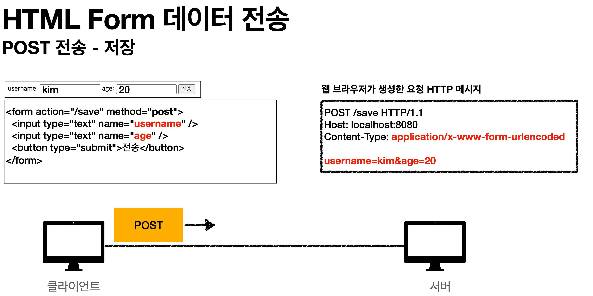
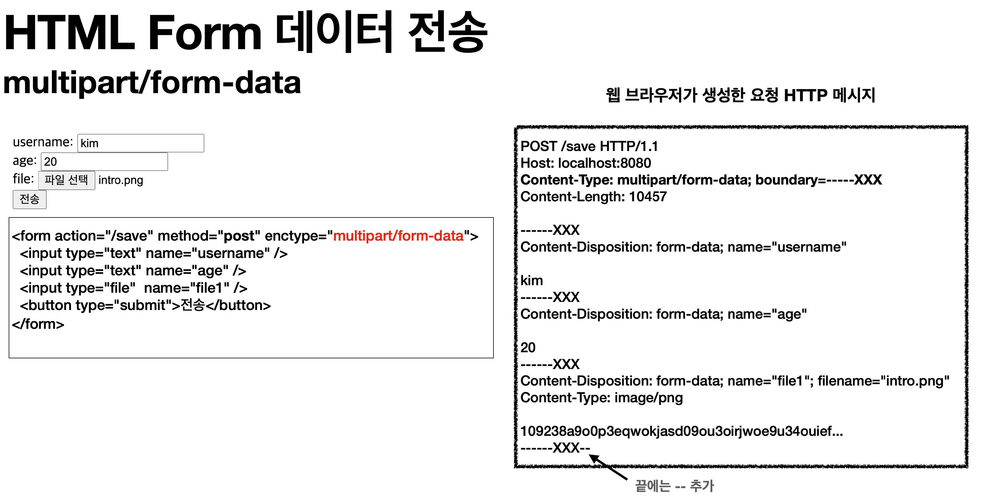

# 섹션 11. 파일 업로드
## 01. 파일 업로드 소개
일반적으로 사용되는 `HTML Form`을 통한 파일 업로드를 이해하기 위해 폼을 전송하는 아래 두 가지 방식의 차이를 이해해야 함
### HTML 폼 전송 방식
- `application/x-www-form-urlencoded`
- `multipart/form-data`  
<br/>

#### application/x-www-form-urlencoded 방식

`application/x-www-form-urlencoded`방식은 `HTML 폼 데이터`를 서버로 전송하는 가장 기본적인 방법
- `Form 태그`에 별도의 `enctype` 옵션이 없다면 웹 브라우저는 요청 HTTP 메시지의 헤더에 아래의 내용을 추가함
  - `Content-Type: application/x-www-form-urlencoded`
- 폼에 입력한 전송할 항목을 `HTTP Body`에 문자로 `username=kim&age=20`과 같이 `&`로 구분해 전송함
- 파일 업로드시 파일은 문자가 아니라 `바이너리 데이터`를 전송해야 함
- 문자를 전송하는 해당 방식으로는 파일을 전송하기 어려움
  - 또한 보통 폼을 전송할 때 파일만 전송하는 것이 아님
```
// 폼 전송시 파일 외 전송 가능성 있는 데이터--------------
- 이름
- 나이
- 첨부파일
```
- 파일 외에 `이름, 나이, 첨부파일 등`도 함께 전송해야 할 수 있음
  - 이름, 나이는 문자로 전송하더라도 첨부파일은 바이너리로 전송해야 함
  - 즉, `문자와 바이너리`를 동시에 전송해야하는 상황이 문제임
- 위와 같은 문제 때문에 HTTP는 `multipart/form-data`라는 전송 방식을 제공함
<br/>

#### multipart/form-data 방식

해당 방식을 사용하기 위해선 `Form 태그`에 별도의 `enctype="multipart/form-data`를 지정해야 함
- `multipart/form-data` 방식은 다른 종류의 여러 파일과 폼의 내용을 함께 전송할 수 있음
  - 폼의 입력 결과로 생성된 HTTP 메시지를 보면 각각의 전송 항복이 구분되어 있음
    - `Content-Disposition`이라 하는 항복별 헤더가 추가되어 있음
- 즉 `multipart/form-data`는 각각의 항복을 구분해 한번에 전송함