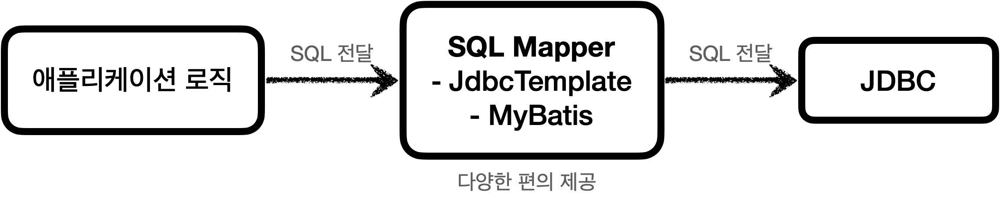
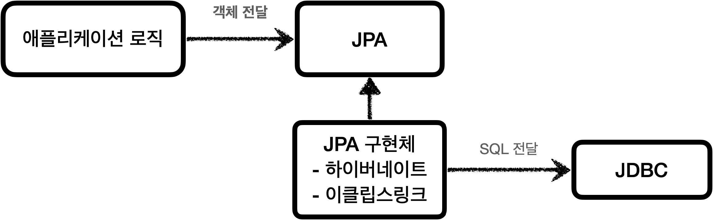

# 섹션 01. JDBC 이해
## 02. H2 데이터베이스 설정
### h2
- `H2 데이터베이스`는 개발이나 테스트 용도로 사용하기 좋은 `DB`
  - 굉장히 가볍고 편리함, `SQL`을 실행할 수 있는 웹 화면도 제공
- 버전 : `2.2.224`  
<br/>

### 테이블 생성하기
```
create table member (
    member_id varchar(10),
    money integer not null default 0,
    primary key (member_id)
);

insert into member(member_id, money) values ('hi1',10000);
insert into member(member_id, money) values ('hi2',20000);
```
- 위의 `SQL`을 h2 웹 콘솔에 입력해 `memeber` 테이블을 생성
- `select * from memeber;`를 입력해 저장한 데이터가 출력되는지 확인  
<br/><br/><br/>

## 03. JDBC 이해
### JDBC 등장 이유
애플리케이션 개발시 중요한 데이터는 대게 `데이터베이스`에 보관한다.  
<br/>

#### 클라이언트, 애플리케이션 서버, DB

<br/>

#### 애플리케이션 서버와 DB - 일반적인 사용법

- `커넥션 연결`: 주로 TCP/IP를 사용해 커넥션 연결
- `SQL 전달`: DB가 이해할 수 있는 SQL을 연결된 커넥션을 통해 DB에 전달
- `결과 응답`: DB는 전달된 SQL을 수행한 후 결과를 응답함, 애플리케이션은 해당 결과를 활용함  
<br/>

#### 애플리케이션 서버와 DB - DB 변경

기존의 문제는 각 데이터베이스마다 `커넥션을 연결 방법`, `SQL 전달 방법`, `결과 응답 받는 방법`이 모두 다르다는 점
- 데이터베이스를 다른 종류의 데이터베이스로 변경 -> 서버에 개발된 `데이터베이스 사용 코드도 변경`해야 함
- 개발자가 각 데이터베이스마다 `커넥션 연결, SQL 전달, 결과 응답 받는 방법`을 새로 학습해야 함
- 이러한 문제를 해결하기 위해 `JDBC`라는 자바 표준이 등장함  
<br/>

### JDBC 표준 인터페이스
`JDBC(Java Database Connectivity)`: 자바에서 데이터베이스에 접속할 수 있도록 하는 `Java API`
- 데이터베이스에서 자료를 쿼리하거나 업데이트하는 방법을 제공  
<br/>

#### JDBC 표준 인터페이스

대표적으로 다음 3가지 기능을 표준 인터페이스로 정의해 제공함
- `java.sql.Connection` - 연결
- `java.sql.Statement` - SQL을 담은 내용
- `java.aql.ResultSet` - SQL 요청 응답  
<br/>

#### JDBC 드라이버
각 DB 벤더(회사)에서는 자신의 DB에 맞도록 `JDBC 인터페이스를 구현`해 라이브러리를 제공하는 것
- ex) `MySQL DB <--(접근O)-- MySQL JDBC 드라이버`, `Oracle DB <--(접근O)-- Oracle JDBC 드라이버`  
<br/>

#### MySQL 드라이버 사용
  
<br/>

#### Oracle 드라이브 사용
  
<br/>

### 정리
JDBC의 등장으로 위에 언급한 데이터베이스 변경시 발생하는 2가지 문제점이 해결 됨
1. 기존 데이터베이스 사용 코드 변경
   - 애플리케이션은 JDBC 표준 인터페이스에만 의존하므로 `JDBC 구현 라이브러리`만 변경하면 됨
   - 서버의 사용 코드를 그대로 유지 가능!
2. 각 데이터베이스별 사용법 학습
   - 개발자는 `JDBC 표준 인터페이스` 사용법만 학습하면 됨  
<br/>

물론 기본적인 부분만 공통화 되었기 때문에 어느정도 한계가 있다.<br/>
(SQL은 데이터베이스에 맞도록 수정 해야할 수 있음)  
<br/><br/><br/>

## 04. JDBC와 최신 데이터 접근 기술
최근에는 JDBC를 직접 사용하지 않고 편리하게 사용하는 다양한 기술을 사용한다.<br/>
대표적으로 `SQL Mapper`와 `ORM 기술`로 나눌 수 있음  
<br/>

#### JDBC 직접 사용
  
<br/>

#### SQL Mapper

- 장점: JDBC 사용을 편리하게 해줌
  - SQL 응답 결과를 객체로 편리하게 변환해줌
  - JDBC의 반복 코드를 제거해줌
- 단점: 개발자가 `SQL`을 직접 작성해야 함
- 대표기술: `Spring JdbcTemplate`, `MyBatis`  
<br/>

#### ORM 기술

`ORM`: `객체를 관계형 데이터베이스 테이블과 매핑`해주는 기술
- 장점 : 개발자 대신 `SQL`을 동적으로 만들어 실행해줌 
  - 개발자는 더 이상 반복적인 `SQL`을 직접 작성하지 않음
  - 추가로 각 데이터베이스 별, 다른 `SQL`을 사용하는 문제도 해결해줌
- 대표기술: `JPA`, `하이버네이트`, `이클립스링크`
  - `JPA`: 자바 진영의 `ORM 표준 인터페이스`
  - 나머지 두 기술은 `JPA`의 구현 기술들임  
<br/>

### SQL Mapper VS ORM 기술
- `SQL Mapper`: `SQL`만 직접 작성하면 나머지 번거로운 작업은 대신 해결해줌
- `ORM 기술`: `SQL` 자체를 작성할 필요가 없어 생산성이 매우 높아짐
  - 단, 기술에 난이도가 있어 실무 사용시 깊이있는 학습이 필요함  
<br/>

### 결론
위에 설명한 기술들을 보면 결국 모두 `JDBC`를 사용한다.<br/>
그렇기에 직접 `JDBC`를 사용하진 않더라도 해당 기술이 어떻게 동작하는지 `기본 원리`를 알아두어야 한다.<br/>
그래야 문제 발생시 `근본적인 문제를 해결`할 수 있기 때문이다.