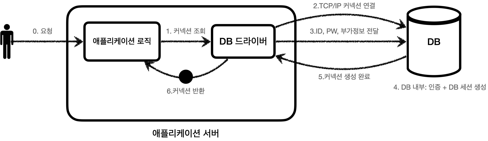
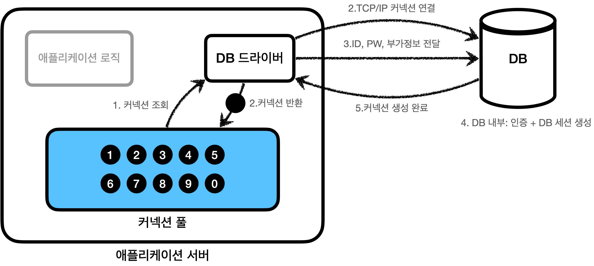
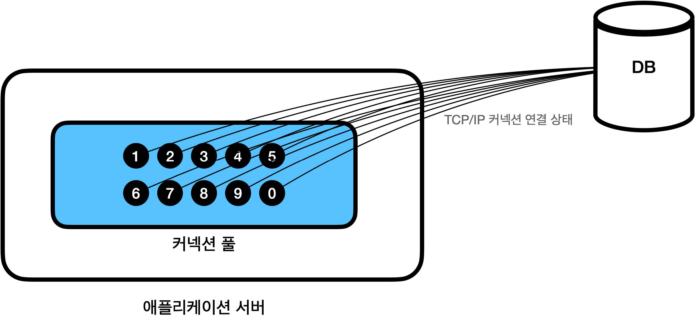
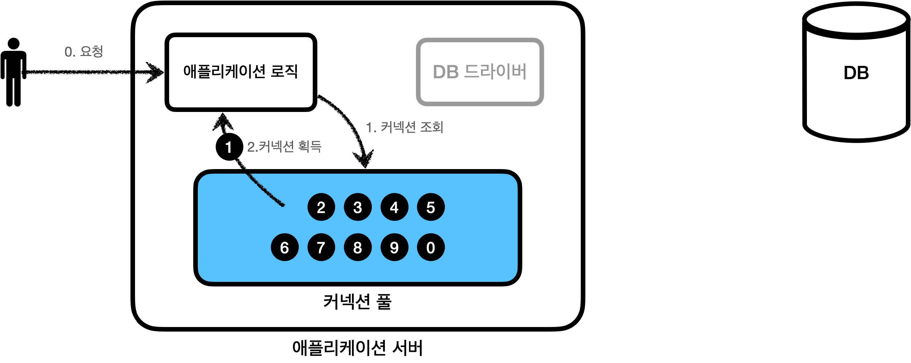
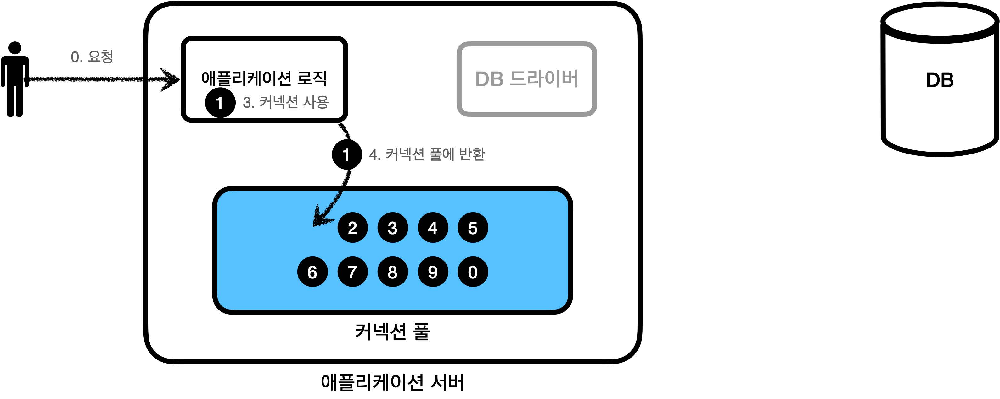
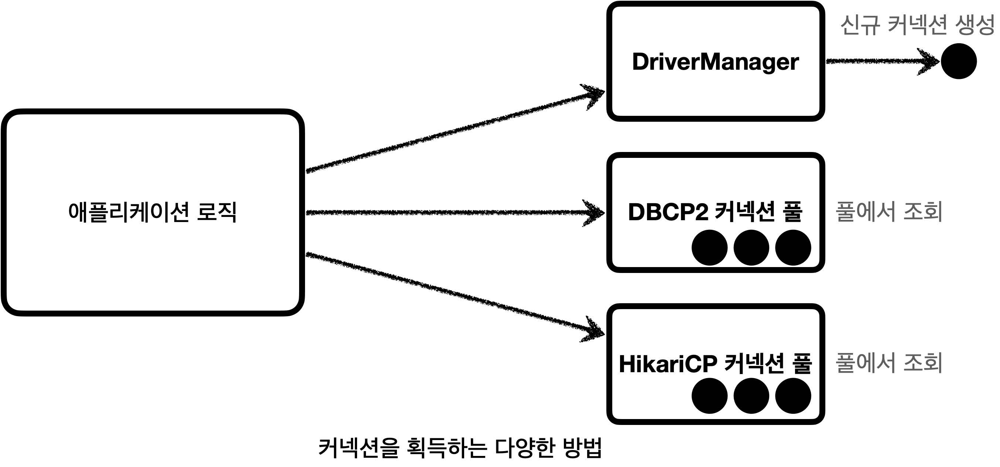
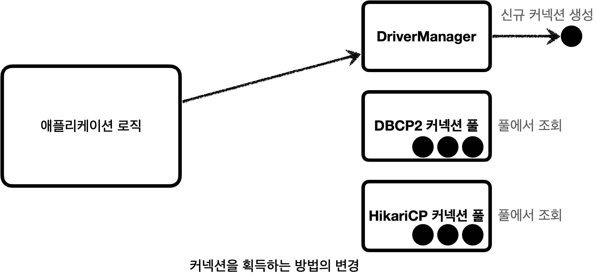
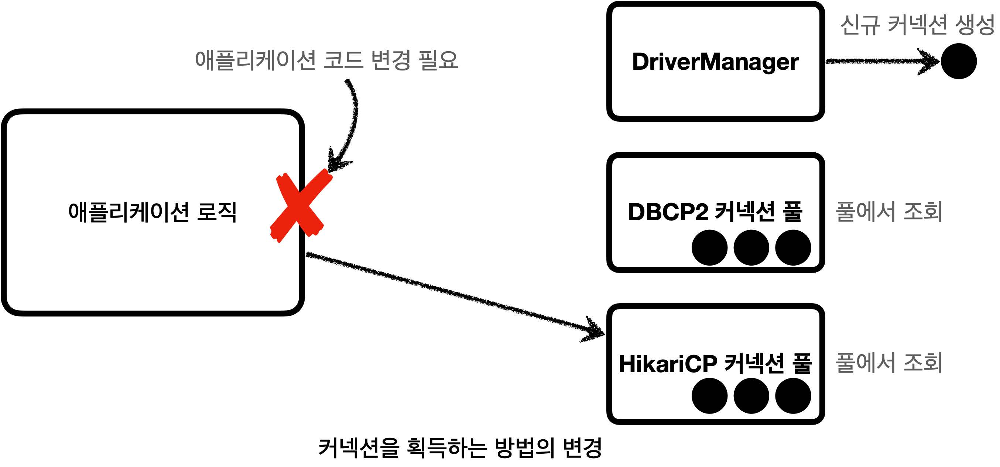
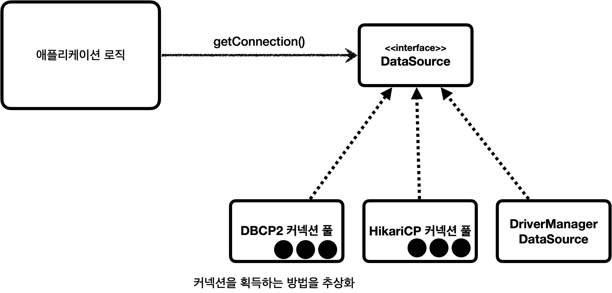

# 섹션 02. 커넥션 풀과 데이터소스 이해
## 01. 커넥션 풀 이해
#### 데이터베이스 커넥션을 매번 획득

데이터베이스 커넥션을 획득할 때, 아래와 같은 복잡한 과정을 거침
1. 애플리케이션 로직이 `DB 드라이버`를 통해 커넥션을 조회
2. DB 드라이버는 `DB`와 `TCP/IP` 커넥션을 연결
   - 해당 과정에서 `3 way handshake` 같은 `TCP/IP` 연결 네트워크 동작이 발생
3. DB 드라이버는 `TCP/IP` 커넥션이 연결되면 `ID, PW`와 기타 부가정보를 DB에 전달
4. DB는 `IP, PW`를 통해 내부 인증을 완료, 내부에 `DB 세션`을 생성
5. DB는 커넥션 생성 완료 응답을 전달
6. DB 드라이버는 커넥션 객체를 생성해 클라이언트에 반환  
 

즉, 커넥을 새로 만든다는 것은 복잡한 과정과 시간도 많이 소모되는 일
- DB는 물론이요 애플리케이션 서버에서도 `TCP/IP` 커넥션을 생성하기 위한 리소스를 매번 사용해야만 함
- 고객이 애플리케이션을 사용시, `SQL` 실행 시간 뿐만 아니라 커넥션을 새로 생성하는 시간이 추가되는 것이 진짜 문제임
  - 이는 사용자에게 좋지 않은 경험으로 이어질 확률이 높음
- 이러한 문제들을 해결하기 위해 커넥션을 미리 생성해두고 사용하는 `커넥션 풀`이라는 방법  
 

#### 커넥션 풀 초기화

애플리케이션을 `시작하는 시점`에 커넥션 풀은 필요한 만큼 커넥션을 미리 확보해 풀에 보관함 
보관 기간은 `서비스 특징`과 `서버 스펙`에 따라 다르며, 기본 값은 보통 10개임  
 

#### 커넥션 풀의 연결 상태

커넥션 풀에 들어있는 커넥션들은 `TCP/IP`로 DB와 커넥션이 연결되어 있어 언제든지 `SQL`을 DB로 전달 가능함  
 

### 사용
#### 커넥션 풀 사용1

- 애플리케이션 로직에서는 DB 드라이버를 통해 새로운 커넥션을 얻을 필요가 없음
  - 그냥 커넥션 풀에 미리 생성해둔 커넥션을 `객체 참조`로 가져다 쓰기만 하면 됨
  - 커넥션 풀에 요청하면 커넥션 풀은 가지고 있는 커넥션 중 하나를 반환해줌  
 

#### 커넥션 풀 사용2

- 애플리케이션 로직은 건네받은 커넥션을 사용, `SQL`을 데이터베이스에 전달하고 결과를 받아 처리함
- 커넥션 사용이 끝나면 커넥션을 종료하는 것이 아니라 다시 사용할 수 있게 커넥션 풀에 반환함
  - 이 때 커넥션은 죽은 상태가 아니라 살아있는 상태로 반환해야 함  
 

### 정리
- 적절한 커넥션 풀의 커넥션 갯수는 `서비스 특징, 서버 스펙`을 고려해 성능 테스트를 통해 정해야 함
- 서버당 최대 커넥션 수를 제한 할 수 있어, DB를 보호하는 효과를 볼 수 있음
- 실무에선 항상 기본으로 사용됨
- 단순해 보여 직접 구현할 수도 있겠으나 이미 편리하며 뛰어난 성능을 가진 오픈소스 커넥션 풀이 많아 이를 추천함
  - 대표적으로 `commons-dbcp2, tomcat-jdbc pool, HikariCp`등이 있음
  - 성능과 사용의 편리함 때문에 `hikariCp`를 대부분 사용하는 편이라고 함  
   

## 02. DataSource 이해
커넥션을 얻는 방법은 앞서 학습한 `JDBC DriverManager`를 직접 사용하거나, 커넥션 풀을 사용하는 등 다양한 방법이 존대
#### 다양한 커넥션 획득 방법
  
 

#### DriverManager를 통한 커넥션 획득
  
 

#### DriverManager -> 커넥션 풀 변경 문제

- 의존관계가 변경되기 때문에, 커넥션을 획득하는 `애플리케이션 코드 변경`도 필요함
  - 물론 둘의 사용법도 조금씩 다를 것이다.  
 

#### 커넥션 획득 방법 추상화

- 의존관계 변경 문제를 해결하기 위해 자바에서는 `javx.sql.DataSource` 인터페이스를 제공함
  - `DataSource`: 커넥션 획득 방법을 추상화하는 역할의 인터페이스, 핵심 기능은 `커넥션 조회` 하나임  
 

### 정리
- 대부분의 커넥션 풀은 `DataSource` 인터페이스를 이미 구현해둠
  - 즉, 개발자는 `DataSource` 인터페이스만 의족하도록 애플리케이션 코드를 작성하면 됨
  - 커넥션 풀 구현 기술을 변경 시 해당 구현체로 갈아끼우기만 하면 됨
- `DriverManager`는 `DataSource`를 사용하지 않아 커넥션 풀로 변경 시 관련 코드를 다 고쳐야 함
  - 하지만 스프링에서는 `DataSource`를 구현한 `DriverManagerDataSource` 클래스를 제공함
  - 커넥션 풀로 변경 시 더이상 애플리케이션 로직을 변경하지 않아도 됨