# 섹션 03. 트랜잭션 이해
## 01. 트랜잭션 - 개념 이해
### 데이터베이스에 데이터를 저장하는 이유?
데이터 베이스가 `트랜잭션`이라는 개념을 지원하기 때문!  
- `트랜잭션`: 직역하면 `거래`라는 뜻이며, 여기서는 하나의 `거래를 안전하게 처리`하도록 보장해주는 것을 뜻함
  - `안전한 거래 처리`: 예를 들어 `A`가 `B`에게 `5,000원`을 계좌이체 할 때 [`A`: `-5,000`, `B`: `+5,000`]
  - 잔고의 감소와 증가가 합쳐저 하나의 작업처럼 동작해야 함
  - 두 작업(감소, 증가)이 `모두 성공`하면 저장, `둘 중 한 작업이라도 실패`한다면 이전 상태로 돌아가야 함
    - `커밋(Commit)`: 모든 작업이 성공해 DB에 정상 반영
    - `롤백(Rollback)`: 둘 중 하나라도 작업이 실패해 이전으로 되돌리는 것  
<br/>

### 트랜잭션 ACID
트랜잭션은 `ACID`라고 하는 `원자성(Atomicity)`, `일관성(Consistency)`, `격리성(Isolation)`, `지속성(Durability)`을 보장해야 함
- `원자성`: 트랜잭션 내, 실행 작업들은 `하나의 작업`처럼 모두 성공하거나 모두 실패해야 함
- `일관성`: 모든 트랜잭션은 `일관성 있는 DB 상태`를 유지해야 함
  - ex) DB에서 정한 `무결성 제약 조건`을 항상 만족해야 함
- `격리성`: 동시에 실행되는 트랜잭션들이 `서로 영향을 미치지 않게` 격리함
  - ex) 동시에 같은 데이터를 수정하지 못하도록 해야함
  - 동시성과 관련된 성능 이슈로 인하여 `트랜잭션 격리 수준(Isolation level)`을 선택 가능함
- `지속성`: 트랜잭션 성공시 항상 결과를 기록하여야 함
  - 작업 중간에 시스템 문제가 발생해도 DB 로그 등을 사용해 성공한 트랜잭션 내용을 복구해야 함  
<br/>

### 문제는 격리성
트랜잭션은 원자성, 일관성, 지속성을 보장한다. 문제는 격리성이며 이를 완벽하게 보장하려면 트랜잭션은 거의 순서대로 실행해야 한다.
- 하지만 완벽히 보장할 경우 `동시 처리 성능`이 매우 떨어진다.
- 그렇기에 `ANSI 표준`에서는 트랜잭션의 격리 수준을 4단계에 나누어 정의함
  1. READ UNCOMMITTED (커밋되지 않은 읽기)
  2. READ COMMITTED (커밋된 읽기) -> `일반적으로 많이 사용`
  3. REPEATABLE READ (반복 가능한 읽기)
  4. SERIALIZABLE (직렬화 가능)  
<br/><br/><br/>

## 02. 데이터베이스 연결 구조와 DB 세션
#### 데이터베이스 연결 구조1
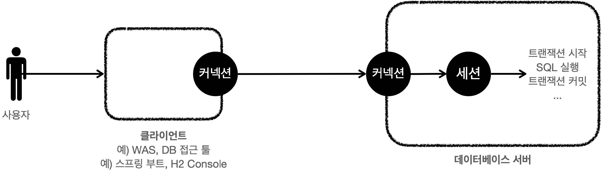
- 사용자는 `웹 애플리케이션 서버(WAS)`나 `DB 접근 툴`같은 클라이언트를 사용해 DB 서버에 접근 가능함
  - DB 서버에 연결을 요청 -> 커넥션을 맺게 됨
  - 이 때, DB 서버는 내부에 `세션`이라는 것을 생성
  - 해당 커넥션을 통한 모든 요청이 `세션`을 통해 실행하게 됨
- 개발자가 클라이언트를 통해 `SQL`을 전달하면 현재 커넥션에 연결된 `세션`이 `SQL`을 실행함
- `세션`: 트랜잭션 시작, 커밋/롤백을 통해 트랜잭션을 종료, 새로운 트랜잭션 시작이 가능함
- 사용자가 커넥션을 닫거나 DBA(DB 관리자)가 세션을 강제 종료하면 세션이 종료됨  
<br/>

#### 데이터베이스 연결 구조2
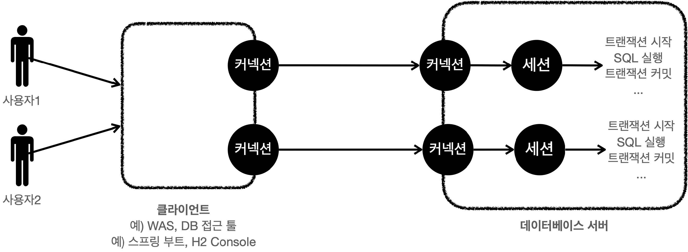
- 커넥션 풀이 10개의 커넥션을 생성할 경우 세션 또한 10개가 만들어짐  
<br/><br/><br/>

## 03. 트랜잭션 - DB 예제1 - 개념 이해
아래의 예제는 `트랜잭션의 동작 개념의 전체 그림`을 이해하기 위해 작성됨
- 구체적인 구현같은 경우 데이터베이스 마다 다르기 때문이다.  
<br/>

### 트랜잭션 사용법
- 데이터 변경 쿼리 실행 --(`commit` 명령어 호출)--> 결과 반영
- 데이터 변경 쿼리 실행 --(`rollback` 명령어 호출)--> 결과 반영 X
- `커밋 호출 전까진 임시로 데이터를 저장`
  - 이 때 해당 트랜잭션을 시작한 사용자(세션)에게만 변경 데이터가 보임
  - 다른 사용자(세션)에게는 변경데이터가 보이지 않음
- 등록, 수정, 삭제 모두 같은 원리로 동작함 -> 통틀어 `변경`이라고 지칭  
<br/>

#### 기본 데이터
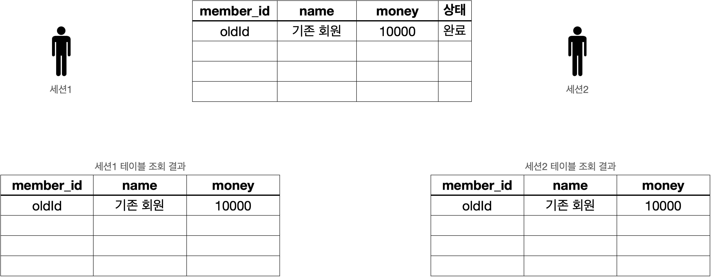
- 각 세션에서 그림의 가운데 위치한 `기본 테이블` 조회시 해당 데이터가 그대로 조회됨  
<br/>

#### 세션1 신규 데이터 추가
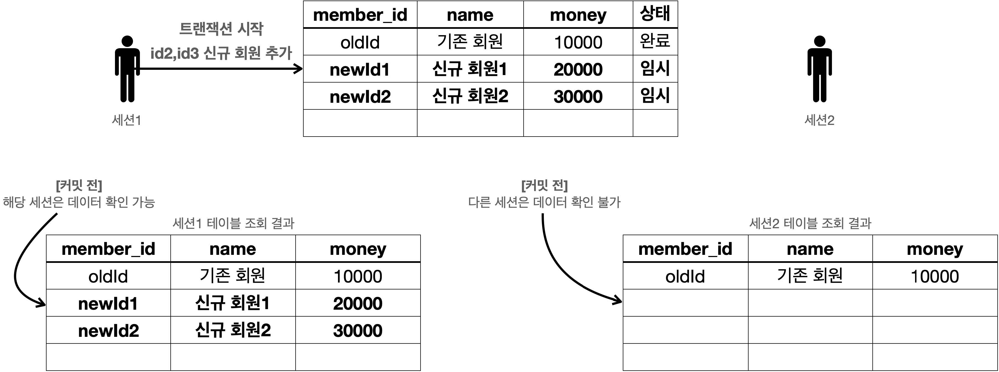
- 세션1은 트랜잭션을 시작하고 신규 회원1, 신규회원2를 DB에 추가함(커밋X)
  - 이 때 새로운 데이터는 임시 상태로 저장됨
- 아직 커밋을 하지 않았기에 각 세션이 조회할 수 있는 데이터는 아래와 같음
  - `세션1`: 기본 테이블 데이터 + 본인이 추가한 데이터
  - `세션2`: 기본 테이블 데이터  
<br/>

#### 커밋하지 않은 데이터를 다른 곳에서 조회 가능할 경우 발생하는 문제
- 세션2가 세션1이 추가한 데이터에 대해서 어떤 로직을 수행 --(세션1 rollback)--> 세션2도 데이터 증발
  - 이렇게 데이터 정합성에 큰 문제가 발생할 수 있음  
<br/>

#### 세션1 신규 데이터 추가 후 commit
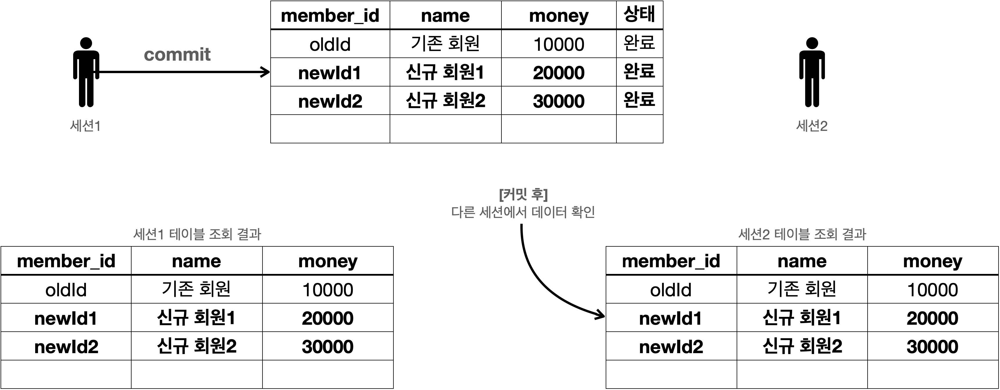
- 세션1이 신규 데이터를 추가하고 `commit`을 호출 -> 실제 DB에 신규 데이터 반영
  - 데이터 상태가 `임시 -> 완료`로 바뀜
  - 세션2에서도 신규 데이터를 확인 가능  
<br/>

#### 세션1 신규 데이터 추가 후 rollback
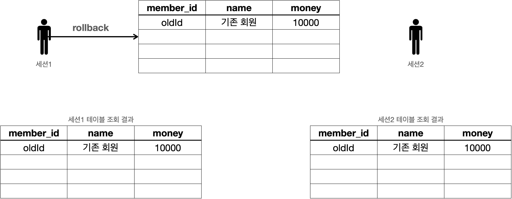
- 세션1이 신규 데이터 추가 후 `rollback` 호출 -> 신규 데이터 추가 이전으로 데이터가 복구됨
  - `변경` 데이터는 종류(수정, 삭제 등)를 불문하고 트랜잭션 시작 직전의 상태로 복구됨  
<br/><br/><br/>

## 04. 트랜잭션 - DB 예제2 - 자동 커밋, 수동 커밋
### 예제 사용 스키마
```
drop table member if exists;  // 기존에 member 테이블이 있다면 삭제

// member 테이블 생성
create table member (
    member_id varchar(10),
    money integer not null default 0,
    primary key (member_id)
)
```  
<br/>

### 자동 커밋과 수동 커밋
#### 자동 커밋 설정
```
set autocommit true;  // 자동 커밋으로 설정

insert into member(member_id, money) values ('data1',10000);  //자동 커밋
insert into member(member_id, money) values ('data2',10000);  //자동 커밋
```
- 보통 자동 커밋 모드가 기본으로 설정된 경우가 많음
- 쿼리를 하나하나 실행할 때 마다 자동으로 커밋이 됨, 하지만 트랜잭션 기능을 제대로 사용할 수 없음  
<br>

#### 수동 커밋
```
set autocommit false; // 수동 커밋 모드 설정

insert into member(member_id, money) values ('data3',10000);
insert into member(member_id, money) values ('data4',10000);

commit; // 수동으로 커밋
```
- `수동 커밋 모드로 설정`하는 것을 `트랜잭션을 시작`한다고 표현함
- 당연하지만 수동 커밋 모드일 경우 변경 이후에 꼭 `commit` 또는 `rollback`을 호출해야 함
- 어떤 모드를 설정하든 해당 세션에서는 계속 유지가 됨
  - 물론 중간에 다른 모드로 변경하는 것은 가능함  
<br/><br/><br/>

## 05. 트랜잭션 - DB 예제3 - 트랜잭션 실습
### 1. 기본 데이터 입력
#### 데이터 초기화 SQL
```
set autocommit true;

delete from member;
insert into member(member_id, money) values ('oldId', 10000);
```
- 현 상태에서 세션1, 세션2에서 `select * from member;`를 실행하면 두 세션 모두 기본 데이터를 조회 가능함  
<br/>

### 2. 신규 데이터 추가 - 커밋 전
#### 세션1에서 신규 데이터 추가 SQL
```
set autocommit false; // 수동 커밋 설정 = 트랜잭션 시작

insert into member(member_id, money) values ('newId1',10000);
insert into member(member_id, money) values ('newId2',10000);
```
- 커밋이 수동 모드이기 때문에 현재 신규 데이터는 임시 저장 상태임
- 현 상태에서 세션1, 세션2에서 `select * from member;`를 실행
  - `세선1`: 기본 데이터 + 신규 데이터 조회 가능
  - `세션2`: 기본 데이터 조회 가능, 신규 데이터 조회 불가능  
<br/>

### 3-1. 커밋 - commit
#### 세션1에서 신규 데이터 commit
- 세션1에서 `commit;` 호출 -> 데이터베이스에 신규 데이터가 반영이 됨
- 현 상태에서 세션1, 세션2에서 `select * from member;`를 실행
  - `세선1`, `세션2`: 기본 데이터 + 신규 데이터 조회 가능  
<br/>

### 3-2. 롤백 - rollback
- 세션1에서 `rollback;` 호출 -> 트랜잭션 시작 전 상태로 되돌림, 데이터베이스에 신규 데이터 반영 X
- 현 상태에서 세션1, 세션2에서 `select * from member;`를 실행
  - `세선1`, `세션2`: 기본 데이터 조회 가능  
<br/><br/><br/>

## 06. 트랜잭션 - DB 예제4- 계좌이체
### 1. 계좌이체 기본 데이터
#### 기본데이터 입력
```
set autocommit true;

delete from member;
insert into member(member_id, money) values ('memberA',10000);
insert into member(member_id, money) values ('memberB',10000);
```
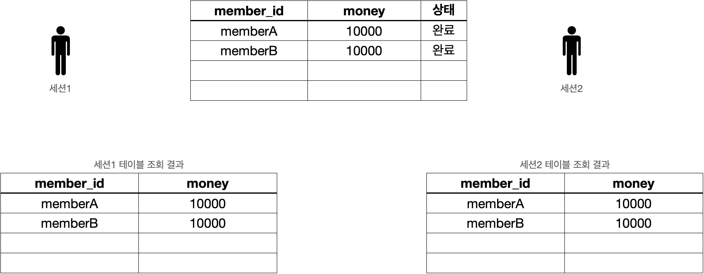  
<br/>

### 2-1. 계좌이제 흐름 - 정상
#### 계좌이체 실행
```
set autocommit false; // 수동 커밋 모드 = 트랜잭션 시작

update member set money=10000 - 2000 where member_id = 'memberA';
update member set money=10000 + 2000 where member_id = 'memberB';
```
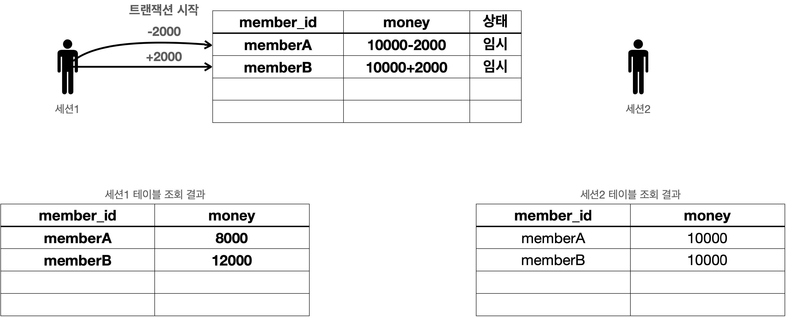
- 세션1에서 `memberA`가 `memberB`에게 `2,000원`을 계좌이체하는 트랜잭션 실행
- 모든 쿼리가 성공해 `memberA`의 금액은 `2,000원 차감`, `memberB`의 금액은 `2,000원 증가`함 
- 단 아직 `commit`을 하지 않아서 변경 데이터는 `임시 상태`
  - 세션2에서 변경된 데이터를 조회 할 수 없음  
<br/>

#### commit 호출
```
commit;
```
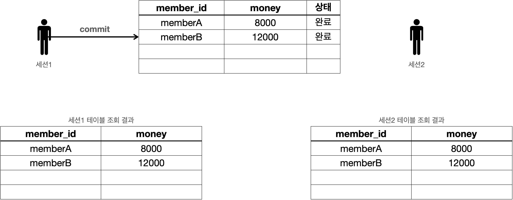
- 세션1에서 `commit`을 호출 -> 데이터베이스에 변경 데이터가 반영됨
  - 세션2에서도 해당 변경 데이터를 조회 가능  
<br/>

### 2-2. 계좌이체 흐름 - 비정상(문제 발생)
#### 계좌이체 실행
```
set autocommit false; // 수동 커밋 모드 = 트랜잭션 시작

update member set money=10000 - 2000 where member_id = 'memberA';   // 성공
update member set money=10000 + 2000 where member_iddd = 'memberB'; // 쿼리 예외 발생
```
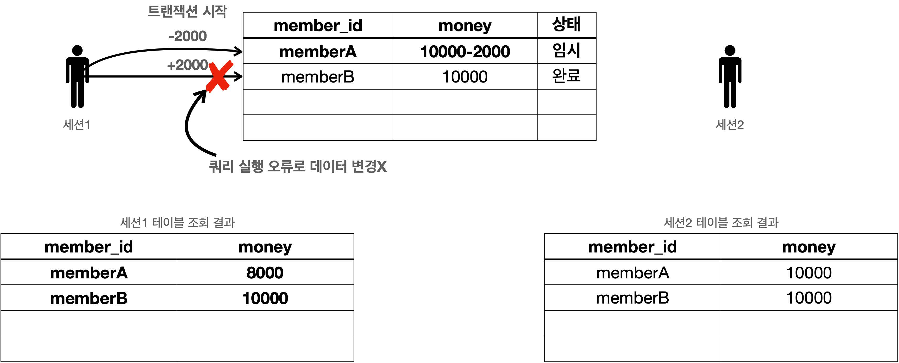
- 계좌이체 트랜잭션 실행 도중 `SQL`에서 문제 발생 -> 오타로 인해 `memberB`의 금액은 `2,000원 증가`시키는 것에 실패
- 중요한 문제점은 `memberA`의 금액만 줄어들었다는 점이다.  
<br/>

#### 2-2-1. 강제 커밋
```
commit;
```

- 결국 일이 커져버림, `memberA`의 금액만 줄어든 잘못된 변경 데이터가 데이터베이스에 반영됨
- 즉, 중간에 문제가 발생했다면 `commit`을 호출해선 절대 안됨  
<br/>

#### 2-2-2. 롤백
```
rollback;
```
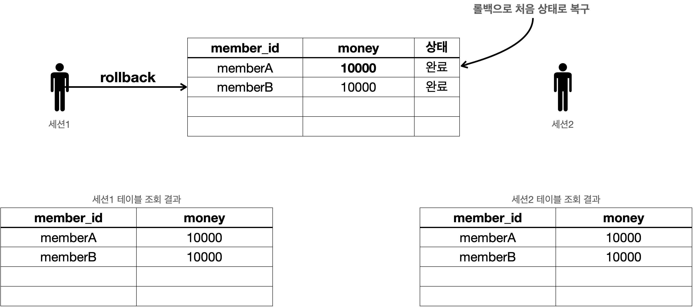
- `rollback`을 호출해서 트랜잭션 시작 직전의 상태로 데이터를 복구함
  - 문제 발생 이전으로 되돌린 것과 같음
- 트랜잭션 시작 이전으로 복구했기에 `세션1, 세션2` 모두 제대로 된 데이터를 조회 가능함  
<br/>

### 정리
1. `원자성`
   - 트랜잭션 내 실행 작업들은 모두 성공하거나 모두 실패 해야함
   - 여러 `SQL 명령어`를 하나의 작업처럼 처리 가능함
   - 성공하면 한 번에 `반영`하고 실패하면 한 번에 `복구`가 가능함
2. `오토 커밋`
   - `SQL` 실행 작업 도중 일부 성공 일부 실패 할 경우 성공된 작업만이 데이터베이스에 반영됨
     - 즉, 쿼리 실행마다 바로 커밋이 되어버리므로 원치 않은 변경 데이터 결과가 데이터베이스에 반영 되어버림
3. `트랜잭션 시작`
   - 즉, 여러 작업을 한 작업처럼 처리하는 종류의 작업은 반드시 `commit`을 `수동 모드`로 설정해야 함
     - 그래야 `rollback`을 호출해 `트랜잭션 시작 전(=문제 발생 전)` 상태로 복구할 수 있기 때문임
     - 이러한 이유로 `커밋을 수동 모드로 전환(설정)`하는 것은 `트랜잭션을 시작`한다고 표현함  
<br/><br/><br/>

## 07. DB 락 - 개념 이해
세션1이 `dataA`를 수정하는 도중(커밋X) 세션2가 동시에 `dataA`를 수정하게 되면 여러가지 문제가 발생할 수 있다.<br/>
이는 트랜잭션의 `원자성`이 깨지는 상황으로 해당 상황의 문제는 반드시 방지해야 할 부분이다.  
<br/>

### DB 락 적용 과정
#### DB 락 적용_00
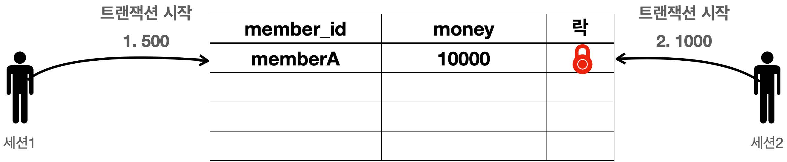
- 세션1은 `memberA`의 금액을 `500원`으로 수정하고 싶어하고, 세션2는 `memberA`의 금액을 `1,000원`으로 수정하고 싶어함  
<br/>

#### DB 락 적용_01
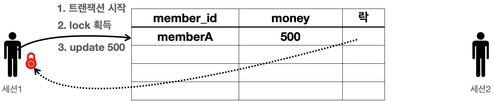
- 섹션1이 트랜잭션을 시작 -> `memberA`의 `money`를 `500`으로 변경 시도
  - 섹션2 보다 먼저 빠르게 요청했기에 세션1이 `락`을 획득함
- 섹션1은 락을 획득했으므로 해당 로우에 `update sql`을 수행함  
<br/>

#### DB 락 적용_02
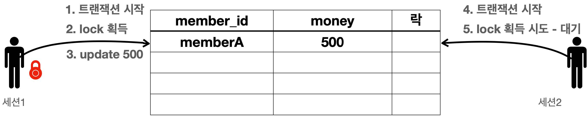
- 섹션2가 데이터 수정을 위해 트랜잭션을 시작 -> 락이 없어 락이 돌아올 때 까지 대기함
  - 무한정 대기하는 것은 아니며 대기시간을 넘길 경우 `락 타임아웃 오류`가 발생함
  - 참고로 `락 대기 시간`은 설정이 가능함  
<br/>

#### DB 락 적용_03
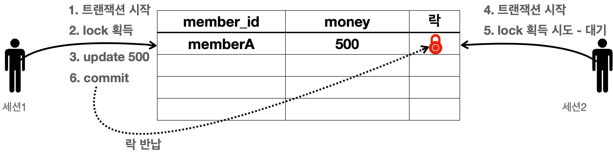
- 세션1이 `commit`을 수행 -> 트랜잭션이 종료되어 락을 반환함  
<br/>

#### DB 락 적용_04
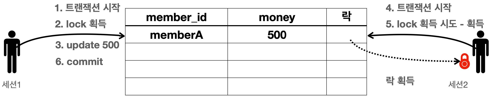
- 대기하던 세션2가 락을 획득함  
<br/>

#### DB 락 적용_05
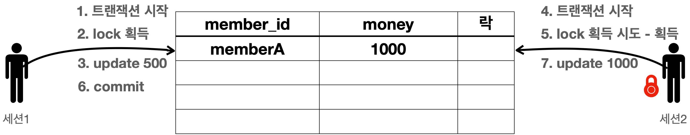
- 세션2가 `update sql`을 수행  
<br/>

#### DB 락 적용_06
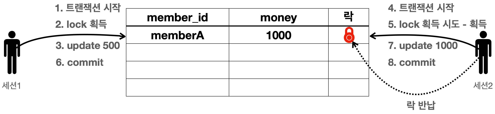
- 세션2가 `commit`을 수행항 -> 트랜잭션이 종료되어 락을 반환함