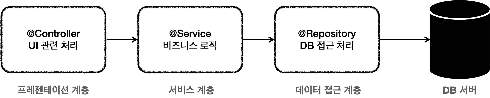
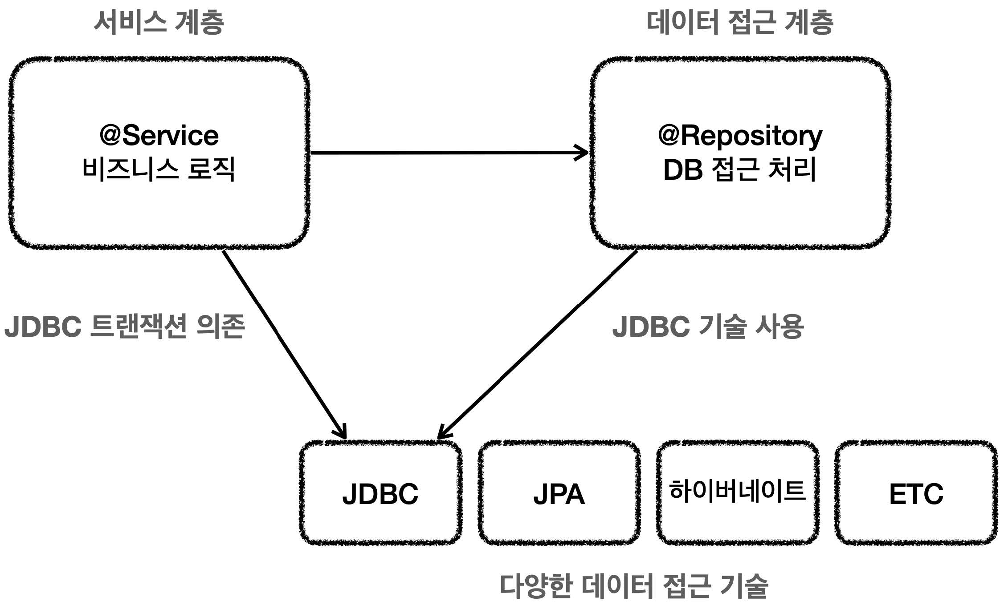
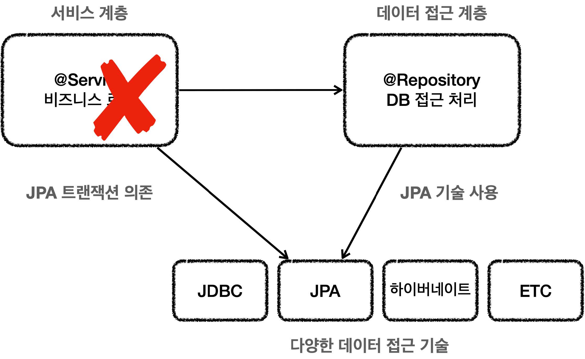
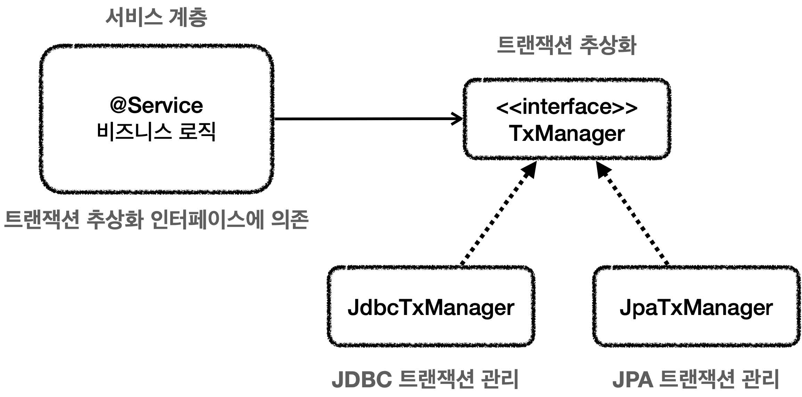
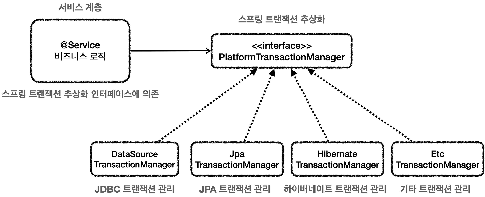
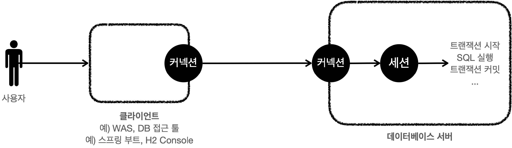
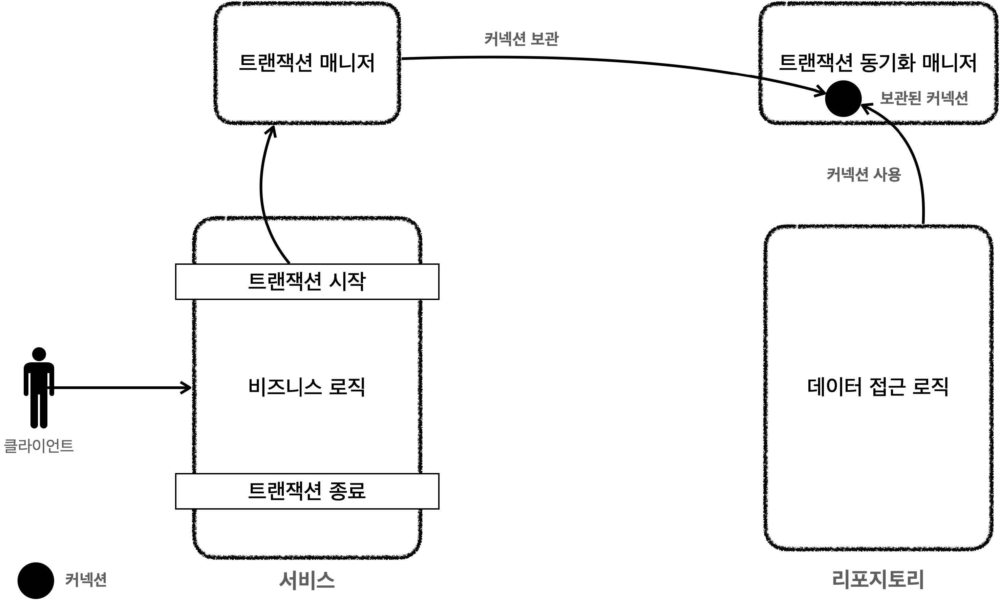
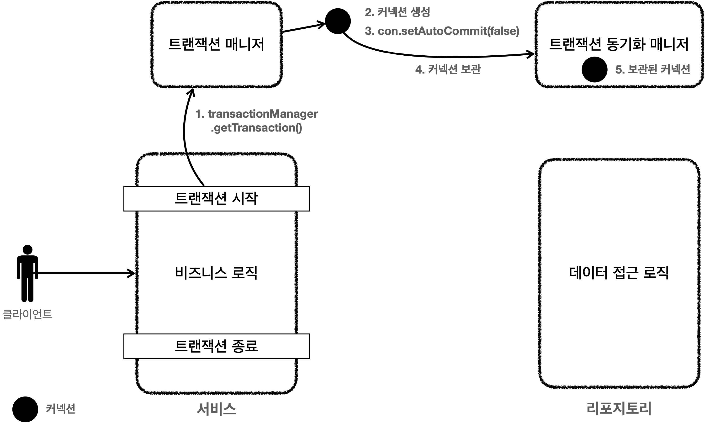
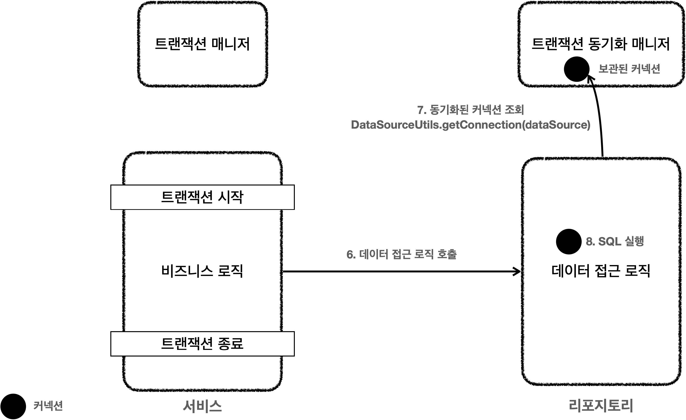
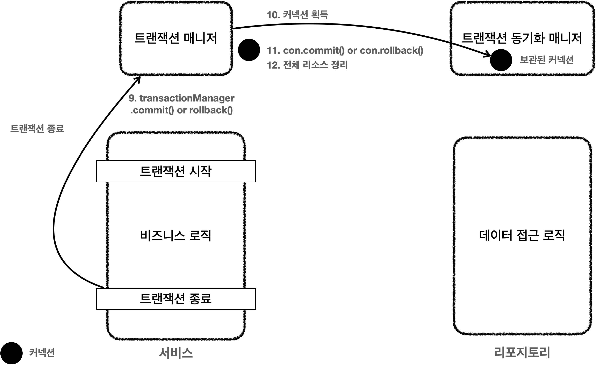

# 섹션 04. 스프링과 문제 해결 - 트랜잭션
## 01. 문제점들
### 어플리케이션 구조
여러 어플리케이션 구조가 있지만, 가장 단순하면서 많이 사용하는 방법은 `역할에 따라 3가지 계층`으로 나누는 것이다.

1. 프레젠테이션 계층
   - `UI`와 관련된 처리 담당
   - 웹 `요청과 응답`
   - 사용자 `요청 검증`
   - 주 사용기술 : `서블릿/HTTP 같은 웹 기술`, `스프링 MVC`
2. 서비스 계층
   - `비즈니스 로직` 담당
   - 주 사용기술 : `특정 기술에 의존하지 않고` 순수 자바 코드로 작성
3. 데이터 접근 계층
   - 실제 데이터베이스에 `접근하는 코드`
   - 주 사용기술 : `JDBC`, `JPA`, `File`, `Redis`, `Mongo` 등  
<br/>

### 순수한 서비스 계층
서비스 계층은 `핵심 비즈니스 로직`이 들어있는 곳으로 가장 중요한 곳이다.<br/>
- `UI(웹)` 관련 부분이 수정되고, 데이터 저장 기술이 바뀌어도 비즈니스 로직은 `최대한 변경없이` 유지되는게 좋다.
- 이를 위해선 서비스 계층을 특정 기술에 `종속적이지 않게` 개발하는 것이 중요하다.
  - 계층을 나눈 이유 또한 최대한 `서비스 계층을 순수하게` 유지하기 위함이다.
  - 기술적 종속은 프레젠테이션 계층과 데이터 접근 계층이 가져간다.
    - 기술이 변경되어도 서비스 계층 외의 다른 계층들의 코드만 수정하면 됨
- 서비스 계층를 순수하게 유지하는 만큼 유지보수가 편하고 테스트하기가 좋다. (변경의 영향 범위가 최소로 유지되기 때문)  
<br/>

### 문제점들
지금까지 작성한 예제를 보면서 과연 `서비스 계층이 순수한지` 확인해 보자
#### MemberServiceV1 - 일부 수정
```java
package hello.jdbc.service;

import java.sql.SQLException;

@RequiredArgsConstructor
public class MemberServiceV1 {
    
    private final MemberRepositoryV1 memberRepository;
    
    public void accountTransfer(String fromId, String toId, int money) throws SQLException {
        Member fromMember = memberRepository.findById(fromId);
        Member toMember = memberRepository.findById(toId);
        memberRepository.update(fromId, fromMember.getMoney() - money);
        memberRepository.update(toId, toMember.getMoney() + money);
    }
}
```
- 긍정적
  - `MemberServiceV1`은 특정 기술에 종속적이지 않고 순수한 자바 로직으로 보임
    - 코드가 깔끔하고 유지보수가 쉬움
  - 추후에 비즈니스 로직의 변경이 필요할 경우 위의 코드 부분을 수정하면 됨
- 부정적
  - 사실 `SQLException`이라는 JDBC 기술에 의존하고 있음
  - `memberRepository`에서 올라오는 예외는 `memberRepository`에서 해결해야 함
  - `MemberRepositoryV1`이라는 구체 클래스에 직접 의존하고 있음
    - `MemberRepository` 인터페이스를 도입할 경우 `MemberService`의 코드 변경 없이 다른 구현 기술로 쉽게 변경이 가능함  
<br/>

#### MemberServiceV2 - 일부 수정
```java
package hello.jdbc.service;

import javax.sql.DataSource;
import java.sql.Connection;
import java.sql.SQLException;

@Slf4j
@RequiredArgsConstructor
public class MemberServiceV2 {
    
    private final DataSource dataSource;
    private final MemberRepositoryV2 memberRepository;
    public void accountTransfer(String fromId, String toId, int money) throws SQLException {

        Connection con = dataSource.getConnection();

        try {
            con.setAutoCommit(false); //트랜잭션 시작
            //비즈니스 로직
            bizLogic(con, fromId, toId, money);
            con.commit(); //성공시 커밋
        } catch (Exception e) {
            con.rollback(); //실패시 롤백
            throw new IllegalStateException(e);
        } finally {
            release(con);
        }
    }

    private void bizLogic(Connection con, String fromId, String toId, int money) throws SQLException {
 
        Member fromMember = memberRepository.findById(con, fromId);
        Member toMember = memberRepository.findById(con, toId);
        memberRepository.update(con, fromId, fromMember.getMoney() - money);
        memberRepository.update(con, toId, toMember.getMoney() + money);
        
    }
    
}
```
- 트랜잭션은 비즈니스 로직이 있는 서비스 계층에서 시작하는 것이 좋음
- 문제는 트랜잭션 사용을 위해 `avax.sql.DataSource`, `java.sql.Connection`, `java.sql.SQLException` 같은 JDBC 기술에 의존해야 함
  - 결과적으로 비즈니스 로직보다 JDBC를 사용해 트랜잭션을 처리하는 코드가 더 많음
- 추후에 JDBC를 JPA 같은 다른 기술로 바꾸게 되면 서비스 코드 변경이 불가피해짐
  - JPA는 트랜잭션을 사용하는 코드가 JDBC와 다르다.
- `핵심 비즈니스 로직 + JDBC 기술`의 구조라 유지보수가 어려움  
<br/>

### 문제 정리
현재 학습 중인 예제의 문제 3가지는 꼽자면 `트랜잭션 문제`, `예외 누수 문제`, `JDBC 반복 문제`  
<br/>

#### 트랜잭션 문제
트랜잭션을 적용하게 되면서 아래와 같은 문제들이 발생했다.
- JDBC `구현 기술이 서비스 계층에 누수`되는 문제
  - 트랜잭션을 사용하기 위해 JDBC 구현 기술이 서비스 계층에 누수됨
  - 서비스 계층은 순수해야 함 -> 구현 기술을 변경해도 서비스 계층은 최대한 유지할 수 있어야 함
    - 접근 계층에 JDBC 코드를 다 몰아둔 이유
    - 추후 데이터 접근 계층의 구현 기술이 변경될 수 있으므로 인터페이스를 제공하는 것이 좋음
- 트랜잭션 `동기화` 문제
  - 같은 트랜잭션을 유지하기 위해선 커낵션을 파라미터로 넘겨야 함
  - 항상 같은 방식을 사용할게 아니라 트랜잭션을 유지하는 기능과 유지하지 않는 기능으로 분리해야 함
- 트랜잭션 `적용 반복` 문제
  - 트랜잭션 적용 코드를 보면 반복되는 코드들이 많이 보임  
<br/>

#### 예외 누수
- 데이터 접근 계층의 `JDBC 구현 기술 예외`가 서비스 계층으로 전파됨
- `SQLException`은 체크 예외이므로 데이터 접근 계층을 호출한 서비스 계층에서 예외를 잡아 처리하거나 명시적으로 `throw`를 통해 밖으로 다시 던져야함
  - JDBC 전용 기술이기에 추후에 JPA 같은 다른 기술로 바뀔 경우 다른 예외로 변경하고 서비스 코드도 수정해야 함  
<br/>

#### JDBC 반복 문제
- `MemberRepository` 코드는 순수한 JDBC를 사용했음
- 그렇다보니 유사 반복 코드들이 너무 많음
  - try, catch, finally 등
  - 커넥션 열기, `PreparedStatement` 사용, 결과 매핑/실행, 커넥션과 리소스 정리가 계속 반복됨  
<br/>

### 스프링과 문제해결
스프링의 경우 서비스 계층을 순수하게 유지하며 위에 설명된 문제들을 해결할 수 있는 다양한 방법/기술을 제공함  
<br/><br/><br/>

## 02. 트랜잭션 추상화
서비스 계층이 트랜잭션을 사용하기 위해서 JDBC 기술에 의존하고 있는 상황, 추후에 기술이 변경되면 트랜잭션 관련 코드도 모두 수정해야 한다.  
<br/>

### 구현 기술에 따른 트랜잭션 사용방법
- 트랜잭션은 원자적 단위의 비즈니스 로직을 처리하기 위해 사용함
- 구현 기술마다 트랜잭션 사용법이 다름
  - `JDBC`: `con.setAutoCommit(false)`
  - `JPA`: `transaction.begin()`  
<br/>

#### JDBC 트랜잭션 코드 예시
```java
public void accountTransfer(String fromId, String toId, int money) throws SQLException {
    
    Connection con = dataSource.getConnection();
    
    try {
        con.setAutoCommit(false); //트랜잭션 시작
        //비즈니스 로직
        bizLogic(con, fromId, toId, money);
        con.commit(); //성공시 커밋
    } catch (Exception e) {
        con.rollback(); //실패시 롤백
        throw new IllegalStateException(e);
    } finally {
        release(con);
    }
    
}
```
<br/>

#### JPA 트랜잭션 코드 예시
```java
public static void main(String[] args) {
    
    //엔티티 매니저 팩토리 생성
    EntityManagerFactory emf = Persistence.createEntityManagerFactory("jpabook");
    EntityManager em = emf.createEntityManager(); //엔티티 매니저 생성
    EntityTransaction tx = em.getTransaction(); //트랜잭션 기능 획득
        
    try {
        tx.begin(); //트랜잭션 시작
        logic(em); //비즈니스 로직
        tx.commit();//트랜잭션 커밋
    } catch (Exception e) {
        tx.rollback(); //트랜잭션 롤백
    } finally {
        em.close(); //엔티티 매니저 종료
    }
    emf.close(); //엔티티 매니저 팩토리 종료
}
```
<br/>

#### JDBC 트랜잭션 의존 관계
  
<br/>

#### 기술 변경 : JDBC -> JPA
  
<br/>

### 트랜잭션 추상화
기술변경에 따른 서비스 계층 트랜잭션 코드를 수정하는 문제를 해결하려면 트랜잭션 기능을 `추상화`하면 된다.  
<br/>

#### 트랜잭션 추상화 인터페이스
```java
public interface TxManager {
    begin();
    commit();
    rollback();
}
```
- 트랜잭션 시작 -> 비즈니스 로직 수행 끝 -> 커밋 or 롤백
- `TxManager` 인터페이스를 기반으로해 각 기술에 맞는 구현체를 만들면 됨
  - `JdbcTxManager`: JDBC 트랜잭션 기능을 제공하는 구현체
  - `JpaTxManager`: JPA 트랜잭션 기능을 제공하는 구현체  
<br/>

#### 트랜잭션 추상화 의존관계

- 서비스가 특정 트랜잭션 기술에 직접 의존하는게 아닌, `TxManager`란 추상화된 인터페이스에 의존함
  - 원하는 구현체를 `DI`를 통해 주입만하면 됨
  - JPA 기술을 사용하고 싶다면 `JpaTxManager`를 주입하면 그만이다.
- 인터페이스를 의존하고 DI를 사용해 `OCP 원칙`을 지키게 됨
  - 더 이상 트랜잭션을 사용하는 서비스 코드를 변경 없이 트랜잭션 기술이 변경 가능함  
<br/>

### 스프링의 트랜잭션 추상화

스프링은 이미 위에서 언급한 문제에 대한 해결책을 준비해 두었다. 우리는 그냥 스프링이 제공하는 트랜잭션 기술을 사용하면 된다.
- `PlatformTransactionManager`: 스프링 트랜잭션 추상화의 핵심 인터페이스
  - `org.springframework.transaction.PlatformTransactionManage`  
<br/>

#### PlatformTransactionManager 인터페이스
```java
package org.springframework.transaction;

public interface PlatformTransactionManager extends TransactionManager {
    TransactionStatus getTransaction(@Nullable TransactionDefinition definition)
        throws TransactionException;

    void commit(TransactionStatus status) throws TransactionException;
    void rollback(TransactionStatus status) throws TransactionException;
}
```
- `getTransaction()`: 트랜잭션 시작
  - 이미 진행 중인 트랜잭션이 있는 경우 해당 트랜잭션에 참여할 수 있어 이름이 `getTransaction()`임
- `commit()`: 트랜잭션 커밋
- `rollback()`: 트랜잭션 롤백  
<br/><br/><br/>

## 03. 트랜잭션 동기화
스프링이 제공하는 트랜잭션 매니저는 크게 2가지 역할을 함
- 트랜잭션 추상화
- 리소스 동기화  
<br/>

### 커넥션과 세션
  
<br/>

### 트랜잭 매니저와 트랜잭션 동기화 매니저

- 스프링은 `트랜잭션 동기화 매니저`를 제공함, 이것은 `쓰레드 로컬(ThreadLocal)`을 사용해 커넥션을 동기화해 줌
  - 트랜잭션 동기화 매니저는 내부에서 `트랜잭션 동기화 매니저`를 사용함
  - 쓰레드 로컬을 사용해 멀티쓰레드 상황에 안전하게 커넥션을 동기화 할 수 있음
  - 커넥션이 필요하다면 `트랜잭션 동기화 매니저`를 통해 커넥션을 획득하면 됨
    - 이전처럼 파라미터로 커넥션을 전달할 필요가 없음  
<br/>

#### 동작 방식 설명
1. 트랜잭션 시작시 커넥션 필요 -> 트랜잭션 매니저는 데이터소스를 통해 커낵션을 생성 -> 트랜잭션 시작
2. 트랜잭션 매니저는 트랜잭션이 시작된 커넥션을 트랜잭션 동기화 매니저에 보관
3. 레포지토리는 트랜잭션 동기화 매니저에서 보관하고 있는 커넥션을 꺼내서 사용함 (파라미터로 커넥션 전할 필요X)
4. 트랜잭션 종료시 -> 트랜잭션 매니저는 트랜잭션 동기화 매니저에 보관한 커넥션을 통해 트랜잭션 종료 -> 커넥션을 닫음  
<br/>

#### 트랜잭션 동기화 매니저
`org.springframework.transaction.support.TransactionSynchronizationManage`
- 이 클래스를 열어보면 쓰레드 로컬을 사용하는 것을 확인 할 수 있음  
<br/><br/><br/>

## 05. 트랜잭션 문제 해결 - 트랜잭션 매니저2
### 트랜잭션 매니저1 - 트랜잭션 시작

클라이언트의 요청 -> 서비스 로직 실행
1. 서비스 계층에서 `transactionManager.getTrasaction()`을 호출 -> 트랜잭션 시작
2. 데이터베이스 커넥션이 필요 -> 트랜잭션 매니저가 내부에서 `데이터소스`를 사용해 커넥션 생성
3. 커넥션을 `수동 커밋 모드`로 변경 -> 실제 데이터베이스 트랜잭션 시작
4. `트랜잭션 동기화 매니저`에 트랜잭션 보관
5. 트랜잭션 동기화 매니저는 `쓰레드 로컬`에 커넥션 보관 -> 멀티 쓰레드 환경에서 안전하게 커넥션 보관 가능  
<br/>

### 트랜잭션 매니저2 - 로직 실행

6. 서비스가 비즈니스 로직을 실행 -> 레포지토리 메서드들을 호출 
   - `커넥션을 파라미터로 전달하지 않음!`
7. 레포지토리의 메서드들은 트랜잭션이 시작된 커넥션이 필요 -> `DataSourceUtils.getConnection()` 사용해 트랜잭선 동기화 매니저에 보관된 커넥션을 꺼내 사용
   - 같은 커넥션을 사용, 트랜잭션 유지
8. 획득한 커넥션을 통해 `SQL`을 DB 에 전달해 실행  
<br/>

### 트랜잭션 매니저3 - 트랜잭션 종료

9. 비즈니스 로직이 끝나면 트랜잭션을 종료 -> 트랜잭션 커밋 or 롤백 시 종료됨
10. 트랜잭션 종료를 위해 동기화된 커넥션 필요 -> 트랜잭션 동기화 매니저를 통해 해당 커넥션 획득
11. 획득한 커넥션을 통해 DB 에 트랜잭션을 커밋 또는 롤백함
12. 전체 리소스를 정리
    - 트랜잭션 동기화 매니저 정리 -> 쓰레드 로컬은 사용후에 반드시 정리해야 함
    - `con.setAutoCommit(true)`로 자동 커밋 모드로 되돌림 -> 커넥션 풀 고려
    - `con.close()` 호출 커넥션 종료 -> 커넥션 풀을 사용할 경우 커넥션이 반환됨  
<br/>

### 정리
- `트랜잭션 추상화` 덕에 서비스 코드는 더이상 JDBC 기술에 의존하지 않음
  - 이후 JDBC에서 JPA로 변경해도 서비스 코드를 그대로 유지할 수 있음
  - 기술 변경시에는 의존관계 주입만 변경해주면 됨
  - 현재 예제 코드에 `java.sql.SQLException`이 남아있으나 추후 해결할 예정
- `트랜잭션 동기화 매니저` 덕에 더이상 커넥션을 파라미터로 넘기지 않아도 됨