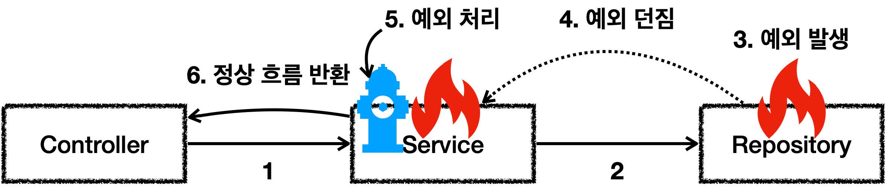
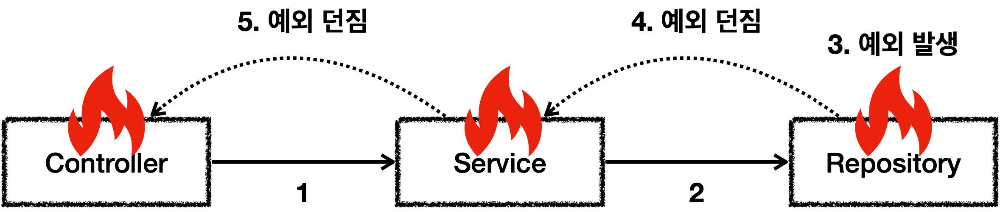

# 섹션 05. 자바 예외 이해
## 01. 예외 계층
스프링이 제공하는 `예외 추상화`를 이해하기 위해선 `자바 기본 예외`에 대한 이해가 필요함
### 예외 계층
#### 예외 계층 그림

- `Object`: 예외도 객체임, 모든 객체의 최상위 부모는 `Object`이므로 예외의 최상위 부모 또한 `Object`임
- `Throwable`: 최상위 예외, 하위에 `Exception`과 `Error`가 있음
- `Error`: 메모리 부족, 심각한 시스템 오류 같이 `애플리케이션 복구가 불가능`한 시스템 예외
  - 상위 예외를 `catch`로 잡으면 하위 예외까지 잡힌다. 그래서 애플리케이션 로직에선 `Throwable`도 잡으면 안됨
  - 애플리케이션 로직은 `Exception`부터 필요한 예외로 생각하고 잡으면 됨
  - 언체크 예외
- `Exception`: 체크 예외
  - 애플리케이션 로직에서 사용할 수 있는 실질적 최상위 예외
  - `Exception`과 하위 예외는 모두 컴파일러가 체크하는 `체크 예외`임
  - 단, `RuntimeException`은 예외
- `RuntimeException`: 언체크 예외, 런타임 예외
  - `RuntimeException`을 비롯해 그 하위 예외들 모두 언체크 예외이며 `런타임 예외`라고 많이 부름  
   

## 02. 예외 기본 규칙
예외 = 폭탄 돌리기, 잡아서 처리 또는 밖으로 던져야 하기 때문임
### 예외 처리

- 예외를 처리할 경우 애플리케이션 로직이 정상 흐름으로 동작함
### 예외 던짐

- 예외를 처리하지 못하면 호출한 곳으로 예외를 계속 던지게 됨  
### 예외에 관해 기억할 2가지 규칙
1. 예외는 잡아서 처리하거나 던져야 한다.
2. 예외를 잡거나 던질 땐 지정한 예외뿐만아니라 그 예외의 자식들도 함께 처리된다.  
 

### 예외를 계속 던지기만 할 경우
- 자바 `main()` 쓰레드의 경우 예외 로그를 출력하며 시스템이 종료됨
- 웹 애플리케이션의 경우 사용자에게 개발자가 지정한 오류 페이지를 보여줌