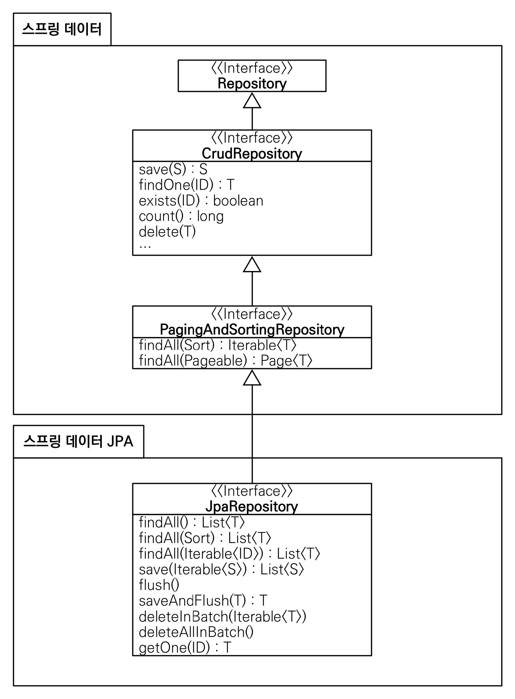
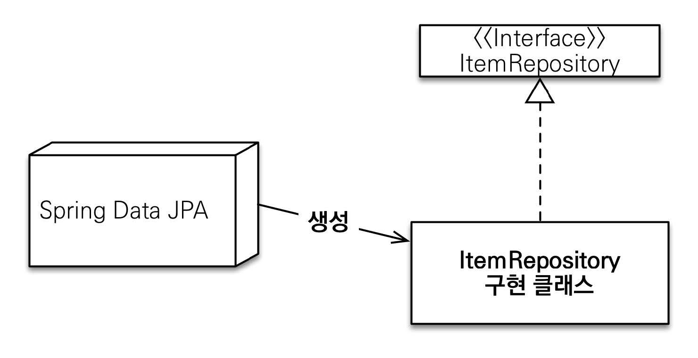

# 섹션 06. 데이터 접근 기술 - 스프링 데이터 JPA
## 03. 스프링 데이터 JPA 주요 기능
`JPA`를 편리하게 사용할 수 있도록 도와주는 `라이브러리`, 많은 기능을 제공하지만 그 중 대표적인 기능은 아래의 2가지
- 공통 인터페이스 기능
- 쿼리 메서드 기능  
<br/>

### 공통 인터페이스 기능

- `JpaRepository` 인터페이스를 통해 기본적인 `CRUD 기능 제공`
- 공통화가 가능한 (거의) 모든 작업 포함  
<br/>

#### JpaRepository 사용법
```
public interface ItemRepository extends JpaRepository<Item, Long> {
}
```
- `JpaRepository` 인터페이스를 상속 받고 제네릭에 관리할 `<엔티티, 엔티티ID>`를 주면 됨
  - `JpaRepository`가 제공하는 기본 `CRUD 기능`을 모두 사용 가능  
<br/>

#### 스프링 데이터 JPA 가 구현 클래스 대신 생성
  
<br/>

### 쿼리 메서드 기능
인터페이스에 메서드만 적어주면, 해당 `메서드 이름을 분석` -> `쿼리를 자동으로 생성/실행`하는 기능 제공  
<br/>

#### 순수 JPA 리포지토리
```
public List<Member> findByUsernameAndAgeGreaterThan(String username, int age) {
  return em.createQuery("select m from Member m where m.username = :username and m.age > :age")
    .setParameter("username", username)
    .setParameter("age", age)
    .getResultList();
}
```
- 순수 JPA 를 사용하게 되면 직접 `JPQL`을 작성하고 파라미터도 직접 바인딩 해야 함  
<br/>

#### 스프링 데이터 JPA
```
public interface MemberRepository extends JpaRepository<Member, Long> {
  List<Member> findByUsernameAndAgeGreaterThan(String username, int age);
}
```
- 메서드 이름을 분석 -> 필요 `JPQL` 생성/실행
  - `JPQL`을 `SQL`로 번역해서 실행해줌
  - 번역시 아무렇게나 하는 것이 아니라 규칙에 따라 번역함  
<br/>

#### 스프링 데이터 JPA 가 제공하는 쿼리 메서드 기능
- `조회`: `find…By`, `read…By`, `query…By`, `get…By`
  - ex) `findHelloBy` 처럼 ...에 식별하기 위한 내용(설명)이 들어가도 된다.
- `COUNT`: `count…By` 반환타입 `long`
- `EXISTS`: `exists…By` 반환타입 `boolean`
- `삭제`: `delete…By`, `remove…By` 반환타입 `long`
- `DISTINCT`: `findDistinct`, `findMemberDistinctBy`
- `LIMIT`: `findFirst3`, `findFirst`, `findTop`, `findTop3`  
<br/>

### JPQL 직접 사용
```
public interface SpringDataJpaItemRepository extends JpaRepository<Item, Long> {
  
  //쿼리 메서드 기능
  List<Item> findByItemNameLike(String itemName);

  //쿼리 직접 실행
  @Query("select i from Item i where i.itemName like :itemName and i.price <= :price")
  List<Item> findItems(@Param("itemName") String itemName, @Param("price") Integer price);

}
```
- 직접 JPQL 을 사용하고 싶을 경우 `@Query`와 함께 작성하면 됨 (메서드 이름으로 실행하는 규칙 X)