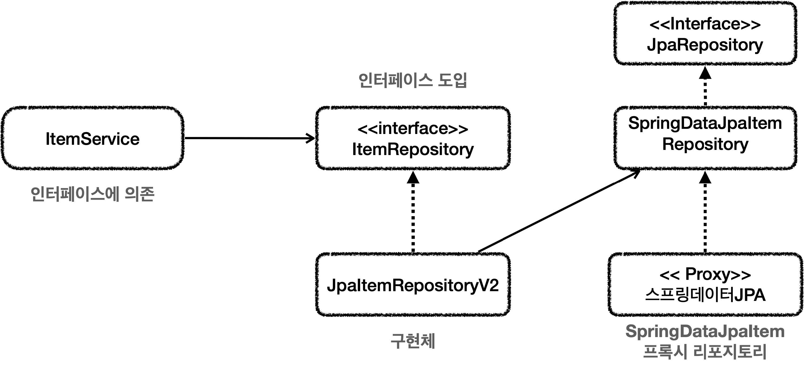
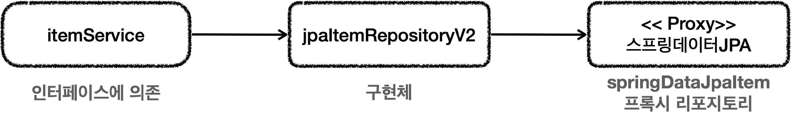
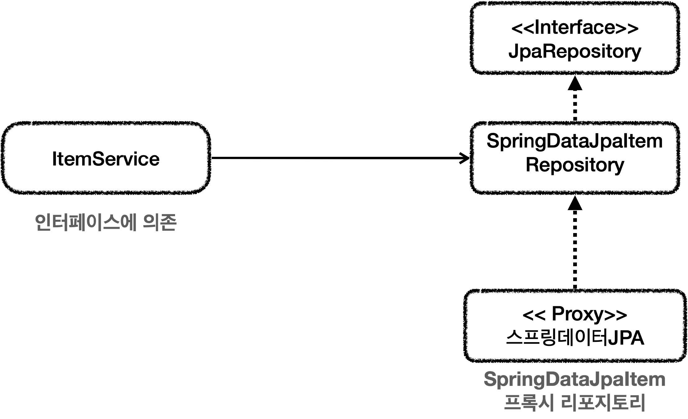
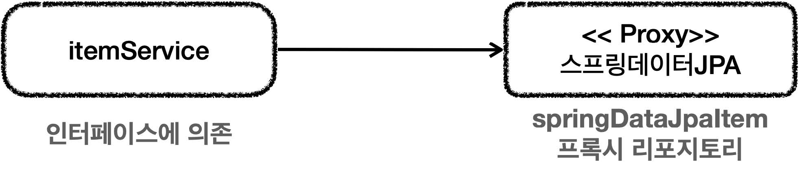

# 섹션 08. 데이터 접근 기술 - 활용 방안
## 01. 스프링 데이터 JPA 예제와 트레이드 오프
### 클래스 의존 관계

### 런타임 객체 의존 관계

- 중간에 `JpaItemRepositoryV2`가 어댑터 역할을 함
  - `ItemService`에서 사용하는 `ItemRepository` 인터페이스를 그대로 유지할 수 있음
  - `ItemService` 코드를 변경하지 않아도 됨  
 

#### 문제점 or 불편사항
- 구조를 맞추려고 중간에 `어댑터`가 들어가게 됨
  - 구조가 복잡해졌고 사용 클래스가 많아짐
- 개발자 입장에서 실제 코드 뿐만 아니라 중간 어뎁터까지 개발해야 하는 상황이 됨
- 물론 유지보수 관점에서는 인터페이스 변경 없이 구현체를 변경할 수 있다는 장점이 있음
  - `DI, OCP 원칙`을 지킬 수 있음
  - 분명 편해지긴 했지만 유지보수해야 할 코드가 `실제 코드`는 물론 `어댑터 코드`까지 늘어남  
 

### 다른 방향 - Spring JPA 직접 사용
- `ItemService` 를 유지하는 걸 고집할게 아니라 일부를 고쳐서 `직접 스프링 JPA`를 사용하는 방향이 있음
  - 단점 : `DI, OCP 원칙`을 포기하게 됨
  - 장점 : 복잡한 어댑터 제거 가능 -> 구조를 단순하게 가져갈 수 있음  
 

#### 클래스 의존 관계

- `ItemService`에서 스프링 데이터 JPA 로 만든 리포지토리를 직접 참조
  - 단, `ItemService` 코드 일부를 변경해야 함  
 

#### 런타임 객체 의존 관계
  
 

### 트레이드 오프
여기서 말하는 `트레이드 오프`란, `구조의 안전성`이냐 `단순한 구조와 개발의 편리성` 사이의 선택
- `구조의 안전성`: DI, OCP 를 지키기 위해 어댑터를 추가해 더 많은 코드를 유지함
- `단순한 구조 & 개발의 편리성`: 어댑터를 제거하며 DI, OCP 를 포기해 구조를 단순하게 가져가며 `ItemService` 코드를 직접 변경
- 어느 것이 정답일 수는 없다. 특정 상황에 따라 중요도가 달라지기 때문이다.
- 개발 필요한 자원은 무한하지 않다. `추상화도 비용이 들기` 때문에 어설픈 추상화는 독이 된다.
  - 여기서 말하는 `비용`은 `유지보수 관점에서의 비용`을 뜻 함  
   

## 03. 다양한 데이터 접근 기술 조합
### 데이터 접근 기술 선택
데이터 접근 기술 선택에는 정답이 없다.
- `비즈니스 상황`, `현재 프로젝트 구성원 역량` 등에 따라 결정해야 한다.
- `JdbcTemplate`이나 `MyBatis` 같은 기술은 SQL 을 직접 작성해야 한다.
  - 이는 단점이 될 수도 있으나 구성원이 SQL 에 익숙하다면 금방 적응 가능하다
- `JPA`, `스프링 데이터 JPA`, `Querydsl` 같은 기술은 개발 생산성이 뛰어나다.
  - 하지만 학습 곡선이 높아 이러한 부분을 고려, 감안해야 한다.
  - 매우 복잡한 통계 쿼리를 다루는 프로젝트에는 잘 맞지 않는다.
- 기본적으로 `JPA, 스프링 데이터 JPA, Querydsl`을 사용하고 복잡한 쿼리 사용시 `JdbcTemplate`나 `MyBatis`를 함께 사용하는 방안도 있다.  
 

### 트랜잭션 매니저 선택
1. `JPA, 스프링 데이터 JPA, Querydsl`의 경우 `JpaTransactionManager` 사용
   - 셋 모두 JPA 기술을 사용함
   - 스프링 부트는 자동으로 `JdbcTransactionManager`를 빈에 등록해줌
2. `JdbcTemplate, MyBatis`의 경우 `DataSourceTransactionManager` 사용
   - 내부에서 JDBC 를 직접 사용함
- 결국 JPA 와 JdbcTemplate 을 함께 사용하면 `트랜잭션 매니저가 달라지는 상황`이 생김
  - 이는 트랜잭션을 하나로 묶을 수 없는 문제가 발생할 수 있음  
 

#### JpaTransactionManager 의 다양한 지원
위에서 언급한 `트랜잭션을 하나로 묶을 수 없는 문제`에 대한 해결방법은 `JpaTransactionManager`에 있음
- `DataSourceTransactionManager`가 제공하는 기능도 대부분 똑같이 제공하기 때문이다.
- 덕분에 `JPA`와 `JdbcTemplate`을 같이 사용할 수 있다.
- 결론 : `JpaTransactionManager`만 스프링 빈에 등록하면 모두를 하나의 트랜잭션에 묶어 사용할 수 있다.
  - 당연하지만 `롤백`도 할 수 있음  
 

### JPA + JdbcTemplate 사용시 주의사항
- JPA 의 `플러시 타이밍` 주의
  - 데이터 변경시 즉시 DB 에 저장하지 않기 때문, 기본적으로 트랜잭션 커밋 시점에 반영한다.
  - 커밋전에 `JdbcTemplate`에서 변경 데이터를 호출할 경우 조회하지 못하는 문제가 발생
  - `JPA 호출 종료 시점`에 JPA 가 제공하는 `플러시 기능`을 사용해 JPA의 변경 내역을 DB 에 반영해주어야 함