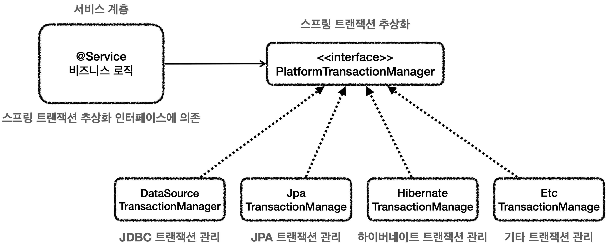
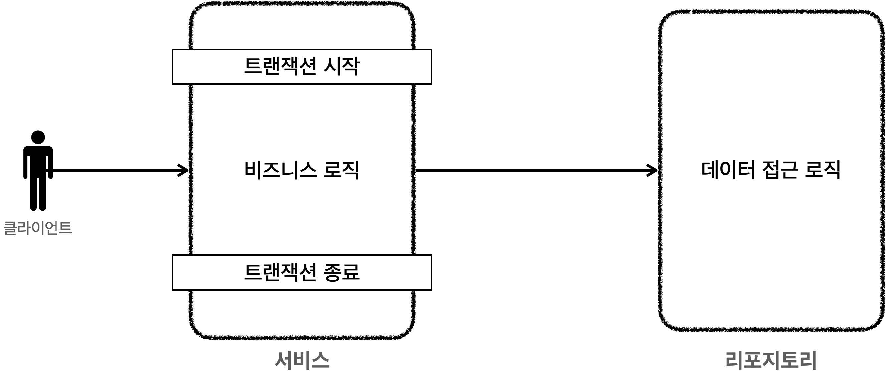
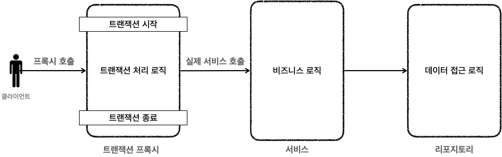
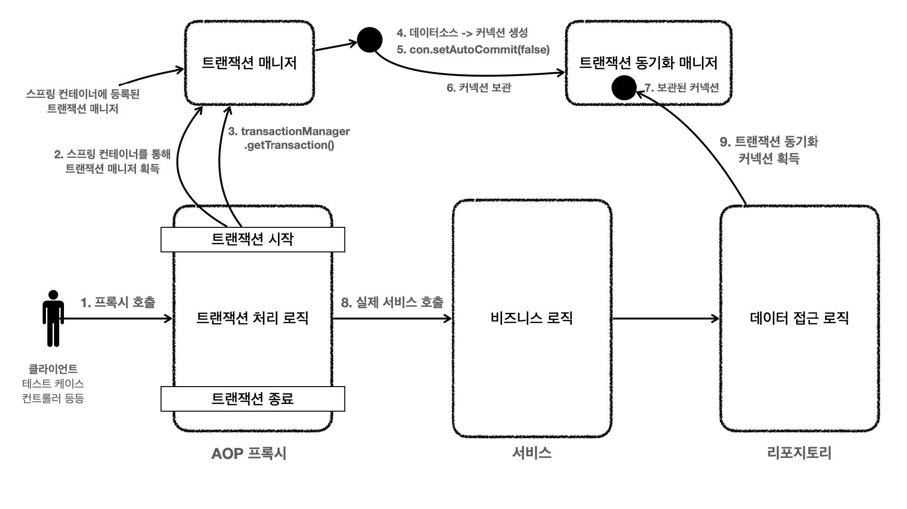

# 섹션 09. 스프링 트랜잭션 이해
## 01. 스프링 트랜잭션 소개
### 스프링 트랜잭션 추상화
각 데이터 접근 기술들은 트랜잭션 처리 방식이 다르다.
- 예로 `JDBC 기술`과 `JPA 기술`은 트랜잭션 사용 코드 자체가 다름
- 즉, 서로 기술 변경이 있을 경우 트랜잭션 코드의 수정이 불가피 함
  - 이러한 문제를 해결하기 위해 스프링은 `PlatformTransactionManager` 인터페이스를 통해 `트랜잭션 추상화`를 제공함  
<br/>

### PlatformTransactionManager 인터페이스
```java
package org.springframework.transaction;

public interface PlatformTransactionManager extends TransactionManager {
    TransactionStatus getTransaction(@Nullable TransactionDefinition definition) throws TransactionException;
    
    void commit(TransactionStatus status) throws TransactionException;
    void rollback(TransactionStatus status) throws TransactionException;
}
```

- 트랜잭션은 `시작(획득)`, `커밋`, `롤백`으로 단순하게 추상화가 가능함
- 스프링은 `트랜잭션 추상화`뿐만 아니라 데이터 접근 기술에 대한 `트랜잭션 매니저 구현체`도 제공함
  - 개발자는 그저 필요한 구현체를 `스프링 빈`으로 등록하고 주입 받아 사용하기만 하면 됨
- 스프링 부트는 어떤 `데이터 접근 기술`을 사용하는지를 자동을 인식하며 적절한 트랜잭션 매니저는 선택해 스프링 빈으로 등록해줌
  - 덕분에 개발자는 `트랜잭션 매니저를 선택하고 등록하는 과정`마저 생략할 수가 있음
    - `JdbcTemplate, MyBatis`: `DataSourceTransactionManager(JdbcTransactionManager)` 스프링 빈 등록
    - `JPA`: `JpaTransactionManager` 스프링 빈 등록  
<br/><br/>

### 스프링 트랜잭션 사용 방식
#### `PlatformTransactionManager` 사용 방법 2가지
1. `선언적 트랜잭션 관리(Declarative Transaction Management)`
   - `@Transactional` 애노테이션을 선언해 매우 편리하게 트랜잭션을 적용하는 방식
   - 트랜잭션을 적용하고 싶은 로직에 선언만하면 트랜잭션이 적용되는 방식
   - 실무에서 대부분 사용하는 방식
2. `프로그래밍 방식의 트랜잭션 관리(Programmatic Transaction Management)`
   - `트랜잭션 매니저`, `트랜잭션 템플릿` 등을 사용해 트랜잭션 관련 코드를 직접 작성하는 방식
   - 애플리케이션 코드가 트랜잭션이라는 `기술 코드와 강하게 결합됨`  
<br/><br/>

### 선언적 트랜잭션과 AOP
`선언적 트랜잭션 관리 방식(@Transactional)`을 사용하게 되면 기본적으로 `프록시 방식의 AOP`가 적용됨  
<br/>

#### 프록시 도입 전

- 서비스 로직에서 트랜잭션을 직접 시작  -> `서비스 계층 = 비즈니스 로직 + 트랜잭션 처리 로직`
<br/>

#### 프록시 도입 후

- `트랜잭션을 처리 객체`와 비즈니스 로직을 처리하는 `서비스 객체`를 명확하게 분리 가능
- 트랜잭션 프록시가 트랜잭션 처리 로직을 모두 가져감 -> `서비스 계층 = 비즈니스 로직`  
<br/><br/>

### 프록시 도입 후 트랜잭션 과정

- `트랜잭션 시작` = 커넥션에 `con.setAutocommit(false)` 설정 (수동 커밋 모드)
- 동일 트랜잭션을 유지하기 위해선 같은 DB 커넥션을 사용해야 함
  - 그래서 스프링 내부에선 `트랜잭션 동기화 매니저`가 사용됨
- `JdbcTemplate`를 포함해 대부분의 데이터 접근 기술들은 트랜잭션을 유지하도록 내부에 `트랜잭션 동기화 매니저`를 통해 `커넥션을 동기화` 함  
<br/><br/>

### 스프링이 제공하는 트랜잭션 AOP
- 트랜잭션은 중요도도 높고 전 세계적으로 누구나 사용하기에 스프링은 `트랜잭션 AOP`를 처리하기 위한 모든 기능을 제공함
  - 스프링 부트 사용시 `트랜잭션 AOP`를 처리하기 위한 스프링 빈들을 자동으로 등록해줌
- 개발자는 `@Transactional` 애노테이션만 필요한 로직에 선언해주면 됨  
<br/><br/><br/>

## 08. 트랜잭션 옵션 소개
### @Transactional - 코드
```java
public @interface Transactional {
    
    String value() default "";
    String transactionManager() default "";

    Class<? extends Throwable>[] rollbackFor() default {};
    Class<? extends Throwable>[] noRollbackFor() default {};

    Propagation propagation() default Propagation.REQUIRED;
    Isolation isolation() default Isolation.DEFAULT;
    int timeout() default TransactionDefinition.TIMEOUT_DEFAULT;
    boolean readOnly() default false;
    String[] label() default {};
    
}
```
#### value, transactionManager
`트랜잭션 매니저` 지정시 사용하는 옵션
- 둘 중 하나에 트랜잭션 매니저의 `스프링 빈의 이름`을 적어주면 됨
- 이름 생략시 기본으로 등록된 트랜잭션 매니저를 사용함 (대부분 생략함)
- 사용하는 트랜잭션 매니저가 둘 이상이라면 트랜잭션 매니저의 이름을 지정해 구분하는 용도로 사용함  
<br/>

#### rollbackFor
예외 발생시 `스프링 트랜잭션의 기본 정책`은 아래와 같음
- `언체크 예외(RuntimeException, Error)`와 그 하위 예외가 발생할 경우 `롤백`
- `체크 예외(Exception)`와 그 하위 예외가 발생할 경우 `커밋`
<br/>

`rollbackFor` 옵션을 사용하면 특정 예외 발생시 롤백을 지정할 수 있음
- ex) `@Transactional(rollbackFor = Exception.class)`  
<br/>

#### noRollbackFor
`rollbackFor`와 반대의 기능을 함, 특정 예외 발생시 롤백을 금지할 수 있음  
<br/>

#### propagation
`트랜잭션 전파`에 관한 옵션  
<br/>

#### isolation
`트랜잭션 격리 수준`을 지정하는 옵션
- `DEFAULT`: 데이터베이스에서 설정한 격리 수준을 따름
- `READ_UNCOMMITTED`: 커밋되지 않은 읽기
- `READ_COMMITTED`: 커밋된 읽기
- `REPEATABLE_READ`: 반복 가능한 읽기
- `SERIALIZABLE`: 직렬화 가능  
<br/>

#### timeout
트랜잭션 `수행 시간`에 대한 `타임아웃을 초 단위로 지정`하는 옵션
- 기본 값은 `트랜잭션 시스템의 타임아웃`
- 운영 환경에 따라 동작 여부가 결정 될 수 있음  
<br/>

#### readOnly
트랜잭션은 기본적으로 읽기/쓰기가 모두 가능하도록 생성이 되는데, `readOnly = true`를 사용하면 읽기 전용 트랜잭션이 생성됨
- 읽기 전용 트랜잭션의 경우 `등록, 수정, 삭제`가 되지 않음 (읽기 기능만 동작)
- 단, 드라이버나 DB 에 따라 정상 동작하지 않을 수 있음
- 크게 3곳에서 적용됨
  - 프레임 워크
    - `JdbcTemplate`인 읽기 전용 트랜잭션 안에서 변경 기능을 실행하면 예외를 던짐
    - `JPA(하이버네이트)`는 읽기 전용 트랜잭션의 경우 커밋 시점에 `플러시`를 호출하지 않음
  - JDBC 드라이버
    - 읽기 전용 트랜잭션에서 변경 쿼리 발생시 예외를 던짐
    - 읽기/쓰기 DB 를 구분해 요청함
  - DB
    - DB 에 따라 읽기 전용 트랜잭션의 경우 읽기만 하면 되므로 내부에서 성능 최적화가 발생