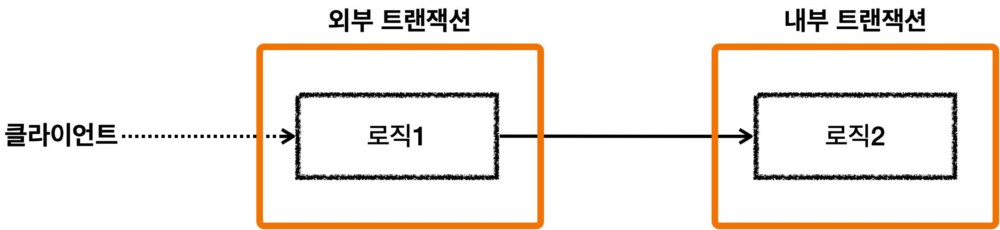
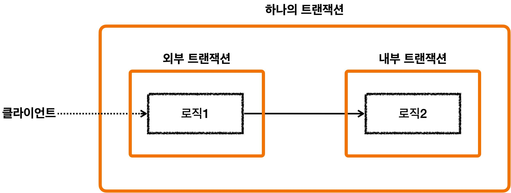
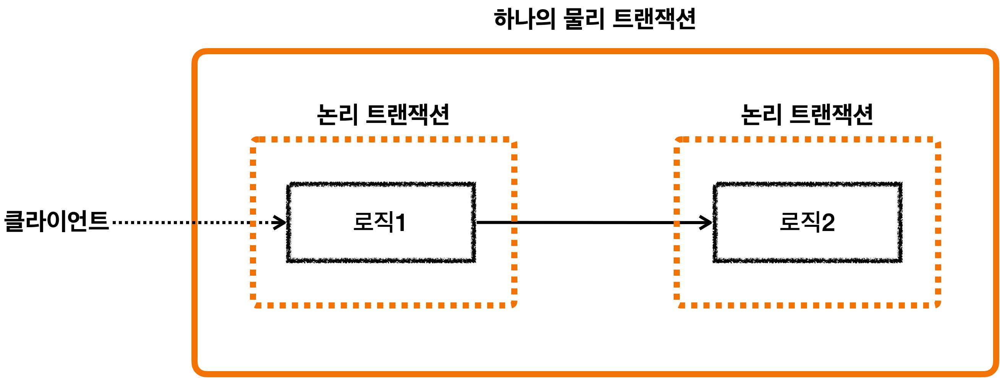
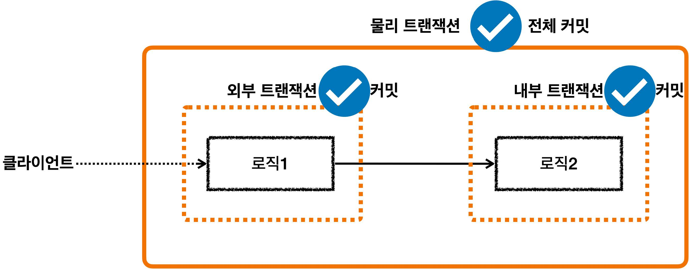
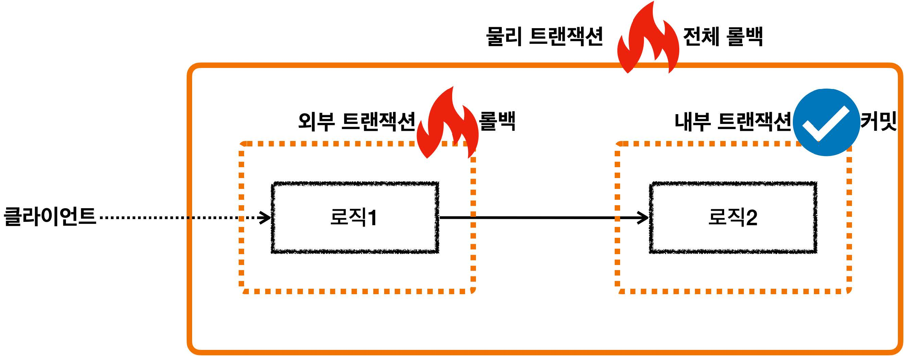
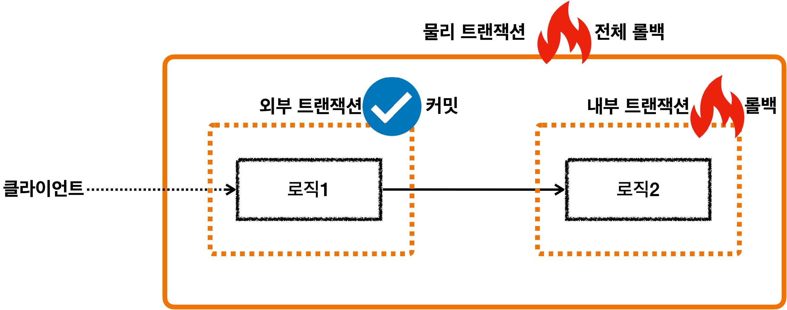

# 섹션 10. 스프링 트랜잭션 전파1 - 기본
## 03. 스프링 트랜잭션 전파 - 전파 기본
`트랜잭션 전파(propagation)`: 트랜잭션 진행 중 추가로 트랜잭션 수행시 어떻데 동작할지 결정하는 것
- 스프링의 경우 `다양한 트랜잭션 전파 옵션`들을 제공  
  

### 외부 트랜잭션 수행 중, 내부 트랜잭션이 추가로 수행

- 외부 트랜잭션이 아직 수행 중일 때 내부 트랜잭션이 수행된다.
- `외부/내부`의 표현은 내부 트랜잭션이 상대적으로 밖에 있기 때문이다.
  - 즉, 빨리 시작된 트랜잭션일 수록 밖에 있다고 표현한다.  

  - 스프링은 이런 경우 외부/내부 트랜잭션을 하나로 묶어 하나의 트랜잭션으로 만들어 준다.
    - 이것이 기본 동작
    - 옵션을 통해서 다른 동작방식도 선택 가능  
 

#### 물리 트랜잭션과 논리 트랜잭션

- 스프링에서는 이해를 위해 `논리 트랜잭션`과 `물리 트랜잭션`으로 개념을 나누었다.
  - 논리 트랜잭션들은 물리 트랜잭션으로 묶인다.
  - `물리 트랜잭션`: 실제 DB 에 적용되는 트랜잭션을 뜻 함, 실제 커넥션을 통해 트랜잭션 시작하고, 커밋/롤백하는 단위
  - `논리 트랜잭션`: 트랜잭션 매니저를 통해 트랜잭션을 사용하는 단위
- 이러한 개념은 트랜잭션 진행 중 내부에 추가로 트랜잭션을 사용하는 경우에 나타남
- 개념을 나눈 이유는 트랜잭션 사용 중 내부에 트랜잭션이 사용되면 여러 복잡한 상황이 나타날 수 있는데 개념을 도입해 아래의 원칙을 적용하기 위함이다.
  - `원칙1`: 모든 논리 트랜잭션이 커밋 되어야 물리 트랜잭션이 커밋된다.
  - `원칙2`: 하나의 논리 트랜잭션이라도 롤백이 되면 물리 트랜잭션은 롤백된다.
  - 즉, 모튼 트랜잭션 매니저를 커밋해야 물리 트랜잭션이 커밋될 수 있음
    - 하나의 트랜잭션 매니저라도 롤백되면 물리 트랜잭션은 롤백 됨  
  

### 그림으로 정리

- 모든 논리 트랜잭션 커밋 --> 물리 트랜잭션 커밋  

- 외부 논리 트랜잭션 롤백 --> 물리 트랜잭션 롤백  

- 내부 논리 트랜잭션 롤백 --> 물리 트랜잭션 롤백